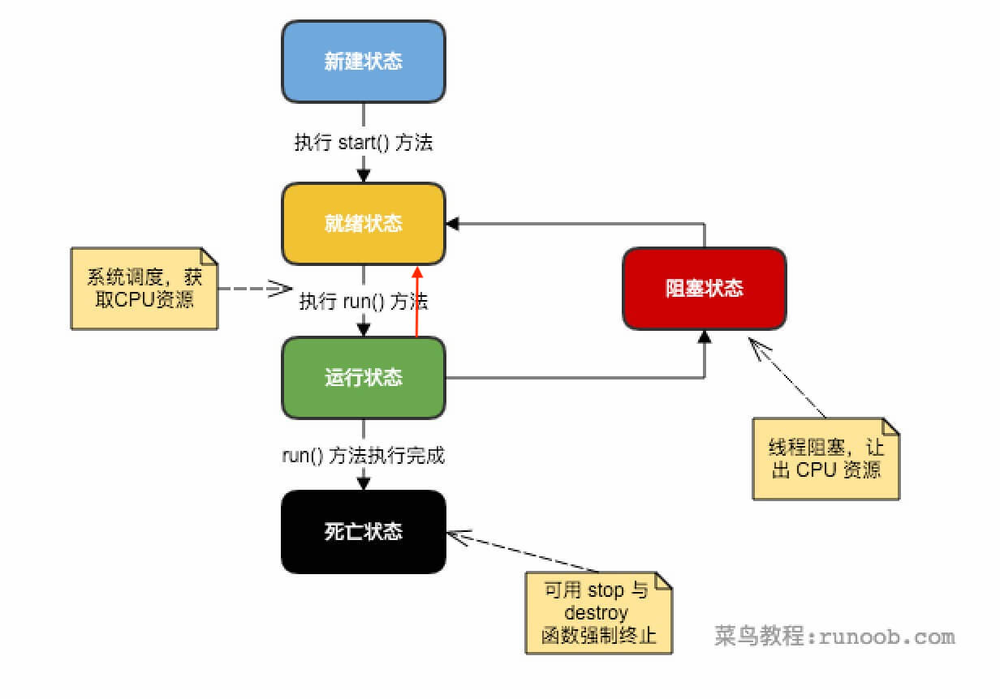

# 多线程基本概念

*进程是系统资源的分配单位，线程是处理器资源的分配单位*

## 目录

1. 线程的生命周期
2. 线程的优先级
3. 线程的创建


## 一、线程的生命周期

线程是一个动态执行的过程，它有一个从产生到死亡的过程



* 新建状态：使用new关键字和Thread类或其子类建立一个线程对象后，该线程对象就处于新建状态。它保持这个状态知道程序start()这个线程。
* 就绪状态：当线程对象调用了start()方法后，该线程就进入就绪状态。就绪状态的线程处于就绪队列中，要等待JVM里线程调度器的调度。
* 运行状态：如果就绪状态的线程获取CPU资源，就可以执行run()，此时线程便处于运行状态。运行状态的线程可以变为阻塞状态、就绪状态和死亡状态。
* 阻塞状态：如果一个线程执行了sleep、suspend等方法，失去所有占用资源后，该线程就从运行状态进入阻塞状态。在睡眠时间已到或获得设备资源后可以重新进入就绪状态。
  * 等待阻塞：运行状态中的线程执行wait()方法，使线程进入到等待阻塞状态
  * 同步阻塞：线程获取 synchronized 同步锁失败（同步锁被其他线程占用）
  * 其他阻塞：通过调用线程的sleep()或join() 发出了 I/O 请求时，线程进入阻塞状态
* 死亡状态：一个运行状态的线程完成任务或者其它终止条件发生时，该线程就切换到终止状态，之后等待JVM回收线程对象。


## 二、线程的优先级

具有高优先级的线程对程序更重要，但线程优先级不能保证线程执行的顺序，而且非常依赖于平台


## 三、线程的创建

Java提供了三种创建线程的方法

#### 1. 实现 Runnable 接口

```java
Thread th = new Thread(new Runnable() {
	@Override
	public void run() {
		//todo...
	}
}, "ThreadName");
```


#### 2. 继承 Thread 类本身

```java
Thread th = new ThreadSon("ThreadName");
```

* 成员方法

```java
public void start();													//使线程开始执行，Java虚拟机调用该线程的run方法
public void run();
public final void setName(String name);				//改变线程名称
public final void setPriority(int priority);	//改变线程优先级
public final void setDaemon(boolean on);			//标记线程为守护线程
public final boolean isAlive();								//测试线程是否活动
```

* 静态方法

```java
public static void sleep(long millisec);			//休眠当前线程
public static Thread currentThread();					//返回线程对象
```


#### 3. Callable 和 Future 创建线程


