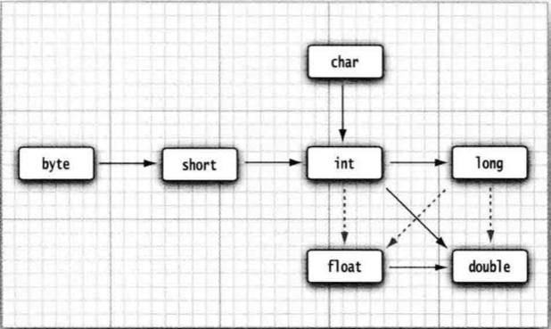

## 2.1 基本数据类型

### 目录

1. 变量的定义
2. 变量的类型
3. 强制类型装换
4. 符号常量和const常量
5. 运算符号


### 1. 变量的定义

Java中的变量定义如下：

```
变量类型 变量名;
```

变量可以在定义时进行赋初值：

```
变量类型 变量名 = 初始值;
```

在Java中，变量的声明尽可能地靠近变量第一次使用的地方，这是一种良好的程序编写风格。

变量名的命名规则

* 变量名必须是一个以字母开头并由字母或数字构成的序列
* 不能是Java标识符，比如 for、if、or 等
* 变量名要有实际意义，可以提高程序可读性
* 变量名区分大小写


### 2. 变量的类型

基本数据类型可以分为四类：整型、浮点型、字符型、布尔型，下表列出 Java 中常见的基本类型。

|        | 类型    | 存储需求 | 取值范围                      | 大致范围                  |
| ------ | ------- | -------- | ----------------------------- | ------------------------- |
| 整型   | int     | 4字节    | $[-2^{31}, （2^{31}-1）]$     | $[-2*10^9, 2*10^9]$       |
|        | long    | 8字节    | $[-2^{63}, （2^{63}-1）]$     | $[-9*10^{18}, 9*10^{18}]$ |
| 浮点型 | double  | 8字节    | $[-2^{1024}, （2^{1024}-1）]$ |                           |
| 字符型 | char    | 2字节    | $[0, （2^{16}-1）]$           |                           |
| 布尔型 | boolean |          | false or true                 |                           |

Java中没有任何无符号（unsigned）形式的基本类型

绝对值在$10^9$范围以内的整数都可以定义成int型，超过取值范围则使用long型

```java
long longNum = 123456789012345l;
```

如果在数值计算中不允许有任何舍入误差，应该使用BigInteger、BigDecimal类


### 3. 强制类型转换

强制类型转换：

```
(新类型名)变量名
```

如果将结果赋值给较小的类型，就必须使用强制类型转换。在将浮点型数值转型为整数型数值时，总是对该数字执行截尾操作。如果想要得到四舍五入的结果，需要使用java.lang.Math中的round()方法。

```java
double x = 9.997;
int nx = (int)x; //nx=9
int mx = (int)Math.round(x); //mx=10
```


如果将结果赋值给较大的类型，编译器会自动进行类型转换。通常，表达式中出现的最大的数据类型，决定了表达式最终的结果类型。

数值类型之间的合法转换：




### 4. 常量

Java中通常利用final指示常量，关键字final表示这个变量只能被赋值一次，且一旦被赋值后，不可以被更改。常量名一般使用大写。


### 5. 运算符

* 算数运算符

Java中使用的算数运算符有+、-、*、/，分别表示加、减、乘、除。其中当参与/ 运算的两个操作数都是整数时，表示整数除法，整数的求余操作用%表示；否者，表示浮点数除法。

需要注意，整数被0除将会产生一个异常，而浮点数被0除将会得到无穷大或NaN结果。

* 关系运算符

常见的关系运算符有六种：<、>、<=、>=、==、!=，当表达式成立时返回真，不成立时返回假。

* 逻辑运算符

常见的逻辑运算符有三种：&&、||、！。其中a&&b为真，当且仅当ab都真；a||b为假，当且仅当ab都假

* 条件运算符

Java支持三元操作符

```java
A ? B : C;
```

其含义是：如果A为真，那么执行并返回B的结果；如果A为假，那么执行并返回C的结果。

* 位运算符

在处理整数型类型时，常见的位运算符有六种，如下图所示

| 运算符 | 含义   | 语法 | 效果                                                         |
| ------ | ------ | ---- | ------------------------------------------------------------ |
| <<     | 左移   | a<<x | 整数a按二进制位左移x位                                       |
| >>     | 右移   | a>>x | 整数a按二进制位右移x位                                       |
| &      | 位与   | a&b  | 整数a和b按照二进制对齐，按位进行与运算(除了11得1，其他均为0) |
| \|     | 位或   | a\|b | 整数a和b按照二进制对齐，按位进行或运算(除了00得0，其他均为1) |
| ^      | 位异或 | a^b  | 整数a和b按照二进制对齐，按位进行异或运算(相同为0，不同为1)   |
| ~      | 位取反 | ~a   | 整数a的二进制的每一位进行0变1、1变0的操作                    |

最后，>>>运算符会用0填充高位，这与>>不同，它会用符号位填充高位。不存在<<<运算符。

* 数学函数与常量
  * Math.sqrt(x) //计算x的平方根
  * Math.pow(x, a) //计算x的a次幂
  * Math.sin/cos/tan/atan/atan2 //三角函数
  * Math.exp //指数函数
  * Math.log //自然数对数
  * Math.log10 //以10为底的对数
  * Math.PI //表示圆周率的近似值
  * Math.E //表示e常量的近似值