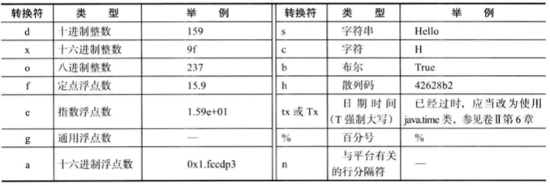
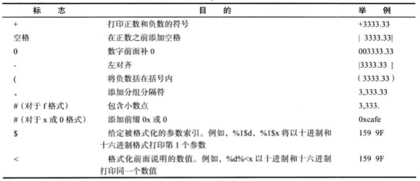

## 2.3 输入输出

### 目录

1. 读取输入
2. 格式化输出


### 1. 读取输入

若要通过控制台进行输入，需要构造Scanner对象，并与标准输入流System.in进行关联

```java
Scanner in = new Scanner(System.in); //基本方法
Scanner in = new Scanner(new BufferedInputStream(System.in)); //缓存加速

String name = in.nextLine(); //获取一行输入
String firstName = in.next(); //获取一个字符串，以空白分隔
int age = in.nextInt(); //读取一个整数
Double weight = in.nextDouble; //读取一个浮点数

while(in.hasNext()) doSomeThing(); //循环到EOF时结束
```

Scanner类定义在java.util包中，需要使用import关键字将其引入

```java
import java.util.Scanner;
```

Scanner类的常见API:

```java
Scanner(InputStream in) //用给定的输入流创建一个Scanner对象
String nextLine() //读取输入的下一行内容
String next() //读取输入的下一个单词，以空格作为分隔符
int nextInt() //读取并转换下一个表示整数的字符序列
int nextDouble() //读取并转换下一个表示浮点数的字符序列
boolean hasNext() //检测输入中是否还有其他单词
boolean hasNextInt() //检测是否还有表示整数的下一个字符序列
boolean hasNextDouble() //检测是否还有表示浮点数的下一个字符序列
```

最快的读取输入：

```java
BufferedReader br = new BufferedReader(new InputStreamReader(System.in));

String[] in = br.readLine().split(" ");
String name = in[0];
int age = Integer.parseInt(in[1]);
double weight = Double.parseDouble(in[2]);
```


### 2. 格式化输出

使用System.out.print(x)，可以将数据类型所允许的最大非0位数进行打印

```java
double x = 10000.0/3.0;
System.out.print(x); //3333/3333333335
```

Java沿用了C语言函数库中的printf方法

```java
System.out.printf("%.2f", x);//3333.33
```

用于printf的转换符号如下：



还可以给出控制格式化输出的各种标志如下：



如果有不进行打印输出需求，可以使用静态的String.format方法创建一个格式化的字符串

```java
String message = String.format("Hello, %s. Next year, you'll be %d", name, age);
```

