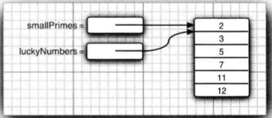
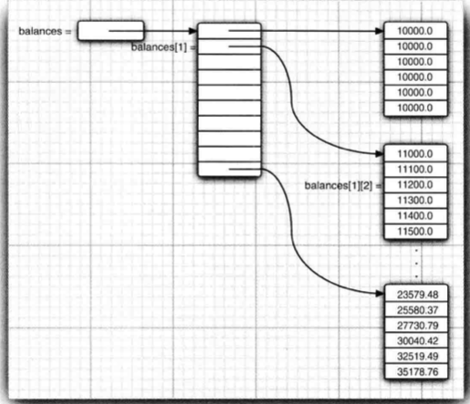

## 2.5 数组

### 目录

1. for each 循环
2. 数组初始化以及匿名数组
3. 数组拷贝
4. 命令行参数
6. 多维数组


### 1. for each 循环

这种增强的for循环格式为：

```java
for(variable: collection) statement;
```

其中collection这一集合表达式必须是一个数组或者是一个实现了Iterable接口的类对象。

注意variable 是作为一个临时变量

### 2. 数组初始化以及匿名数组

数组的声明：

```java
int[] a;
```

数组的初始化：

```java
int[] a = new int[100];
int[] a = {2, 3, 4, 5};
```

匿名数组：

```java
fun(new int[] {2, 3, 4,5})
```

在创建一个数字数组时，所有元素初始化为0；在创建一个boolean数组时，所有元素初始化为false；在创建一个对象数组时，所有元素初始化为一个特殊值null，表示这些元素尚未存放任何对象。

如果需要在运行过程中扩展数组的大小，可以使用另外一种数据结构——数组列表。


### 3. 数组拷贝

数组变量的引用赋值：

```java
int[] luckyNumbers = smallPrimes;
luckyNumbers[5] = 12; //smallPrimes[5] = 12
```



如果希望对数组的元素进行拷贝，则需要使用Arrays类的copyOf方法：

```java
int[] copiedLuckyNumbers = Arrays.copyOf(luckyNumbers, luckyNumbers.length);
```

上述方法的第二个参数是新数组的长度，此方法还可以用来高效的增加数组的长度。

```java
luckyNumbers = Array.copyOf(luckyNumbers, 2*luckyNumbers.length);
```

如果数组的类型是int，那么多余的元素初始化为0；如果数组的类型是boolean，那么多余的元素初始化为false；如果数组的长度小于原来的长度，那么只拷贝前面的元素。


Arryas 类的常见方法：

```java
static type copyOf(type[] a, int length) // 返回与a类型相同的数组，其长度为length，数组元素为a的值
static type copyOfRange(type[] a, int start, int end)// 返回与a类型相同的数组，其长度为end-start，数组元素为[start, end)
static void sort(type[] a) //对数组进行排序
static int binarySearch(type[] a, type v) //采用二分查找值v，并返回相应下标；否则返回负数值r，-r-1是为保持有序应该插入的位置
static void fill(type[] a, type v) //将数组的所有元素设置为v
static boolean equals(type[] a, type[] b) //如果两个数组大小相同，并且相同下标的元素都相等，放回true
```


### 4. 命令行参数

main方法往往会接收一个字符串数组：

```java
public class Message {
  public static void main(String[] args) {
  }
}
```

运行该程序：

```shell
java Message -g cruel world
```

Args数组将包含以下内容

```shell
args[0]: "-g"
args[1]: "cruel"
args[2]: "world"
```


### 5. 多维数组

声明二维数组：

```java
double[][] balances;
```

初始化二维数组：

```java
balances = new double[NYEARS][NRATES];
// or
int [][] balances = {
  {14, 2, 3 ,5},
  {65, 2, 2, 1},
  {5, 3, 5, 54}
};
```

二维数组的访问：

```java
for(double[] row: a)
  for(double value: row)
    do something with value
```

在Java中，实际上没有多维数组，只有一维数组



