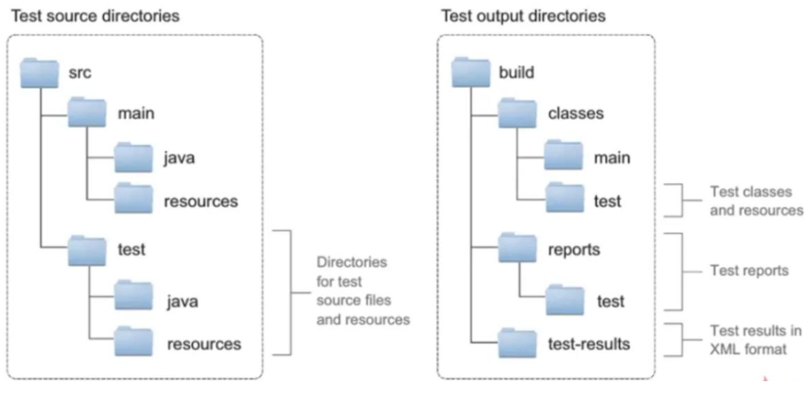

# Gradle 入门


## 目录

1. Gradle 简介
2. 常见的项目构建工具
3. Gradle 安装
4. Gradle 项目目录结构
5. Gradle 构建项目
6. Gradle 单元测试


## 一、Gradle 简介

**Gradle 是什么？**

* Gradle 是一款由google推出的基于JVM的项目构建工具，支持 Maven，JCenter 第三方仓库
* Gradle 不使用 xml 文件，而使用支持多种语言（Java、Groovy）的build脚本文件
* Spring 家族的源码大部分是基于 Gradle 构建的


**官网链接**

* https://gradle.org/


## 二、常见的项目构建工具

以下对比了常见的三种项目构建工具

| 构建工具 | Ant          | Maven         | Gradle           |
| -------- | ------------ | ------------- | ---------------- |
| 构建性能 | 高           | 低            | 中               |
| 仓库     | 开发者定义   | maven仓库     | 支持多种远程仓库 |
| 依赖管理 | ivy管理      | GAV坐标管理   | GNV坐标管理      |
| 插件支持 | 方便         | 较难          | 方便             |
| 目录结构 | 自定义       | maven目录结构 | maven目录结构    |
| 配置文件 | xml          | xml           | 代码脚本         |
| 侧重点   | 小型项目构建 | 项目包管理    | 大型项目构建     |
| 目前地位 | 过去         | 现在          | 未来             |


## 三、Gradle 安装

版本要求：SpringBoot的Gradle插件需要Gradle 6.8 版本及以上

JDK要求：JDK 版本1.8及以上

环境变量：GRADLE_HOME为安装路径，GRADLE_USER_HOME为仓库路径


## 四、Gradle 项目目录结构

Gradle 项目的默认目录结构和Maven项目的目录结构一致，都是约定大于配置

```
gradle
|__	build：字节码、Jar包、War包、测试报告等（target）
|__	gradle：包装器
|	|__	wrapper
|		|__	gradle-wrapper.jar
|		|__	gradle-wrapper.properties
|__	src
|	|__	main
|	|	|__	java
|	|	|__	resources
|	|	|__	webapp
|	|		|__	WEB-INF
|	|		|	|__web.xml
|	|		|__	index.jsp
|	|__	test
|		|__	java
|		|__	resources
|__	gradlew：包装器启动脚本（mvnw）
|__	gradlew.bat：包装器启动脚本（mvnw.bat）
|__	build.gradle：项目构建脚本
|__	settings.gradle：项目和子项目名称信息
```


## 五、Gradle 构建项目

**脚手架**

* https://start.spring.io/


**常用指令**

* `gradle clean` ：清空build目录
* `gradle classes`：编译业务代码和配置文件
* `gradle test`：编译测试代码，生成测试报告
* `gradle build`：构建项目
* `gradle build -x test`：跳过测试构建项目


**远程镜像**

Grade 可以指定仓库地址为本地maven仓库地址和远程仓库地址，从而避免每次都去远程仓库下载依赖库。我们可以在 GRADLE_HOME 的 init.d 目录下创建 init.gradle

```groovy
allprojects {
    repositories {
        mavenLocal()
        maven { name "Alibaba" ; url "https://maven.aliyun.com/repository/public" }
        maven { name "Bstek" ; url "https://nexus.bsdn.org/content/groups/public/"}
        mavenCentral()
    }

    buildscript { 
        repositories { 
            maven { name "Alibaba" ; url 'https://maven.aliyun.com/repository/public' }
            maven { name "Bstek" ; url 'https://nexus.bsdn.org/content/groups/public/' }
            maven { name "M2" ; url 'https://plugins.gradle.org/m2/' }
        }
    }
}
```


**阿里云仓库地址**

* https://developer.aliyun.com/mvn/guide


**Wrapper 包装器**

包装器可以使用项目自带的 gradle 来构建项目，其中 gradlew 和 gradlew.cmd 的使用方式与gradle 的使用方式完全一致。


## 六、Gradle 单元测试

Gradle 测试任务会自动检测并执行所有单元测试，并生成一个直观的测试报告。Gradle 约定单元测试的目录结构如下图左所示，输出的目录结构如下图右所示。




Gradle 支持 Junit4.x

```groovy
dependencies {
    testImplementation group: 'junit' ,name: 'junit', version: '4.12'
}

test {
    useJUnit()
}
```


Gradle 支持 Junit5.x

```groovy
dependencies {
    testImplementation 'org.junit.jupiter:junit-jupiter-api:5.8.1'
    testRuntimeOnly 'org.junit.jupiter:junit-jupiter-engine:5.8.1'
}

test {
    useJUnitPlatform()
}
```


Gradle 可以在批量测试任务中，包含和排除某些特定测试

```groovy
test {
    enabled true
    useJUnit()
    include 'com/**'
    exclude 'com/abc/**'
}
```

