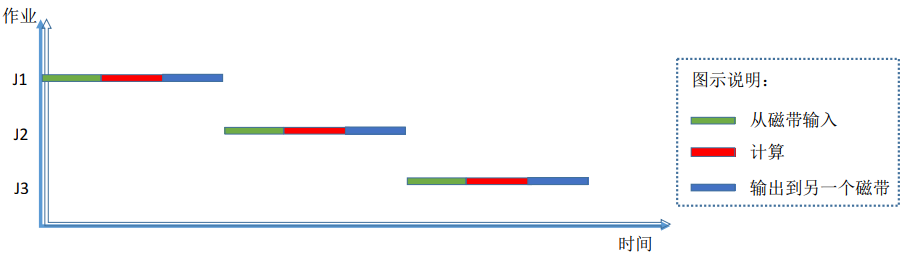
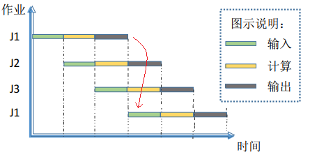

# 2.3 进程同步

## 目录

1. 进程同步的基本概念
2. 实现临界区互斥的基本方法
3. 信号量
4. 管程
5. 经典同步问题

## 进程同步的基本概念

在认识进程同步之前，先回顾一下操作系统的发展历程。

最初的批处理系统采用单道方式，串行的依次执行每个进程。单道方式虽然效率低下，但是其进程的执行过程是最为安全的，不会产生相互干扰。这种头尾连续的执行模式，便是我们所说的同步方式。

随着多道批处理方式的出现，我们的操作系统诞生了，其采用流水线的处理方式，并发的执行每个进程。之后出现的分时操作系统，更是引入时间片机制，我们的作业被分成一个个小小的时间片，在不同的时刻，以流水线方式并发的执行。这种走走停停的执行模式，便是我们所说的异步方式。

总而言之，同步和异步可以简单的理解成一步和多步。一个进程是一步执行完成，还是分多步执行完成，取决于采用同步方式还是异步方式。

那么异步会带来什么问题呢？

假设我们有一个正在执行的打印机程序，它采用流水线方式以时间片为间隔分多步执行（J1在第1和第4时刻都在执行），那么如果其中间出现的进程也是用的打印机（J2、J3都将使用打印机），这种异步就会导致临界资源发生冲突（打印机乱了）。所以为了避免这种问题的发生，我们需要对这种访问临界资源的进程进行同步。

同步的本质是要让一段进程连续的访问临界资源。我们可以通过临界区互斥的方式，阻塞中间使用临界资源的其他进程，从而实现进程同步，之后等临界资源访问完毕，再释放中间的进程。期间处理器依旧可以并发的执行其他不占用临界资源的进程。

何为临界资源？

举个例子，打印机是最标准的临界资源，但是显示器不是。区别临界资源和其他资源最好的办法，便是看一段时间内，该资源是否可以被进程交替访问。注意这里是一段时间内，因为本质上计算机中所有的资源都是共享资源，需要被同一进程连续访问的资源才是临界资源。

## 实现临界区互斥的基本方法

