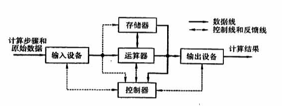
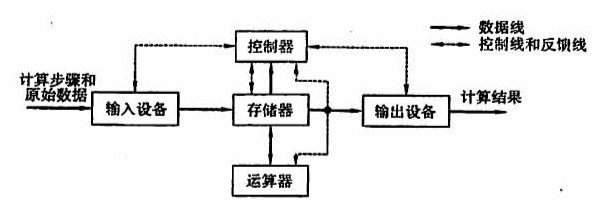
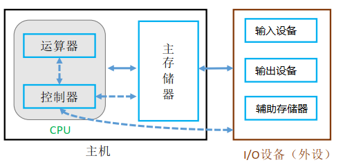
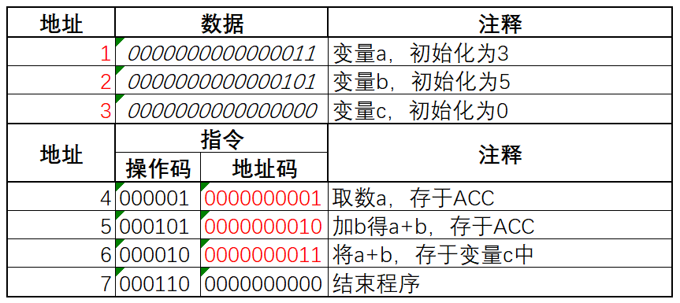
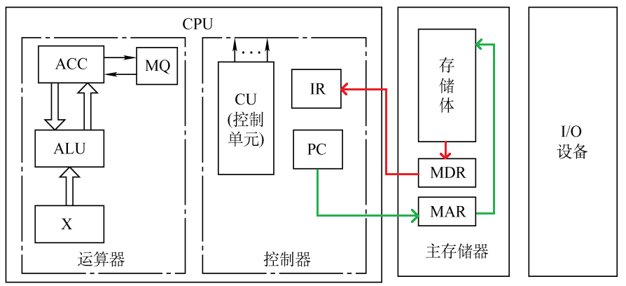
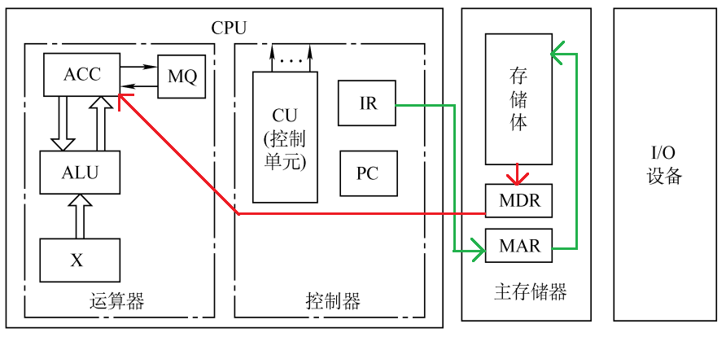
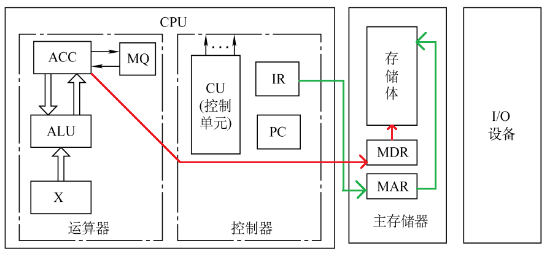

## 1.1 计算机系统层次结构

### 目录

1. 硬件的发展
2. 计算机的功能部件
4. 计算机的工作过程
4. 三种级别的语言


### 硬件的发展

| 发展阶段 | 时间      | 逻辑元件                 | 速度(次/秒) | 内存         | 外存               |
| -------- | --------- | ------------------------ | ----------- | ------------ | ------------------ |
| 第一代   | 1946~1957 | 电子管                   | 上千        | 磁鼓         | 纸带               |
| 第二代   | 1958~1964 | 晶体管                   | 上万        | 磁芯存储器   | 磁带               |
| 第三代   | 1964~1971 | 中小规模集成电路         | 上十万      | 半导体存储器 | 磁盘               |
| 第四代   | 1972~现在 | 大规模、超大规模集成电路 | 上千万      | 半导体存储器 | 光盘、半导体存储器 |


早期的冯诺依曼机：

* 以运算器为中心
* 提出了“存储程序”的概念，将指令和数据以同等地位存放在存储器内，并从首地址开始，逐条执行程序指令



现代计算机的结构：

* 以存储器为中心
* 运算器和控制器结合构成CPU



### 计算机的功能部件

功能部件主要包括：输入/输出设备、存储器、运算器、控制器



#### 输入设备

将信息转换成机器能识别的形式

#### 输出设备

将结构转换成人们所能接受的形式，或其他系统所要求的形式

#### 主存储器

存储体：用于存放数据和指令，每个地址对应一个存储单元

MAR（地址寄存器）：用于寻址，其位数对应存储单元的个数

MDR（数据寄存器）：用于存数，其位数和存储字长相等


**例子：**已知，MAR为4位，MDR为16位，求存储空间的大小

存储空间的大小=$2^4 * 16 / 8$


#### 运算器：

| 寄存器            | 加         | 减         | 乘             | 除           |
| ----------------- | ---------- | ---------- | -------------- | ------------ |
| ACC（累加器）     | 被加数、和 | 被减数、差 | 乘积高位       | 被除数、余数 |
| MQ（乘商寄存器）  |            |            | 乘数、乘积低位 | 商           |
| X（操作数寄存器） | 加数       | 减数       | 被乘数         | 除数         |

ALU（算术逻辑单元）：通过内部复杂的电路实现逻辑运算、算术运算


#### 控制器

CU（控制单元）：分析指令，给出控制信号

IR（指令寄存器）：存放当前执行的指令

PC（程序计数器）：存放下一条指令地址，自动加1


### 计算机的工作过程

计算机的工作过程可以分为以下几个步骤：

1. 把程序和数据装入主存储器
2. 从程序的起始地址运行程序
3. 取指令、分析指令、执行指令
4. 重复第3步，至程序结束


#### 装入主存

编写好如下C程序：

```c
int a = 3, b = 5, c = 0;
void main() {
    c = a + b;
}
```

将上述程序编译后，装入主存。其中主存的指令部分，存放 c = a + b 的机器码；主存的数据部分，分配变量空间，并存放初始值。




#### 取指令

在程序的执行过程中，所有的取指令过程均相同，其流程如下：

$(PC) \rightarrow MAR$

$M(MAR) \rightarrow MDR$

$(MDR) \rightarrow IR$

$(PC) + 1 \rightarrow PC$




#### 分析指令

在程序的执行过程中，所有分析指令的过程也是相同的

$OP(IR) \rightarrow CU$


#### 执行指令

根据分析指令产生的控制信号，不同指令的执行步骤不同

* 取数指令的执行流程：

  $AD(IR) \rightarrow MAR$

  $M(MAR) \rightarrow MDR$

  $(MDR) \rightarrow ACC$




* 加法指令的执行流程

  $AD(IR) \rightarrow MAR$

  $M(MAR) \rightarrow MDR$

  $(MDR) \rightarrow X$

  $(ACC) + (X) \rightarrow ACC$

  

  

* 存数指令的执行流程

  $AD(IR) \rightarrow MAR$

  $(ACC) \rightarrow MDR$

  $(MDR) \rightarrow M$

  


* 结束指令的执行流程

  分析指令产生控制信号，结束程序


### 三种级别的语言

编译程序（静态翻译）：

* 高级语言源程序 -> 汇编程序

* 高级语言源程序-> 机器语言程序

汇编程序（静态翻译）：

* 汇编程序 -> 机器语言程序

解释程序（动态翻译）：

* 高级语言源程序 -> 机器语言程序

