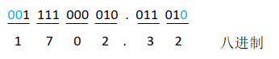
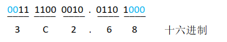
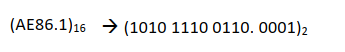
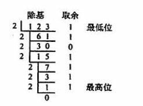
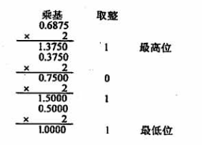

# 2.1 数制与编码

## 目录

1. 二进制与八进制
2. 二进制与十六进制
3. 任意进制转十进制
4. 十进制转任意进制
5. 真值和机器数

## 二进制与八进制

* 二进制转八进制：3位一组，每组转换成对应的八进制符号

* 八进制转二进制：每位八进制符号，展开成3位二进制符号

## 二进制与十六进制

* 二进制转十六进制：4位一组，每组转换成对应的十六进制符号

* 十六进制转二进制：每位十六进制符号，展开成4位二进制符号

## 任意进制转十进制

将任意进制数的各位数码，与它们的基数相乘，并进行累计，可得十进制数

* 十进制计数：$975.36 = 9*10^2 + 7*10^1 + 5*10^0 + 3*10^{-1} + 6*10^{-2}$

* 二进制计数：$101.01 = 1*2^2 + 0*2^1 + 1*2^0 + 0*2^{-1} + 1*2^{-2}$

* 八进制计数：$654.32 = 6*8^2 + 5*8^1 + 4*8^0 + 3*8^{-1} + 2*8^{-2}$

* 十六进制计数：$AE86.1 = 10*16^3 + 14*16^2 + 8*16^1 + 6*16^0 + 1*16^{-1}$

## 十进制转任意进制

例子：将十进制数123.6875装换成二进制数

* 整数部分：除基取余法

* 小数部分：乘基取整法

可得整数部分$123 = (1111011)_2$，小数部分$0.6875 = (0.1011)_2$，所以$123.6875 = (1111011.1011)_2$

除了上述方法，十进制转任意进制可以使用拼凑法快速得出。

例子：将十进制数10.625转换成二进制数

* 整数部分：$10 = 8 + 2 = 2^3 + 2^1$

* 小数部分：$0.625 = 0.5 + 0.125 = 2^{-1} + 2^{-3}$

可得$10.625 = (1010.101)$

## 真值和机器数

真值是符合人类习惯的数字，而机器数是数字实际存到机器里的形式，机器数需要注意正负号的数字化。

$[+8]_{原码} = 0\ 1000$

$[-8]_{原码} = 1\ 1000$

