## 2.2 定点数的表示和运算

定点数的小数点位置固定，浮点数的小数点位置不固定

### 目录

1. 定点数的表示
2. 有符号整数的表示
3. 有符号小数的表示
4. 机器数的对应真值
5. 强制类型转换
6. 数据的存储和排列


### 定点数的表示

* 无符号数的表示：整个机器字长的全部二进制位均为数值位，没有符号位

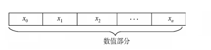

* 有符号数的表示
  * 定点整数的表示：原码、反码、补码、移码
  * 定点小数的表示：原码、反码、补码

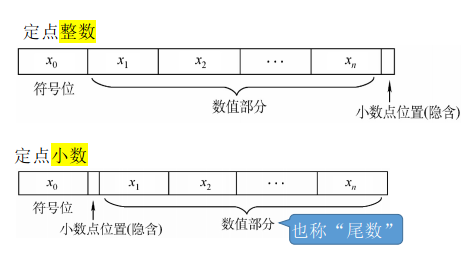

### 有符号整数的表示

* 原码：用尾数表示真值的绝对值，符号位“0/1”对应“正负”
* 反码：若符号位为0，则反码与原码相同；若符号位为1，则数值位全部取反
* 补码：若符号位为0，则补码与原码相同；若符号位为1，则数值位全部取反，末尾加1
* 移码：在补码的基础上，将符号位取反

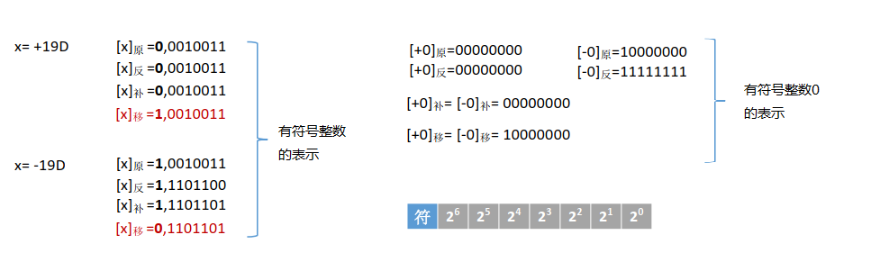


### 有符号小数的表示

* 原码：用尾数表示真值的绝对值，符号位“0/1”对应“正负”
* 反码：若符号位为0，则反码与原码相同；若符号位为1，则数值位全部取反
* 补码：若符号位为0，则补码与原码相同；若符号位为1，则数值位全部取反，末尾加1


### 机器数的对应真值

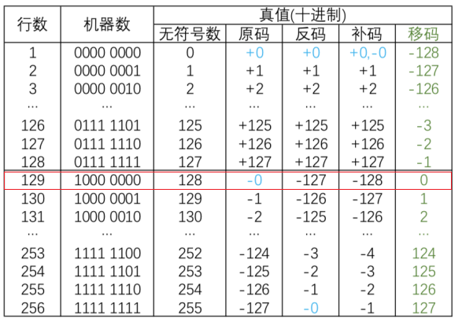

### 强制类型转换

C语言中的有符号整数默认采用**补码**存储

* 有符号转无符号：机器码保持一致，只是改变了解释方式

```c
int main() {
    short x = -4321;
    unsigned short y = (unsigned short)x;
    printf("x=%d, y=%u\n", x, y); //x=-4321, y=61215
}
```

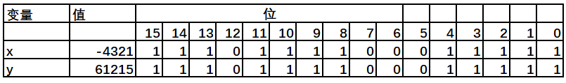


* 无符号转有符号：机器码保持一致，只是改变了解释方式

```c
int main() {
    unsigned short x = 65535;
    short y = (short)x;
    printf("x=%u, y=%d\n", x, y); //x=65535, y=-1
}
```

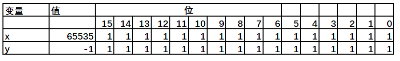


* 长整数转短整数：保留低位机器码

```c
int main() {
    int x=165537, u=-34991;
    short y=(short)x, v=(short)u;
    printf("x=%d, y=%u\n", x, y); //x=165537, y=-31071
    printf("u=%d, v=%u\n", u, v); //u=-34991, v=30545
}
```

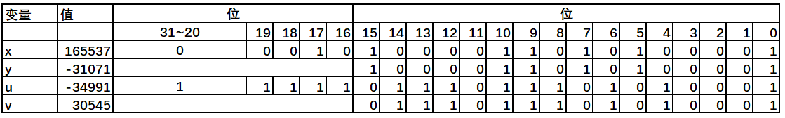


* 短整数转长整数：真值保持一直

```c
int main() {
    short x=-4321;
    int y=x;
    unsigned short u=(unsigned short) x;
    unsigned int v = u;
    printf("x=%d, y=%d\n", x, y); //x=-4321, y=-4321
    printf("u=%u, v=%u\n", u, v); //u=61215, v=61215
}
```

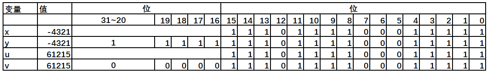


### 数据的存储和排列

#### 大小端模式

int x = 01 23 45 67H

* 大端存储：直观

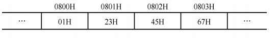

* 小端存储：便于机器运算

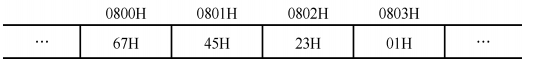


#### 边界对齐

* 对齐：存储步长==存储字长

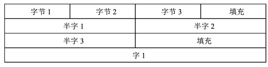

* 不对齐：存储步长!=存储字长

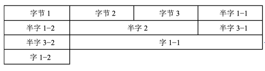