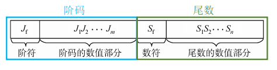
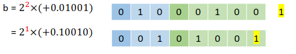
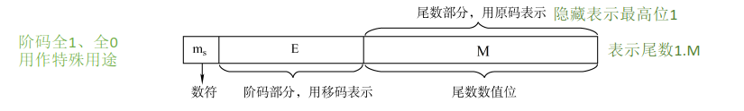
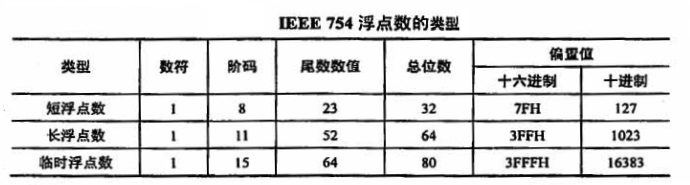

# 2.3 浮点数的表示和运算

定点数可表示的数字范围有限，如何在位数不变的情况下增加数据的表示范围

## 目录

1. 浮点数的表示
2. 浮点数的规格化
3. IEEE 745标准
4. 浮点数的加减运算
5. 强制类型转换

## 浮点数的表示

浮点数的表示是指，将真值转换为机器码。其中E为阶码的真值，通常用补码表示，在IEEE 754标准下，用移码表示；M为尾数的真值，通常用补码表示，在IEEE 745标准下，使用原码表示。

* 浮点数的真值：$N = r^E * M$

* 浮点数的机器码：

**例子**：$[a]_{机器码} = 0,01;1.1001$，$[b]_{机器码} = 0,10;0.01001$，阶码、尾数均用补码表示，求a、b的真值

**解答**：

$[a_E]_原 = 0,01$

$[a_M]_原 = 1.0111$

可得$a_E = 1$，$a_M = (-0.0111)_2$，于是$a = 2^1 * (-0.0111)_2$

$[b_E]_原 = 0,10$

$[b_M]_原 = 0.01001$

可得$b_E = 2$，$b_M = (0.01001)_2$，于是$b = 2^2 * (0.01001)_2$

## 浮点数的规格化

浮点数的规格化要求，尾数的最高位为有效值

* 左规：如果尾数的最高位无效，则算术左移一位，阶码减1
* 右规：如果尾数出现溢出，则算术右移一位，阶码加1

注意：左规容易导致阶码下溢，右规导致阶码上溢

**例子**：$[b]_{机器码} = 0,10;0.01001$，对b进行左规，避免精度丢失

## IEEE 754标准

* 浮点数的真值：$N = r^E * M$

* 浮点数的机器码：

* 机器码的常见类型：

**例子：**$[a]_{机器码} = C0\ A0\ 00\ 00\ H$，单精度浮点数采用IEEE 754标准，求a的真值

**解答：**

$[a]_{机器码} = C0\ A0\ 00\ 00\ H = 1100,0000,1010,0000,0000,0000,0000,0000$

$[a_E]_移 = 1000,0001$ 可得 $a_E = [a_E]_移 - 偏置值 = 1000,0001 - 0111,1111 = (0000,0010)_2 = 2$ 

$[a_W]_原 = 11.01,0000...,0000$ 可得 $a_W = (-1.01)_2$

于是 $a = r^E * 1.M = 2^2 * (-1.01)_2$

## 浮点数的加减运算

**例子：**$a = 9.851 * 10^3，b= 2.111 * 10^2$，假设浮点数格式：阶码2位、尾数4位，要求计算a+b的结果c

**解答：**

* 对阶：$a = 9.851 * 10^3，b = 0.2111 * 10^3$
* 尾数加减：$c = 10.0621 * 10^3$
* 规格化：$c = 1.00621 * 10^4$
* 舍入：$c = 1.0062 * 10^4$
* 判溢出：$4 = (100)_2$，阶码出现上溢

## 强制类型转换

转换过程中没有精度损失：

* char -> int -> long -> double

* float -> double

转换过程中存在精度损失：

* int -> float
* float -> int

