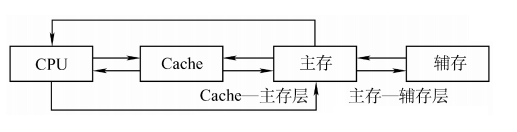
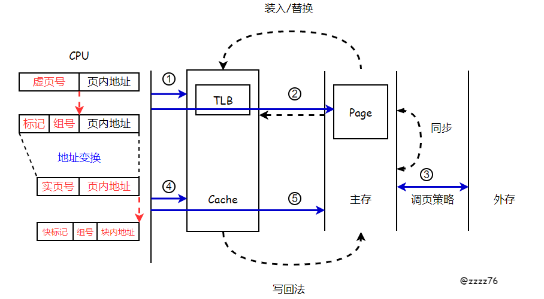
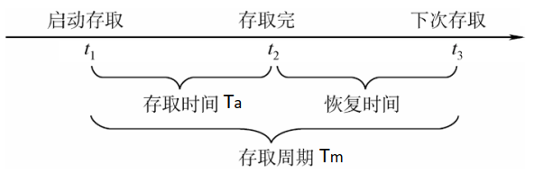

## 3.1 存储器的层次结构

### 目录

1. 存储系统的功能部件
2. 存储系统的工作过程
3. 存储器的分类
4. 存储器的性能指标

### 存储系统的功能部件

功能部件主要包括四个部分：中央处理器CPU、高速缓冲处理器cache、主存储器、辅存存储器

* 主存：用来存放正在执行的程序段和数据
* cache：位于主存和CPU之间，解决了主存与CPU速度不匹配的问题
* 辅存：用来存放当前暂时不用的程序和数据，实现了虚拟存储系统，解决了主存容量不够用的问题

### 存储系统的工作过程

由于CPU和IO的速度不匹配，计算机约定不直接从外存中，而是间接从内存中拿数据。因此，在访问存储系统的过程中，计算机需要将外存中的数据映射到相应的内存地址上，供CPU快速访问。

其中，页表起到了记录映射的作用，可以判定外存中的数据是否映射到了相应的内存地址上。若页表未命中，说明所需页面未调入主存，需要执行调页策略；若页表命中，说明所需页面已经映射到了相应的内存地址上，接下来进行地址的变换，访问主存并获取数据。

存储系统的工作工程可以分为5个部分：①TLB的访问过程，②Page的访问过程，③页面的分配和置换，④cache的访问过程，⑤主存储器的访问过程

对以上过程思考两个问题：

* 数据页调入主存后，如何在主存中定位目标页
* 数据块装入Cache后，如何在Cache中定位目标块

提示：从map和数组不同的缓存策略进行思考

### 存储器的分类

| 存储器   | 存储介质 | 存取方式        | 可更改性  | 可保存性 | 读取破坏 |
| -------- | -------- | --------------- | --------- | -------- | -------- |
| cache    | 半导体   | 按内容访问(CAM) | 可读可写  | 易失     | 非破坏   |
| 主存储器 | 半导体   | 随机存取(RAM)   | 可读可写  | 易失     | 破坏     |
| 磁盘     | 磁性材料 | 直接存取(DAM)   | 可读可写  | 非易失   | 非破坏   |
| 磁带     | 磁性材料 | 顺序存取(SAM)   | 可读可写  | 非易失   | 非破坏   |
| 光盘     | 光介质   |                 | 只读(ROM) | 非易失   | 非破坏   |

### 存储器的性能指标

主要性能指标：

| 指标               | 计算公式            |
| ------------------ | ------------------- |
| 存储容量           | 存储字数*存储字长   |
| 单位成本           | 总成本/总容量       |
| 存储速度(主存带宽) | 数据的宽度/存储周期 |

存取周期：

