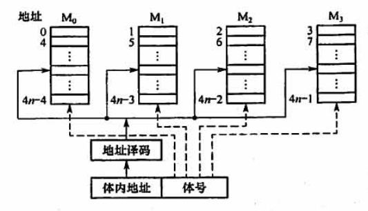

# 3.2 半导体随机存储器

## 目录

1. RAM的基本结构
2. DRAM的地址线复用技术
3. SRAM vs DRAM
4. RAM的容量扩展
5. RAM的速度扩展

## RAM的基本结构

不同类型的半导体芯片的基本结构相同，只是构成存储单元的存储元不一样。

**例子：**

假设当前地址线、片选线共8位，数据线为8位，那么译码器翻译出来的选通线有2^8根，对应2^8个存储单元，其中每个存储单元的字长为8bit。

## DRAM的地址线复用技术

**例子：**假设当前地址线、片选线共8位，对应2^8个存储单元，全部的存储单元排列成16*16的行列矩阵。

由于原地址被拆分成了行列地址，所以对应的行地址选通线有2^4根，列地址选通线有2^4根，总共的选通线由原来的256根减少到了32根。

所谓地址线复用技术，就是将行、列地址分两次送，可以使得地址线更少，芯片引脚更少

## SRAM VS DRAM

## RAM的容量扩展

### 1. 位扩展法

扩展存储单元的位数：将多个存储芯片的地址线、片选线和读写控制线相应并联，数据线分别引出。

**例子：**

假设当前地址线为$13$位，数据线为$8$位，每个存储芯片为$8K*1$位，如何得到一个$8K*8$位的存储器？

**回答:**

$13$位的地址线可以对应$8K$个存储单元，在只接入一个存储芯片的情况下，每个存储单元为$1bit$；如果将$8$个存储芯片并联接入，即可以将存储单元扩展为$8$位，进而得到$8K*8$位的存储器

### 2. 字扩展法

扩展存储单元的个数：将多个存储芯片的地址线、数据线、读写控制线相应并联，由片选线来区分不同的芯片。

### 3. 字位扩展法

扩展存储单元的位数和个数：将多个存储芯片的地址线、读写控制线相应并联，由片选线来区分不同的芯片组，芯片组内数据线分别引出，芯片组间数据线并联。

## RAM的速度扩展

如果cache访问未命中，则需要访问主存。而在访问主存的过程中cpu的传输周期比存储器的存储周期小，为了提高访问速度，存储系统通常采用技术如下：

### 1. 双端口RAM

允许两个独立的控制器，同时异步的访问存储单元。需要注意的是，当两个端口同时存取同一地址单元时，可能会产生冲突。

### 2. 单体多字存储器

利用局部性原理，每次并行读出m个连续的字，要求地址必须顺序排列，并处于同一个存储单元。

**例子：**

假设在一个存储周期内，单体多字存储器并行取出m条指令，然后逐条将指令送至CPU执行。

上述过程等价于，每隔1/m个存取周期，CPU向主存取一条指令，这显然提高了存储器的带宽。

### 3. 多体并行存储器

多体并行存储器由多体模块组成，每个模块都可由RAM芯片经过扩容而成

* 高位顺序编址：高位地址为体号

* 低位交叉编址：低位地址为体号

**注意：**

多体并行存储器采用低位交叉编址后，可以在不改变每个模块存取周期的前提下，采用流水线的方式存取，提高存储器的带宽。

**例子：**

设存储周期T=200ns，总线传输周期r=50ns，则连续读出4个字的时间为$t = T + 3 * r$

