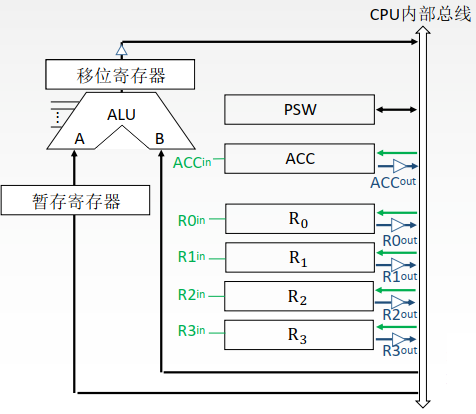
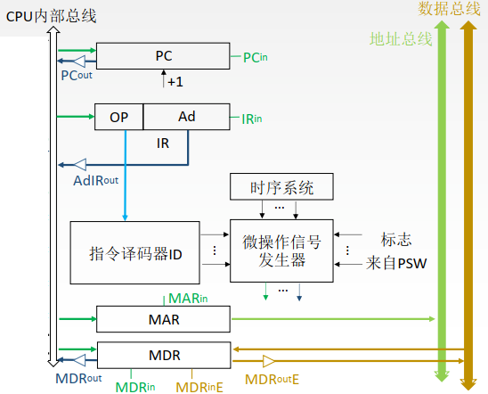
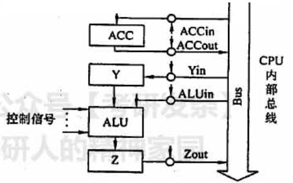

## 4.1 CPU的基本结构

### 目录

1. CPU的功能
2. 运算器的基本结构
3. 控制器的基本结构
4. 数据通路的基本结构

### CPU的功能

* 指令控制：完成取指令、分析指令和执行指令的操作，即程序的顺序控制
* 操作控制：把各种操作信号送往相应的部件，要求部件按照指令进行动作
* 时间控制：按照时间顺序，发出控制信号
* 数据加工：对数据进行算术和逻辑运算
* 中断处理：对运行过程中的异常情况进行处理

### 运算器的基本结构

* 算术逻辑单元ALU：进行算术和逻辑运算
* 通用寄存器组：用于存放操作数
* 暂存寄存器：用于暂存从主存读取的数据
* 累加寄存器ACC：用于存放ALU运算结果，属于通用寄存器
* 程序状态字寄存器PSW：保留各种状态信息
* 移位器：对运算结果进行移位运算

### 控制器的基本结构

* 程序计数器PC：指出下一条指令在主存中的存放地址
* 指令寄存器IR：用于保存当前正在执行的指令
* 指令译码器：仅对操作码字段进行译码
* 时序系统：由CLK分频得到，用于产生各种时序信号
* 微操作信号发生器CU：根据时序信号，产生各种控制信号
* 存储器地址寄存器MAR：存放所要访问的存储单元地址
* 存储器数据寄存器MDR：存放向主存写入的信息或从主存读出的信息

### 数据通路的基本结构

数据通路是指，数据在功能部件之间传送的路径，数据通路的基本结构主要有三种：CPU内部单总线方式、CPU内部多总线方式、专用数据通路方式。

以下着重介绍CPU内部单总线方式

**a) 寄存器之间数据传送**

例如：把PC内容送至MAR

$(PC) \rightarrow Bus$				PCout 有效，PC 内容送总线

$Bus \rightarrow MAR$				MARin 有效，总线内容送 MAR

**b) 主存与CPU之间的数据传送**

例如：CPU从主存读取指令

$(PC) \rightarrow Bus \rightarrow MAR$		PCout 和 MARin 有效，现行指令地址送入MAR

$1 \rightarrow R$										CU 发出读命令

$MEM(MAR) \rightarrow MDR$		MDRinE 有效

$MDR \rightarrow Bus \rightarrow IR$				MDRout 和 IRin 有效，现行指令送入IR

**c) 执行算术或逻辑运算**

例如：CPU执行一条加法指令

$Ad(IR) \rightarrow Bus \rightarrow MAR$		MDRout 和 MARin 有效

$1 \rightarrow R$											CU 发出读命令

$MEM(MAR) \rightarrow MDR$			MDRinE 有效

$MDR \rightarrow Bus \rightarrow Y$					MDRout 和 Yin 有效，操作数送入Y

$(ACC) + (Y) \rightarrow Z$					ACCout 和 ALUin 有效，CU 向 ALU 发加命令，结果送入Z

$Z \rightarrow ACC$									Zout 和 ACCin 有效，结果送入ACC

