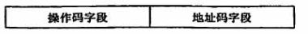
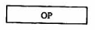
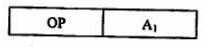
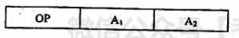
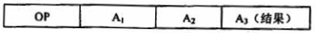
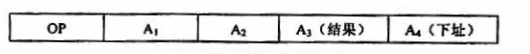
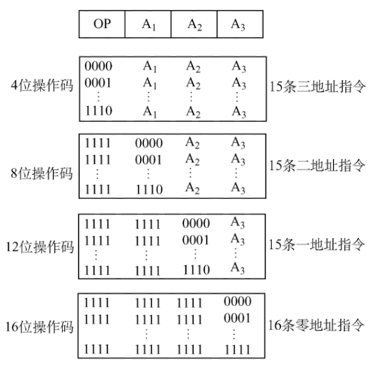

## 4.2 指令格式

在指令周期的取指阶段，能够获取哪些格式的指令

### 目录

1. 指令的基本格式
2. 定长操作码指令格式
3. 扩展操作码指令格式

### 指令的基本格式

机器指令，是指计算机执行某种操作的命令，是计算机运行的最小功能单位。一台计算机所有指令的集合，构成该机的指令系统，也称为指令集。

一条指令通常包括操作码字段和地址码字段两部分：

一条指令可能包括多个地址码，根据地址码数目的不同，将指令分为以下几种格式：

#### a) 零地址指令

只给出操作码OP，没有显示地址

* 不需要操作数的指令，如停机指令、关中断指令
* 用于堆栈计算机中的零地址运算类指令：如 push, pop

#### b) 一地址指令

给出操作码，仅有一个显示地址

* 只有目的操作数的单操作数指令：$OP(A_1) \rightarrow A_1$

* 隐含约定目的地址的双操作数指令：$(ACC) OP (A_1) \rightarrow ACC$

#### c) 二地址指令

* 有目的操作数和源操作数的双操作数指令：$(A_1) OP (A_2) \rightarrow A_1$

#### d) 三地址指令

* 指令含义：$(A_1) OP (A_2) \rightarrow A_3$

#### e) 四地址指令

* 指令含义：$(A_1) OP (A_2) \rightarrow A_3，A_4 = 下一条要执行指令的地址$

### 定长操作码指令格式

指令系统中，所有指令的操作码长度都相同，一般n位操作码字段的指令系统，最大能表示 $2^n$ 条指令

### 扩展操作码指令格式

指令系统中，所有指令的操作码位数不固定，但指令字长度固定

**例子：**

指令字长为16位，每个地址码占4位

在设计扩展操作码指令格式时，必须注意两点：

* 不允许短操作码是长操作码的前缀 

* 各指令的操作码不能重复