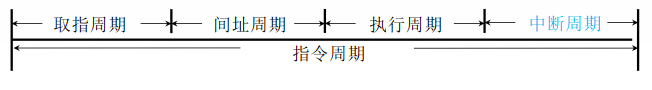
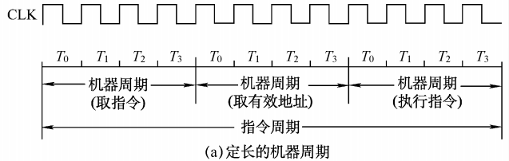
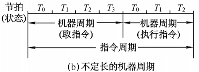
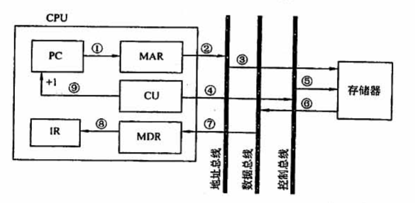
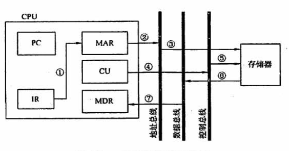
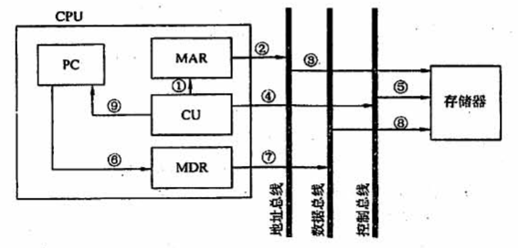

# 4.4 指令执行过程

## 目录

1. 指令周期
2. 指令周期的数据流
3. 指令执行方案

## 指令周期

指令周期是指，CPU从主存中取出并执行一条指令所需要的全部时间。指令周期包括四种工作周期，都有CPU访存操作：取址周期取指令、间址周期取有效地址、执行周期取操作数、中断周期保存程序断点。

指令周期由若干机器周期表示，机器周期由若干时钟周期表示。每个指令周期内机器周期数可以不等，每个机器周期内的节拍数也可以不等。

## 指令周期的数据流

不同阶段要求依次访问的数据序列

### a) 取指周期

取指周期的任务是，根据PC中的内容，从主存中取出指令代码并存放在IR中。

### b) 间址周期

间址周期的任务是获取操作数的有效地址EA。

### c) 执行周期：

执行周期的任务是，根据IR中指令字的操作码和操作数，通过ALU产生执行结果。

### d) 中断周期：

中断周期的任务是处理中断请求，先将程序断点存入主存，再将PC指向中断服务程序的入口地址。

## 指令执行方案

如何安排多条指令的执行

* 单指令周期：所有指令都采用相同的指令周期，指令之间串行执行。
* 多指令周期：不同指令采用不同的指令周期，指令之间串行执行。
* 流水线方案：隔一段时间启动一条指令，指令之间并行执行。
