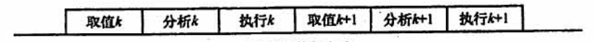
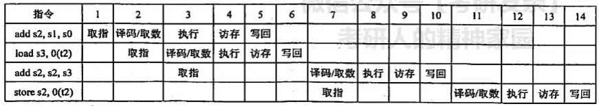
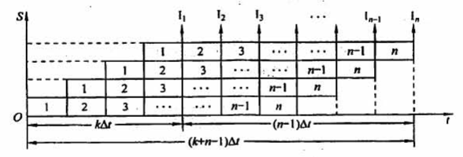
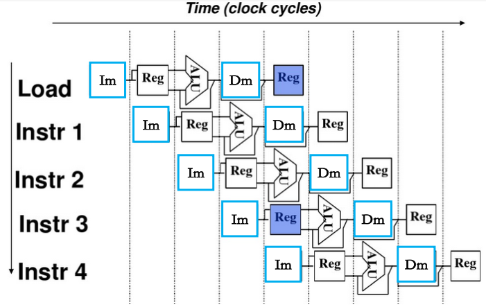
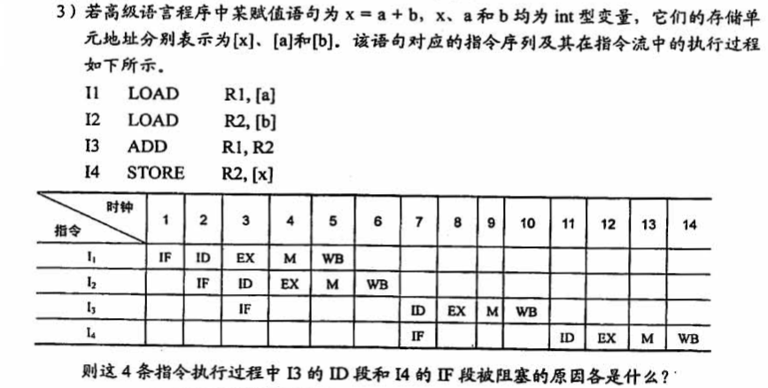

## 4.5 指令流水线

### 目录

1. 流水线的概念
2. 流水线的表示
3. 流水线的性能指标
4. 影响流水线的因素

### 一、流水线的概念

通常把一条指令的执行过程划分为取指、分析、执行3个阶段，假设每个阶段的时间都相等，当多条指令在处理器中执行时，可以采用以下两种方式

* 顺序执行方式

* 流水线执行方式

即指令流水线把一个重复的过程分为若干子过程，每个子过程与其他子过程并行执行。为了获得更高的执行速度，还可以将流水段进一步细分。

### 二、流水线的表示

* 指令流程图：主要用于分析影响流水线的因素

* 时空图：主要用于分析流水线的性能

### 三、流水线的性能指标

**a) 吞吐率**

吞吐率是指，在单位时间内流水线所完成的任务数量，即$TP = n / T_k$

当流水线段数为k，时钟周期为t时，$T_k = (k + n - 1) * t$

**b) 加速比**

加速比是指，顺序执行与流水线执行的时间比率，即$S = T_0 / T_k$

当顺序执行n个任务时，所需的时间为 $T_0 = k*n$

**c) 效率**

效率是指，流水线的设备利用率，即$E = T_0 / (k*T_k)$

在流水线的启动和结束阶段，部分功能部件被闲置，存在利用率上的损失

### 四、影响流水线的因素

流水线中存在一些相关的情况，使得下一条指令无法在设计的时钟周期内执行。为了分析影响流水线的因素，我们将流水线分为5段，取指令(IF)、译码/读寄存器(ID)、执行/计算有效地址(EX)、访问存储器(M)、结果写回寄存器(WB)

**a) 结构相关（资源冲突）**

由多条指令在同一时刻争用同一资源而形成的冲突称为数据相关

解决办法：

1. 后一条相关指令暂停一指令周期
2. 分别配置数据存储器和指令存储器

**b) 数据相关（数据冲突）**

数据相关是指，在一个程序中，存在必须等前一条指令执行完才能执行后一条指令的情况

例题：

解决办法：

1. 后一条相关指令暂停几个时钟周期
2. 数据旁路技术
3. 通过编译优化，调整指令顺序

**c) 控制相关（控制冲突）**

当流水线遇到转移指令和其他改变PC值的指令而造成断流时，会引起控制相关

