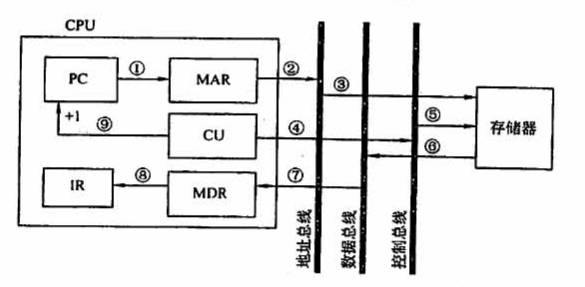

# 5.2 总线操作和定时

## 目录

1. 总线传输的阶段
2. 同步定时方式
3. 异步定时方式

## 总线传输的阶段

* 申请分配阶段：决定哪个主控设备使用总线
* 寻址阶段：主控设备送出要访问的主存或设备的地址，同时送出有关命令（读或写），启动从设备
* 传输阶段：主、从设备间进行数据交换
* 结束阶段：有关信息在总线上撤销，让出总线使用权

以取指周期为例，根据PC中的内容，从主存中取出指令代码并存放在IR中。

## 总线通信方式

解决主、从设备如何获知传输开始和传输结束，以及通信双方如何协调进行数据通信

**a) 同步定时方式**

在一个总线周期中，发送方和接收方可以完成一次数据传送，该过程由统一的时钟信号控制。

例如，在处理器-主存总线上执行存储器读操作，其协议为：在第1个时钟周期发送地址和存储器读命令，然后存储器被要求在第5个时钟将数据放到总线上。

**b) 异步定时方式**

在一个总线周期中，发送方和接收方可以完成一次数据传送，该过程采用应答方式，可以进行有效性检验。

例如，使用三条控制线和一条数据地址公共线进行总线传输

* 在请求阶段1，处理器发送地址和存储器读命令，然后在回答阶段1，存储器表示已收到请求信号

* 在请求阶段2，存储器发送数据和就绪信号，然后在回答阶段2，处理器表示已收到请求信号

根据“请求”和“回答”信号的撤销是否互锁，异步定时方式又分为以下三种类型

* 不互锁方式：主设备发出请求信号，自动撤销；从设备接收到请求信号后，发出回答信号，自动撤销
* 半互锁方式：主设备发出请求信号，收到回答才撤销；从设备接收到请求信号后，发出回答信号，自动撤销
* 全互锁方式：主设备发出请求信号，收到回答才撤销；从设备接收到请求信号后，发出回答信号，收到回答才撤销

