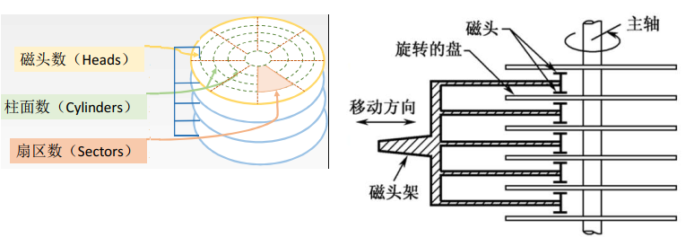
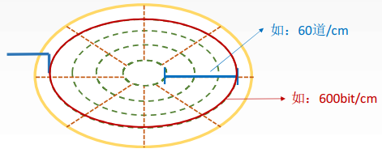
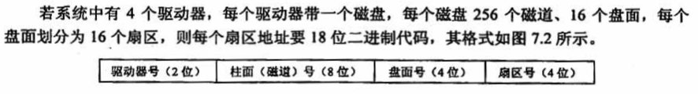
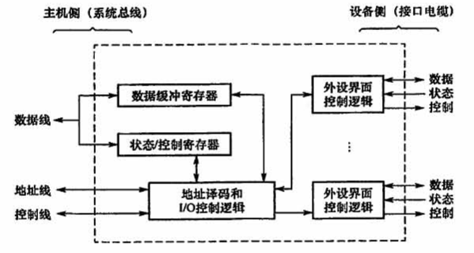
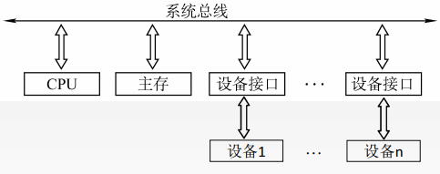
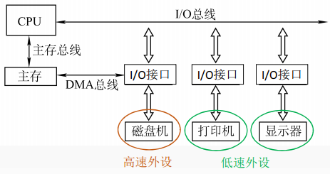

# 6.1 I/O系统概述

## 目录

1. I/O系统的定义
2. 外部设备
3. 磁盘存储器
4. I/O接口

## I/O系统的定义

输入/输出是以主机为中心而言的，将信息从外部设备传送到主机称为输入，反之称为输出。输入/输出系统解决的主要问题是对各种形式的信息进行输入和输出的控制。

## 外部设备

包括输入/输出设备，及通过输入/输出接口才能访问的外存储设备

* 输入设备：用于向计算机系统输入命令和文本、数据等信息的部件。键盘和鼠标是最基本的输入设备。
* 输出设备：用于将计算机系统中的信息输出到计算机外部进行显示、交换等的部件。显示器和打印机是最基本的输出设备。
* 外存设备：是指除计算机内存以及CPU缓存以外的存储器。硬盘、磁盘、光盘是最基本的外存设备。

## 磁盘存储器

**a) 磁盘设备的组成**

一块磁盘含有若干个记录面，每个记录面划分为若干条磁道，而每条磁道又划分为若干个扇区，扇区（也称块）是磁盘读写的最小单位，即磁盘按块存取

**b) 磁盘的性能指标**

* 磁盘容量：一个磁盘所能存储的字节总数

* 记录密度：盘片单位面积上记录的二进制的信息量，通常以道密度、位密度、面密度表示

* 平均存取时间：包括寻道时间、旋转延迟时间、传输时间
* 数据传输率：磁盘存储器在单位时间内向主机传送的字节数

**c) 磁盘地址**

## I/O接口

I/O接口又称为I/O控制器，在各个外设与主机进行数据传输时，为进行各种协调工作的逻辑部件

* 内部接口：内部接口与系统总线相连，只能为并行传输
* 外部接口：外部接口与外设电缆相连，可能为串行传输

IO端口是指接口电路中可以被CPU直接访问的寄存器。通常CPU能够对数据端口执行读写操作，对状态端口执行读操作，对控制端口执行写操作。I/O端口想要被CPU访问，必须要有端口地址。

* 统一编址：把I/O端口当做存储器的单元进行地址分配，使用统一访存指令

* 独立编址：I/O端口地址与存储器地址无关，需要设置专门的访问指令

