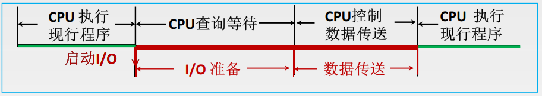
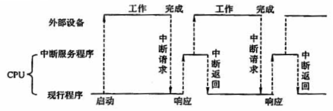
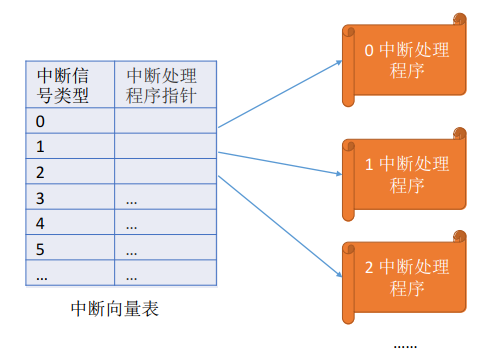

# I/O控制方式

主机与I/O设备之间的数据传送，可以采用不同的控制方式

## 目录

1. 程序查询方式
2. 程序中断方式

## 程序查询方式

信息交换的控制完全由主机执行程序实现。当主机进行I/O操作时，首先发出询问信号，读取设备的状态，并根据设备的状态决定下一步操作究竟是数据传送还是等待

## 程序中断方式

程序中断是指，在计算机执行现行程序的过程中，出现某些急需处理的异常情况或特殊请求，CPU暂时中止现行程序，而转去处理异常情况或特殊请求，在处理完毕后，CPU又自动返回到现行程序的断电处，继续执行原程序。

中断隐指令由硬件实现，其主要任务如下

* 关中断：开始原子操作
* 保存断点：保存原PC值
* 引出中断服务程序：更新PC

中断服务程序由软件实现，其主要任务如下

* 保护现场：保存通用寄存器和状态寄存器的内容
* 执行服务服务程序：比如将字符送入打印机的缓冲区中
* 恢复现场：恢复通用寄存器和状态寄存器的内容
* 开中断：结束原子操作
* 中断返回：还原PC

“中断”是操作系统内核夺回CPU使用权的唯一途经，广义的中断分为内中断和外中断。

内中断：信号来源于CPU内部，与当前执行的指令有关。应用程序主动或被动的将CPU控制权还给内核。

* 指令中断：系统调用时的访管指令
* 硬件故障：缺页
* 软件中断：整数除0

外中断：信号来源于CPU外部，与当前执行的指令无关。每一条指令执行结束时，CPU都会例行检查是否有外部中断信号。

* 时钟中断：时间片中断信号
* 外设请求：I/O中断请求
* 人工干预：用户终止进程

中断向量表：为不同的中断信号类型，提供相应的中断处理程序的地址。显然，中断处理程序一定是内核程序，需要运行在内核态。

