# 408组成原理考点

分章节整理2015-2020年的高频考点，以及对应的考研真题

## 考点框架

| 章节                 | 考点                     | 考频 | 小题 | 大题 |
| -------------------- | ------------------------ | ---- | ---- | ---- |
| 一、计算机系统概述   | 计算机系统的层次结构     | 常考 |      |      |
|                      | 计算机性能指标           | 常考 |      |      |
| 二、数据的表示和运算 | 数制与编码               |      |      |      |
|                      | 定点数的表示和运算       | 必考 |      |      |
|                      | 数据的存储方式           | 常考 |      |      |
|                      | 浮点数的表示和运算       | 必考 |      |      |
|                      | 各种精度数据的转换       |      |      |      |
|                      | 算术逻辑单元ALU          |      |      |      |
| 三、存储系统         | 存储器的分类             |      |      |      |
|                      | 存储器的层次化结构       |      |      |      |
|                      | 半导体随机存取存储器     | 常考 |      |      |
|                      | 主存储器与CPU的连接      |      |      |      |
|                      | 低位交叉存储器           |      |      |      |
|                      | 双口RAM和多模块存储器    |      |      |      |
|                      | 高速缓冲存储器(cache)    | 必考 |      |      |
|                      | 虚拟存储器               | 常考 |      |      |
| 四、指令系统         | 指令格式                 |      |      |      |
|                      | 指令的寻址方式           | 必考 |      |      |
|                      | CISC和RISC的基本概念     |      |      |      |
| 五、中央处理器       | CPU的功能和基本结构      |      |      |      |
|                      | 指令执行过程             |      |      |      |
|                      | 数据通路的功能和基本结构 |      |      |      |
|                      | 控制器的功能和工作原理   | 常考 |      |      |
|                      | 指令流水线               | 必考 |      |      |
| 六、总线             | 总线概述                 | 常考 |      |      |
|                      | 总线操作和定时           |      |      |      |
|                      | 总线标准(性能指标)       | 必考 |      |      |
| 七、输入/输出系统    | I/O系统基本概念          |      |      |      |
|                      | 外部设备(磁盘与RAID)     | 常考 |      |      |
|                      | I/O接口(控制器)          |      |      |      |
|                      | 程序查询方式             |      |      |      |
|                      | 程序中断方式             | 必考 |      |      |
|                      | DMA方式                  |      |      |      |

## 一、计算机系统概述

### 计算机系统的层次结构【常考】

2015：

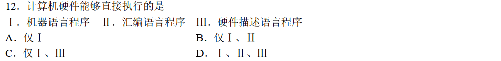

2016：

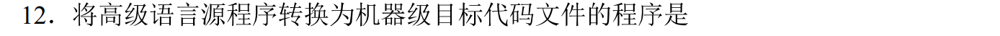

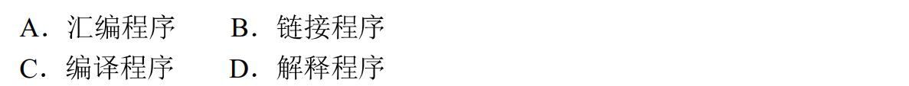

2018：

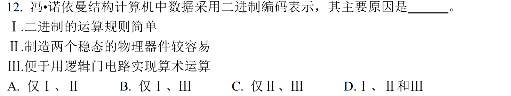

2019：

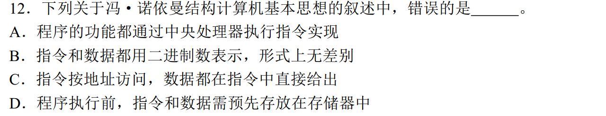

### 计算机性能指标【常考】

2017：

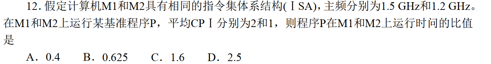

2020：

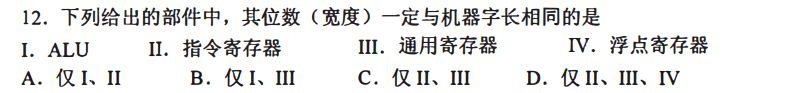

## 二、数据的表示和运算

### 数制与编码

### 定点数的表示和运算【必考】

2015：

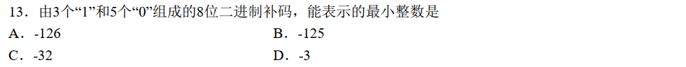

2018：

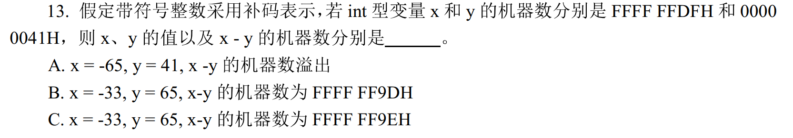

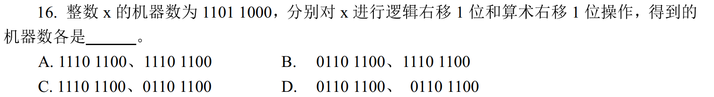

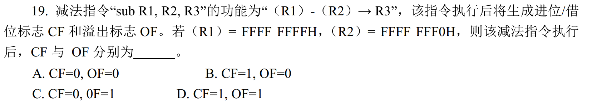

### 数据的存储方式【常考】

2016：

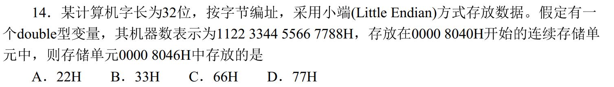

2018：

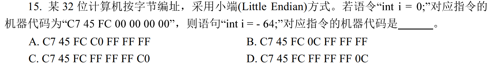

2019：

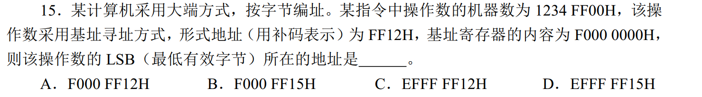

2020：

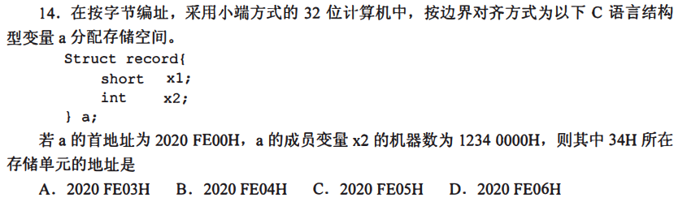

### 浮点数的表示和运算【必考】

2018：

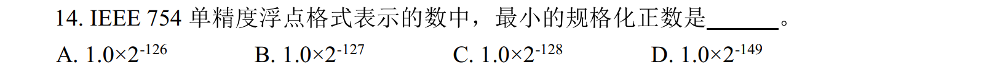

2020：

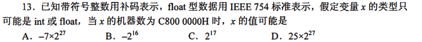

### 各种精度数据的转换

2016：

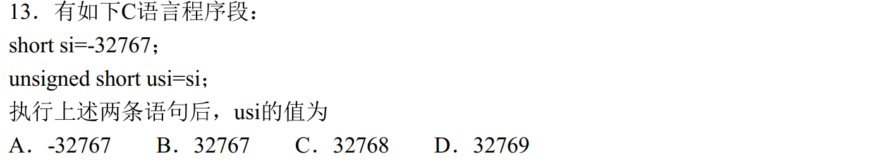

2019：

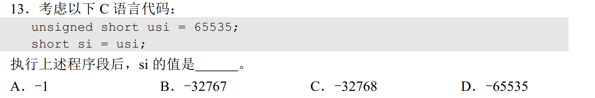

### 算术逻辑单元ALU

## 三、存储系统

### 存储器的分类

### 存储器的层次化结构

### 半导体随机存取存储器【常考】

2015：

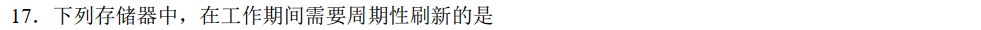

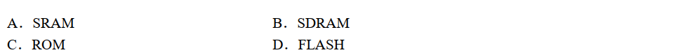

2018：

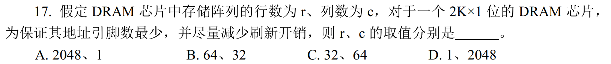

### 主存储器与CPU的连接

2016：

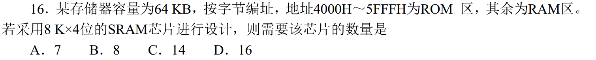

### 低位交叉存储器

2015：

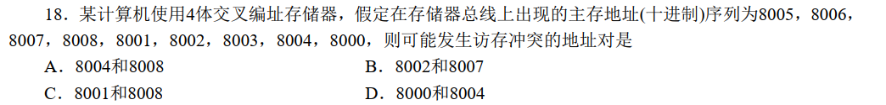

2017：

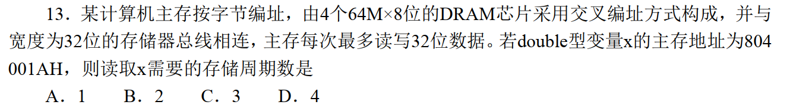

### 双口RAM和多模块存储器

### 高速缓冲存储器(cache)【必考】

2015：

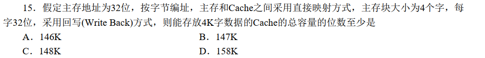

2016：

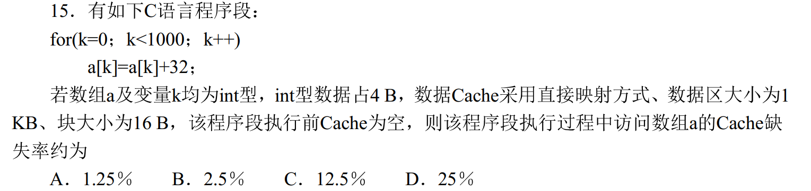

2017：

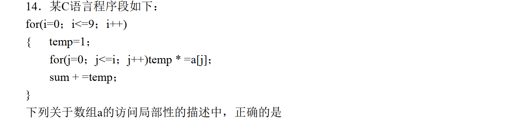

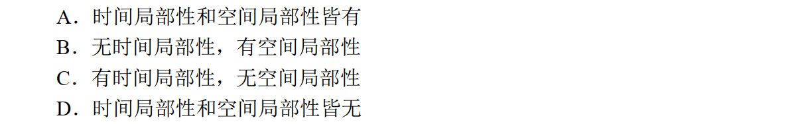

### 虚拟存储器【常考】

2015：

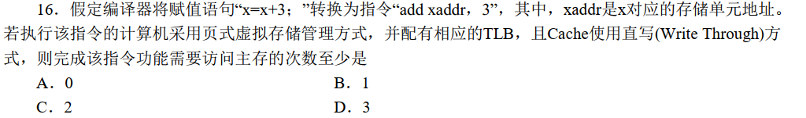

2019：

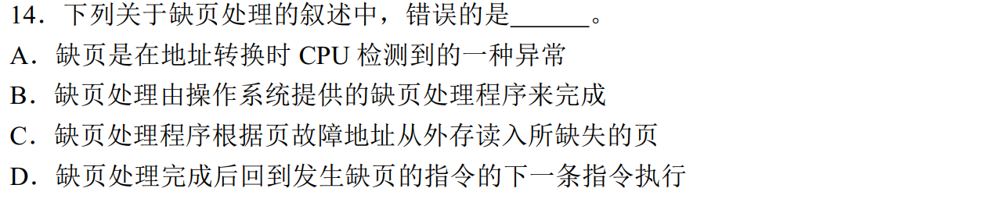

2020：

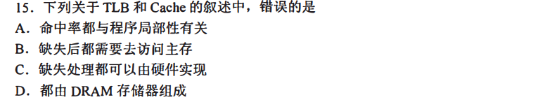

## 四、指令系统

## 五、中央处理器

## 六、总线

## 七、输入/输出系统

