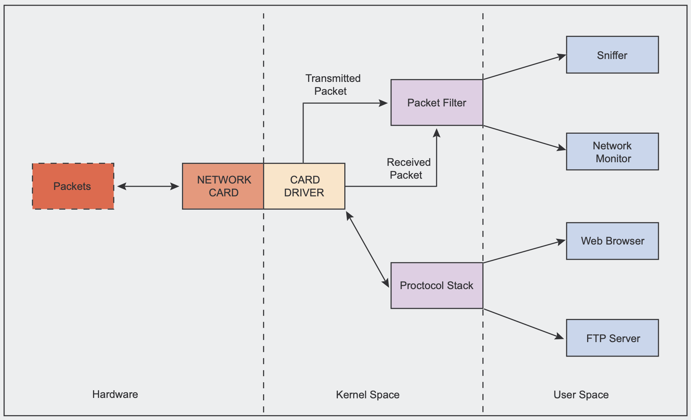
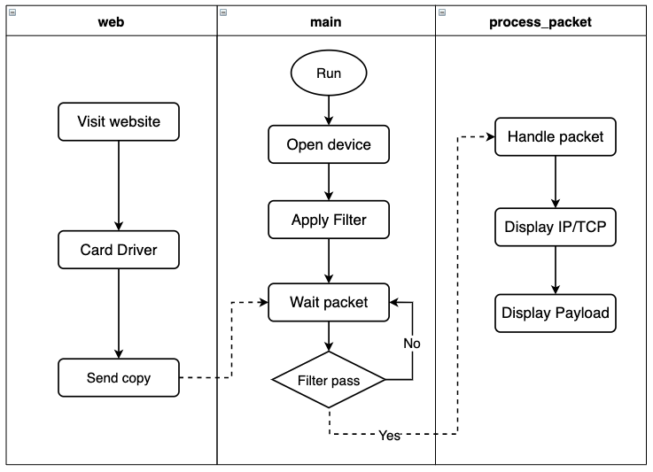
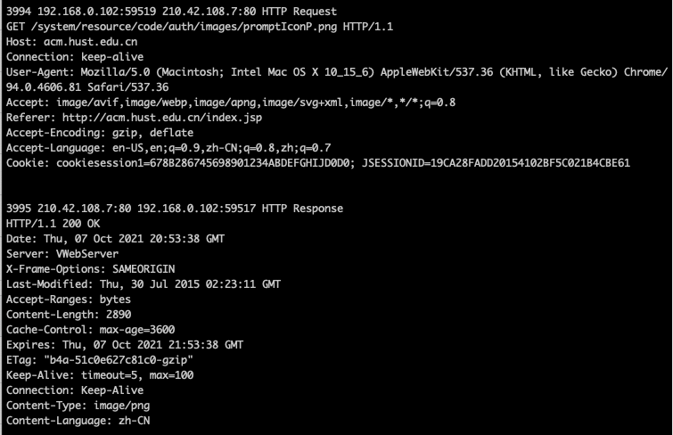

## HTTP Header Sniffer

### 1. Introduction / Reference

* Language: gcc 7.5.0

* OS: Ubuntu 18.04

* Reference
  * [libpcap](http://www.tcpdump.org/): This is the officail web site of libpcap, a portable c/c++ library for network traffic capture
  * [http-sniffer](https://github.com/caesar0301/http-sniffer): A multi-threading tool to sniff TCP flow statistics and embedded HTTP headers from PCAP file. Each TCP flow carrying HTTP is exported to text file in json format.


### 2. Flow char or Diagram

Before we introduce the flow of the sniffer program, let's review how packet capture works in Ethernet based networks. With one difference, When we use a sniffer, the network driver also sends a copy of any received or transmitted packet to a part of the kernel called packet filter.




Then, we designed the program flow chart. 




### 3. Logical explanations block by block in detail

The most important part of the whole process is the use of libpcap, using the documentation given to develop our own Http header sniffer.

We first decide which interface to sniff. We can either define the device in a string, or we can ask PCAP to give us the name of an interface to do this. if "pcap_lookupdev()" fails, it will store an error message in errbuf.

```c
/* find the name of the default device suitable for capture */
device = pcap_lookupdev(errbuf);
if (device == NULL) {
  printf("Can't find the default device: %s", errbuf);
  return 2;
}
printf("Finding the device %s\n", device);

/* get the properties for the device */
if (pcap_lookupnet(device, &ip, &mask, errbuf) == -1) {
  printf("Can't get properties for the device %s: %s\n", device, errbuf);
}
struct in_addr mask_addr, ip_addr;
mask_addr.s_addr = mask;
ip_addr.s_addr = ip;
printf("The mask for the device %s\n", inet_ntoa(mask_addr));
printf("The ip for the device %s\n", inet_ntoa(ip_addr));
```


How do we distinguish between them? Use file handles.  Just like opening a file for reading and writing, we must name the sniffer "session" to distinguish it from other such sessions.

```c
/* create a sniffing session */
handle = pcap_open_live(device, PCAP_BUF_SIZE, 1, 512, errbuf);
if (handle == NULL) {
  printf("Can't open the device %s: %s\n", device, errbuf);
  return 2;
}
printf("Opening the device %s\n", device);
```


If we only want to sniff specific traffic, we have to create a rule set, compile it and apply it. We then tell PCAP to apply it to any session we want it to filter.

```c
/* filter traffic*/
if (pcap_compile(handle, &fp, filter_exp, 0, ip) == -1) {
  printf("Can't compile filter %s: %s\n", filter_exp, pcap_geterr(handle));
  return 2;
}
if (pcap_setfilter(handle, &fp) == -1) {
  printf("Can't install filter %s: %s\n", filter_exp, pcap_geterr(handle));
  return 2;
}
printf("Compile and apply the filter expression %s\n", filter_exp);
```


Then, we tell PCAP to enter its main execution loop. In this state, PCAP waits until it receives any number of packets we want it to receive. Every time it receives a new packet, it calls another function we've defined.

```c
/* call process_pack for every received packet */
pcap_loop(handle, -1, process_packet, (u_char *) &count);
```


So, what about the method being called

```c
void process_packet(u_char *args, const struct pcap_pkthdr* head, const u_char *packet);
```


Firstly, the length of the source IP address, destination IP address, and IP head are extracted according to the structure of the IP header. Note that the Ethernet header structure is always 14 bytes, and the IP header is 20 bytes next to the Ethernet header.

```c
/* IP header */
struct ip_header {
    u_char  vhl;     // version and header length
    u_char  tos;     // type of service
    u_short len;     // total length
    u_short id;      // identification
    u_short off;     // fragment and offset
    u_char  ttl;     // time to live
    u_char  prt;     // protocol
    u_short sum;     // checksum
    struct in_addr src_add, dst_add;    // source and destination address
};

void process_packet(u_char *args, const struct pcap_pkthdr* head, const u_char *packet) {
  ...
    /* Ethernet Header is always 14 bytes */
    /* IP Header is 20 bytes next to Ethernet Header */
    ip = (struct ip_header*)(packet + ETHER_HEAD_SIZE);
    ip_size = ((ip->vhl) & 0x0f)* 4; //
    /* TCP Header is 20 bytes next to IP Header */
    tcp = (struct tcp_header*)(packet + ETHER_HEAD_SIZE + ip_size);
    tcp_size = ((tcp->hlr & 0xf0) >> 4) * 4;
  ...
}

```


Similarly, we can obtain the packet source port, destination port, and TCP head length based on the TCP data structure

```c
/* TCP header */
struct tcp_header {
    u_short src_port, dst_port;     // source port and destination port
    u_int seq;                      // seq number
    u_int ack;                      // ack number
    u_char hlr;                     // header length and rsvd
    u_char flags;                   // flag
    u_short win;                    // window
    u_short sum;                    // checksum
    u_short urp;                    // urgent pointer
};

void process_packet(u_char *args, const struct pcap_pkthdr* head, const u_char *packet) {
  ...
		/* TCP Header is 20 bytes next to IP Header */
    tcp = (struct tcp_header*)(packet + ETHER_HEAD_SIZE + ip_size);
    tcp_size = ((tcp->hlr & 0xf0) >> 4) * 4;

    payload = packet + (ETHER_HEAD_SIZE + ip_size + tcp_size);
    payload_size = head->caplen - (ETHER_HEAD_SIZE + ip_size + tcp_size);
  ...
}
```


And then we show it in the format

```c
/* Display format */
head_type = ((tcp->src_port & 0x00FF) != 0x50) ? "Request" :  "Response";
printf("%d %s:%d %s:%d HTTP %s\n", counter,
       inet_ntoa(ip->src_add), ntohs(tcp->src_port),
       inet_ntoa(ip->dst_add), ntohs(tcp->dst_port), head_type);
```


Also, the payload should be formatted with the given template

```c
if (payload_size > 0) {
        const u_char *p = payload;
        int byte_count = 0;
        int crlf = 0;
        int request_type = *p;
        /* If GET or POST request or response */
        if (*p == 0x47 || *p == 0x48 || *p == 0x50) {
            while (byte_count++ < payload_size) {
                if (*p == 0x0d) {
                    printf("\n");
                    p++;
                    if (crlf) {
                        /* If POST request */
                        if (request_type == 0x50) {
                            printf("%c", *p);
                        }
                        printf("\n");
                        return;
                    }
                    crlf = 1;
                }
                else {
                    printf("%c", *p);
                    crlf = 0;
                }
                p++;
            }
            printf("\n");
        }
    }
```


### 4. Deliverables

The project.c provide the actual code, and the setup.sh install dependencies and compile the project code, after we get the project application, we work the application with "run.sh > result.txt". When visit the acm.hust.edu.cn, we can get the result as follow: 


