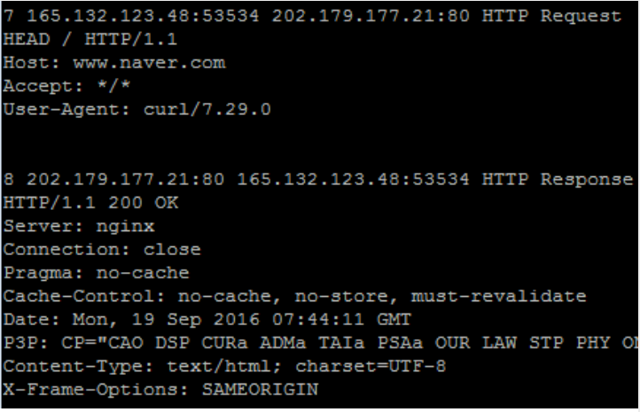

## HTTP Header Sniffer

### 目录

1. 背景
2. 需求
3. 说明


### 背景

TCP/IP 的五层次结构：物理层、数据链路层、网络层、传输层、应用层，包括每层的协议和数据单元，还有里面的地址标识

HTTP Header：请求头与响应头，包括协议的数据结构，和举例


### 需求

1. 实现 HTTP Header sniffer
2. 打印请求头与响应头（with out entity body）
3. Display Format (按格式显示、并提供注释)

```
# No S_IP:S_Port D_IP:D_Port HTTP [Request | Response]
[Request Line] (or [Status Line])
[Header Lines]
```




### 说明

#### 1. 项目环境

语言：gcc 7.5.0 \ Python 3.5.2

OS：Ubuntu 18.04

工具库：must use pcap library

* C(pcap)

```c
# include <pcap.h>
gcc -o <output> project_1.c -lpcap
```

* Python(pcapy)

```python
import pcapy
```


#### 2. 项目报告

* Introduction (5pts)：开发环境、程序语言、参考资料
* 流程图或图表 (15pts)：表明程序逻辑，描述代码是如何工作的
* 模块详细介绍 (20pts)：模块功能，方法说明


#### 3. 项目代码

* 寻找所有的抓包设备 (10pts)
* 正确的过滤数据包 (10pts)
* 获取Http请求和相应 (20pts)
  * 顺序(序号)要求正确
  * header 部分打印，格式与给定模板要匹配


#### 4. 项目交付

YourID_ProjectNo.zip

* project.c: Your code with detail comments
* run.sh: This shold work with the command "run.sh > results.txt"
* setup.sh: This should install dependencies or compile your code
* report.pdf: Your comprehensive comments of this project


#### 5. TIP

首先，必须要添加网络选择器，可以参考 pcap 的findalldevs

程序需要跑在后台，可以通过浏览器进行测试、or Postman、Wget、libcurl


