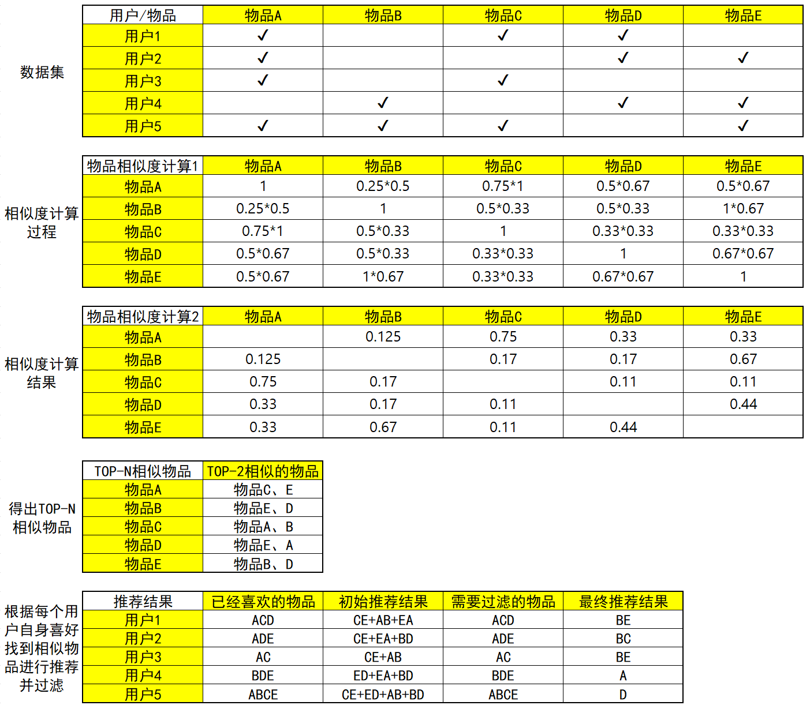
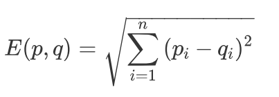
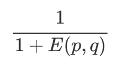

# 基于记忆的协同过滤


## 一、算法流程

假设两个用户分别有2个爱好和4个爱好，其中有2个爱好是共同的，那么他们的相似度可以用：2/3 * 2/4 = 1/3 ≈ 0.33 来表示。

* 基于用户的协同过滤推荐：跟你喜好相似的人喜欢的东西你也有可能喜欢


* 基于物品的协同过滤推荐：跟你喜欢的东西相似的东西你也有可能喜欢




## 二、相似度计算

1）欧氏距离

在同一个n维欧氏空间下，两个点p,q间距离称为欧氏距离



若要求相似度的计算结果位于[0, 1]之间，可以进行归一化操作




2）杰卡德相似度 & 余弦相似度 & 皮尔逊相关系数 

杰卡德相似度适合度量布尔值向量之间的相似度，通过两个集合的交集元素个数在并集中所占的比例来计算相似程度。

余弦相似度使用两个向量之间的夹角余弦值来度量相似的情况。余弦相似度与向量长度无关，两个向量只要方向一致，则为相似向量。

皮尔逊相关系数通过对向量进行中心化处理，解决了余弦相似度对向量长度不敏感带来的问题。向量a,b各自减去向量的均值后，再计算余弦相似度。


## 三、代码实现

### a) 杰卡德相似度

构建数据集

```python
users = ["User1", "User2", "User3", "User4", "User5"]
items = ["Item A", "Item B", "Item C", "Item D", "Item E"]
# 用户购买记录数据集
datasets = [
    [1, 0, 1, 1, 0],
    [1, 0, 0, 1, 1],
    [1, 0, 1, 0, 0],
    [0, 1, 0, 1, 1],
    [1, 1, 1, 0, 1],
]

import pandas as pd

df = pd.DataFrame(datasets, columns=items, index=users)
print(df)
```


杰卡德相似度计算

```python
# 直接计算某两项的jaccard系数
from sklearn.metrics import jaccard_score

# 输入Item A向量、Item B向量 返回相似度
print(jaccard_score(df["Item A"], df["Item B"]))

# 计算所有数据两两的jaccard系数
from sklearn.metrics.pairwise import pairwise_distances

# 计算用户间相似度
user_similar = 1 - pairwise_distances(df.values, metric="jaccard")
user_similar = pd.DataFrame(user_similar, columns=users, index=users)
print(user_similar)
# 计算商品间相似度
item_similar = 1 - pairwise_distances(df.T.values, metric="jaccard")
item_similar = pd.DataFrame(item_similar, columns=items, index=items)
print(item_similar)
```


筛选TOP-N相似结果，并进行推荐

* User-Base CF

```python
import pandas as pd
import numpy as np
from pprint import pprint

users = ["User1", "User2", "User3", "User4", "User5"]
items = ["Item A", "Item B", "Item C", "Item D", "Item E"]
# 用户购买记录数据集
datasets = [
    [1, 0, 1, 1, 0],
    [1, 0, 0, 1, 1],
    [1, 0, 1, 0, 0],
    [0, 1, 0, 1, 1],
    [1, 1, 1, 0, 1],
]

df = pd.DataFrame(datasets, columns=items, index=users)
print(df)

# 直接计算某两项的jaccard系数
from sklearn.metrics import jaccard_score

# 输入Item A向量、Item B向量 返回相似度
print(jaccard_score(df["Item A"], df["Item B"]))

# 计算所有数据两两的jaccard系数
from sklearn.metrics.pairwise import pairwise_distances

# 计算用户间相似度
user_similar = 1 - pairwise_distances(df.values, metric="jaccard")
user_similar = pd.DataFrame(user_similar, columns=users, index=users)
print("用户间两两相似度")
print(user_similar)

# 获取每个用户的近邻用户
topN_users = {}
# 遍历用户相似度矩阵的每一行
for i in user_similar.index:
    # 取出每一列数据，并删除自身，然后排序数据
    _df = user_similar.loc[i].drop([i])
    _df_sorted = _df.sort_values(ascending=False)

    top2 = list(_df_sorted.index[:2])
    topN_users[i] = top2

print("Top2相似用户")
pprint(topN_users)

# 构建推荐结果
rs_results = {}
# 遍历用户近邻矩阵的每一行
for user, sim_users in topN_users.items():
    # 从近邻用户中获取推荐结果
    rs_result = set()
    for sim_user in sim_users:
        rs_result = rs_result.union(set(df.loc[sim_user].replace(0, np.nan).dropna().index))
    # 过滤掉已经够买过的商品
    rs_result -= set(df.loc[user].replace(0, np.nan).dropna().index)
    rs_results[user] = rs_result

print("最终推荐结果")
pprint(rs_results)
```


* Item-Base CF

```python
import pandas as pd
import numpy as np
from pprint import pprint

users = ["User1", "User2", "User3", "User4", "User5"]
items = ["Item A", "Item B", "Item C", "Item D", "Item E"]
# 用户购买记录数据集
datasets = [
    [1, 0, 1, 1, 0],
    [1, 0, 0, 1, 1],
    [1, 0, 1, 0, 0],
    [0, 1, 0, 1, 1],
    [1, 1, 1, 0, 1],
]

df = pd.DataFrame(datasets, columns=items, index=users)
print(df)

# 直接计算某两项的jaccard系数
from sklearn.metrics import jaccard_score

# 输入Item A向量、Item B向量 返回相似度
print(jaccard_score(df["Item A"], df["Item B"]))

# 计算所有数据两两的jaccard系数
from sklearn.metrics.pairwise import pairwise_distances

# 计算商品间相似度
item_similar = 1 - pairwise_distances(df.T.values, metric="jaccard")
item_similar = pd.DataFrame(item_similar, columns=items, index=items)
print("商品间两两相似度")
print(item_similar)

# 获取每商品的近邻商品
topN_items = {}
# 遍历商品相似度矩阵的每一行
for i in item_similar.index:
    # 取出每一列数据，并删除自身，然后排序数据
    _df = item_similar.loc[i].drop([i])
    _df_sorted = _df.sort_values(ascending=False)

    top2 = list(_df_sorted.index[:2])
    topN_items[i] = top2

print("Top2相似商品")
pprint(topN_items)

# 构建推荐结果
rs_results = {}
# 遍历所有用户
for user in df.index:
    rs_result = set()
    # 取出用户当前已购商品
    for item in df.loc[user].replace(0, np.nan).dropna().index:
        # 根据每个物品找出最相似的Top-N物品，构建初始推荐结果
        rs_result = rs_result.union(topN_items[item])
    rs_result -= set(df.loc[user].replace(0, np.nan).dropna().index)
    rs_results[user] = rs_result

print("最终推荐结果")
pprint(rs_results)
```


### b) 皮尔逊相关系数

构建数据集

```python
users = ["User1", "User2", "User3", "User4", "User5"]
items = ["Item A", "Item B", "Item C", "Item D", "Item E"]
# 用户购买记录数据集
datasets = [
    [5,3,4,4,None],
    [3,1,2,3,3],
    [4,3,4,3,5],
    [3,3,1,5,4],
    [1,5,5,2,1],
]
```

 

计算相似度：在皮尔逊相关系数中，-1表示强负相关，+1表示强正相关

```python
df = pd.DataFrame(datasets, columns=items, index=users)
print(df)

print("用户间两两相似度：")
user_similar = df.T.corr()
print(user_similar.round(4))

print("商品间两两相似度")
item_similar = df.corr()
print(item_similar.round(4))
```

```
# 运行结果：
用户之间的两两相似度：
        User1   User2   User3   User4   User5
User1  1.0000  0.8528  0.7071  0.0000 -0.7921
User2  0.8528  1.0000  0.4677  0.4900 -0.9001
User3  0.7071  0.4677  1.0000 -0.1612 -0.4666
User4  0.0000  0.4900 -0.1612  1.0000 -0.6415
User5 -0.7921 -0.9001 -0.4666 -0.6415  1.0000
物品之间的两两相似度：
        Item A  Item B  Item C  Item D  Item E
Item A  1.0000 -0.4767 -0.1231  0.5322  0.9695
Item B -0.4767  1.0000  0.6455 -0.3101 -0.4781
Item C -0.1231  0.6455  1.0000 -0.7206 -0.4276
Item D  0.5322 -0.3101 -0.7206  1.0000  0.5817
Item E  0.9695 -0.4781 -0.4276  0.5817  1.0000
```


筛选TOP-N相似结果，并进行推荐

* User-Based CF 评分预测：

  考虑近邻用户的加权平均相似度打分来进行预测
  $$
  pred(u,i)=\hat{r}_{ui}=\cfrac{\sum_{v\in U}sim(u,v)*r_{vi}}{\sum_{v\in U}|sim(u,v)|}
  $$
  比如，预测用户1对物品E的评分，那么可以根据与用户1最近邻的用户2和用户3进行预测
  $$
  pred(u_1, i_5) =\cfrac{0.85*3+0.71*5}{0.85+0.71} = 3.91
  $$
  代码结构

  ```python
  # 预测给定用户对给定物品的评分值
  def predict(uid, iid, rating_matrix, user_similar)
  # 预测给定用户对给定物品列表的评分值
  def _predict_all(uid, item_ids, rating_matrix, user_similar)
  # 预测给定用户对过滤后的物品的评分值
  def predict_all(uid, ratings_matrix, user_similar, filter_rule=None)
  # 获取给定用户的Top-k评分值
  def top_k_rs_result(k)
  ```

  

* Item-Based CF 评分预测：

  考虑用户对相似物品的加权平均相似度打分来进行预测
  $$
  pred(u,i)=\hat{r}_{ui}=\cfrac{\sum_{j\in I_{rated}}sim(i,j)*r_{uj}}{\sum_{j\in I_{rated}}sim(i,j)}
  $$
  比如，预测用户1对物品E的评分，那么可以根据与物品E最近邻的物品A和物品D进行预测
  $$
  pred(u_1, i_5) = \cfrac {0.97*5+0.58*4}{0.97+0.58} = 4.63
  $$

