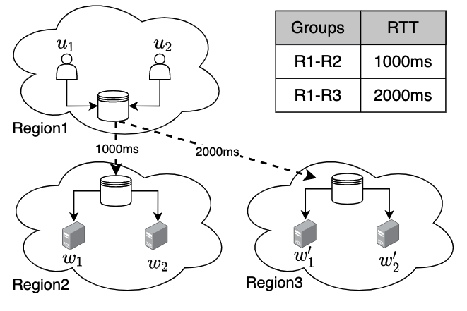
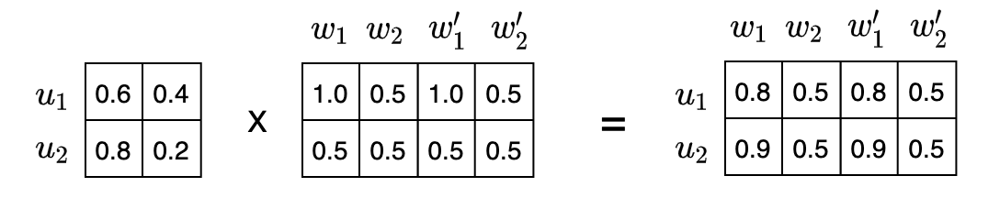

# 2 Motivation(OK)

MF模型试图捕捉用户和服务之间的交互作用，正是这些交互作用产生了不同的质量评分。然而，在实际的网络环境中，大部分观察到的Qos值要么和用户相关，要么和服务相关，要么和用户与服务之间的通信路径相关，而与用户和服务之间的交互作用无关，也就是说仅靠传统的矩阵分解模型不能产生个性化的推荐，因为它忽略了与用户服务交互作用无关的因子。为了更具体的阐述这个问题，本节首先介绍了基于矩阵分解的Qos预测，然后给出了一个简单的例子用来说明网络偏置对基于矩阵分解的Qos预测的影响。

MF attempts to capture the interactions between users and services, and it is these interactions that generate the different QoS values. However, in real network environments, most of the observed QoS values are either related to users, services, or network paths between users and services, rather than the interactions between users and services. This means that the traditional matrix factorization model alone cannot produce personalized QoS prediction because it ignores factors unrelated to user-service interactions. To explain this problem in detail, this section first introduces QoS prediction based on matrix factorization and then gives a simple example to illustrate the influence of network bias on QoS prediction based on matrix factorization.

## 2.1 Matrix Factorization(OK)

矩阵分解使用因子模型来拟合用户服务矩阵进行预测，它将高维度的用户服务调用矩阵分解成两个低维度的特征矩阵来进行预测。低维度的特征矩阵试图通过描述用户和服务在各个因子（如系统结构、指令系统、硬件组成、软件配置）上的特征来解释Qos值。例如，服务隐向量的每个维度值的大小代表了该服务具备这些因子的程度，用户隐向量的每个维度值的大小代表了用户对这些因子的感知程度，用户隐向量和服务隐向量的点积代表了用户和服务之间的交互作用，也就是用户调用服务的Qos值。因此，基于MF的QoS预测方法的一般目标函数可以被推导为：

MF uses a factor model to fit the user-service interactive matrix for prediction, which factorizes the user-service into two low-rank feature matrices. The low-rank feature matrix attempts to explain the QoS values by describing the values of users or services on various latent features (e.g. system structure, instruction system, hardware composition, software configuration). For example, each scalar of the service feature vector represents the degree of service provision for each latent feature, each scaler of the user feature vector represents the degrees of user perception for each latent feature, and the dot product of the user feature vector and the service feature vector represents the interaction between the user and the service, that is, the QoS value of the service observed by the user. Thus, the general objective function for the MF-based Qos prediction method can be derived as:

$$
\begin{split}
\hat {Q}_{ij} &= {U_iW_j^T}
\end{split}
\tag{1}
$$
其中 $U \in R_{m \times d}$ 表示用户潜在特征矩阵，$W \in R_{n \times d}$ 表示服务潜在特征矩阵。向量 $U_i (1\le i\le m)$ 表示用户 $i$ 的潜在特征向量，向量 $W_j (1\le j\le n)$ 表示服务 $j$ 的潜在特征向量，他们的维度为d。用户 $i$ 调用服务 $j$ 的Qos预测值为$\hat{Q}_{ij}$。

Where $U \in R_{m \times d}$ denotes the user latent feature matrix and $W \in R_{n \times d}$ denotes the service latent feature matrix. The vector $U_i (1\le i\le m)$ denotes the latent feature vector of user $i$ and the vector $W_j (1\le j\le n)$ denotes the latent feature vector of service $j$ . The number of latent features in our model is $d$. The predicted QoS value of Web service $j$ observed by user $i$ is $\hat{Q}_{ij}$ .

## 2.2 Motivating Example(OK)

假设用户服务的调用关系如图1，用户$u_1$，$u_2$位于区域R1中，服务$w_1$，$w_2$位于区域R2中，服务$w'_1$，$w'_2$位于区域R3中。其中，服务$w_1$，$w_2$和服务$w'_1$，$w'_2$的性能指标完全相同，区域R1与区域R2通信的平均响应时间为1000ms，区域R1与区域R3通信的平均响应时间为2000ms。那么我们要如何有效和高效地预测用户$u_1$，$u_2$对服务$w_1$，$w_2$，$w'_1$，$w'_2$的质量评分呢？

To explain the influence of network bias on MF-based QoS prediction, a straight-away example is given in Fig. 1. In this example, we need to predict the QoS value of services w1, w2, w'1, w'2 observed by users u1and u2. We assume that users u1and u2 are located in region R1, services w1and w2 are located in region R2, and services w'1 and w'2 are located in region R3. Where services w1 and w2 have the same performance as services w'1 and w'2, the average response time between region R1 and region R2 is 1s, and the average response time between region R1 and region R2 is 2s.

传统矩阵分解的Qos预测过程如图2所示，我们假设用户调用服务的Qos值由两种潜在因子决定，这两种潜在因子分别为硬件组成和软件配置。以用户$u_1$和服务$w_1$，$w'_1$为例。用户$u_1$对硬件组成因子的感知程度为0.6，对软件配置因子的感知程度为0.4，服务$w_1$对硬件组成因子的具备程度为1.0，对软件配置因子的具备程度为0.5，用户$u_1$与服务$w_1$的点积代表了用户$u_1$调用服务$w_1$的Qos值，为0.8。由于服务$w_1$和$w'_1$的性能指标完全相同，它们对潜在因子的具备程度也完全相同，因此用户$u_1$调用服务$w'_1$的Qos值也为0.8。 

The QoS prediction of traditional matrix factorization is shown in Fig. 2, we assume that the QoS value of the service observed by the user is determined by two latent features, which are hardware composition and software configuration. In the following, we will focus on user u1 and services w1, w2. The perception of user u1 for hardware composition feature is 0.6, the perception for software configuration factor is 0.4. The provision of service w1 for hardware composition feature is 1.0, the provision for software configuration factor is 0.5. The dot product of user u1 and service w1 represents the Qos value of service w1 observed by user u1, which is 0.8. Since the performance of services w1 and w'1 are exactly the same, they have the same degree of latent factors, the QoS value of service w'1 observed by user u1 is also 0.8.

然而，传统的矩阵分解方法并没有考虑到用户和服务之间的非交互作用，也就是网络偏差对Qos预测的影响。以响应时间为例，用户感知到的服务响应时间必须包括网络延迟，而网络延迟会根据通信路径的不同而有很大的差异[12]。换句话说，虽然服务$w_1$和服务$w'_1$的性能指标完全相同，但是它们所属区域不同（服务$w_1$位于R2，服务$w'_1$位于R3），用户调用它们的Qos值也会有很大不同。因此，在这种情况下，以前的工作所做的 QoS 预测是不准确的。

However, traditional matrix factorization methods do not take into account the non-interaction between users and services, that is, the influence of network bias on QoS prediction. Taking response time as an example, the user-perceived response time must include network latency, which can vary greatly depending on the network path[12]. In other words, although the performance of services w1 and w'1 are the same, they belong to different regions (w1 is located in R2 and w'1 is located in R3), and their QoS values observed by the user should be very different. In this case, the QoS prediction made by previous work is not accurate.
