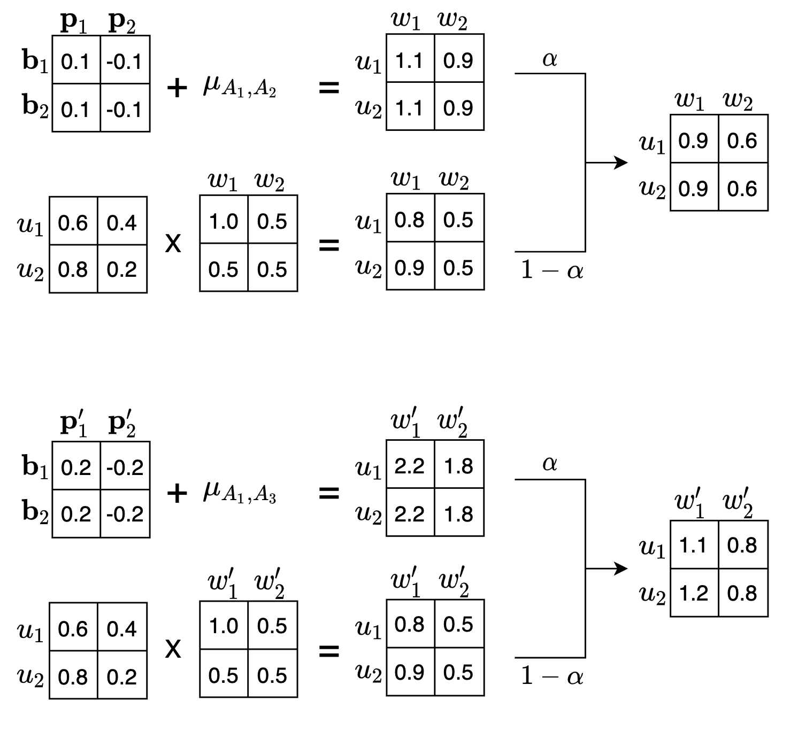

# 3 Our Method

由于这些网络偏置值在观察到的评分中占很大比例，因此对他们进行准确的建模就显得至关重要。为了实现这一目标，我们提出了一种基于网络偏置的矩阵分解方法来进行Qos预测。我们的方法既考虑了与用户服务交互作用相关的因子，又考虑了与用户服务交互作用无关的因子。这使得我们的方法对复杂的网络环境具备很好的适应性。本节将首先介绍我们提出的基于网络偏置的矩阵分解方法，然后给出一个简单的例子用来说明改进后的评分预测过程。

## 3.1 MF with Network Bias

如果我们将网络偏置看做是一个连续的值而不是离散的值，那么就可以借助线性回归思想来预测目标用户对目标服务的网络偏置值。按照以上思路，我们提出了基于网络偏置的矩阵分解方法。我们的建模方法把这些与用户服务交互作用无关的网络偏置封装到线性回归模型中，而把真正代表用户-服务交互作用的那部分数据放到更适合用户偏好的矩阵分解模型中。 因此，基于NBMF的Qos预测方法的一般目标函数可以被推导为：
$$
\begin{split}
\hat {Q}_{ij} &= \alpha \ (\mu_{xy} + \bold{b}_i + \bold{p}_j) + (1-\alpha) \ U_iW_j^T
\end{split}
\tag{2}
$$
在这个公式中，第一项 $\alpha \ (\mu_{xy} + \bold{b}_i + \bold{p}_j)$ 为线性回归模型，用来预测目标用户 $i$ 对目标服务 $j$ 的网络偏置值。其中，$x$ 为用户 $i$ 所在网络，$y$ 为服务 $j$ 所在网络，$\mu_{xy}$ 为网络 $x$ 与网络 $y$ 通信的平均Qos值。向量 $\bold{b}$ 表示用户网络偏置向量，向量 $\bold{p}$ 表示服务网络偏置向量。$\bold{b}_i (1\le i\le m)$ 表示用户 $i$ 所感知到的Qos值普遍高于或低于同网络其他用户的偏置值， $\bold{p}_j (1\le j\le n)$ 表示服务 $j$ 所具备的Qos值普遍高于或低于同网络其他服务的偏置值。 

公式第二项 $(1-\alpha) \ U_iW_j^T$ 为矩阵分解模型，用来捕捉用户 $i$ 和服务 $j$ 之间的交互作用。其中，向量 $U_i (1\le i\le m)$ 表示用户 $i$ 的潜在特征向量，向量 $W_j (1\le j\le n)$ 表示服务 $j$ 的潜在特征向量，他们的点积 $U_iW_j^T$ 表示用户和服务之间的交互作用。$\hat{Q}_{ij}$表示用户 $i$ 调用服务 $j$ 的Qos预测值。

参数 $\alpha (0\le\alpha\le 1)$ 表示我们在Qos预测模型中使用多少网络偏置信息。$\alpha $ 是一个可调整的参数，如果 $\alpha$ 被设置为0，则表示我们的预测模型不考虑网络偏置，完全使用矩阵分解来进行预测。如果 $\alpha$ 被设置为1，则表示我们的预测模型不考虑用户和服务的交互作用，完全使用线性回归来进行预测。为了研究 $\alpha$ 对我们模型的影响并找到一个最佳的模型，本文将在第5节对 $\alpha$ 的值进行评估。

## 3.2 Method Example

以用户$u_1$调用服务$w_1$，$w'_1$为例，改进后的评分预测过程如图3所示。

首先是网络偏置值的预测部分，假设自治域 $AS_1$ 与自治域 $AS_2$ 通信的平均Qos值 $\mu_{A_1,A_2}$ 为1，自治域 $AS_1$ 与自治域 $AS_3$ 通信的平均Qos值 $\mu_{A_1,A_3}$ 为2。用户 $u_1$ 所感知到的Qos值普遍高于或低于同自治域其他用户的偏置值 $\bold{b}_1$ 为0，服务 $w_1$ 所具有的Qos值普遍高于或低于同自治域其他服务的偏置值 $\bold{p}_1$ 为0.1，服务 $w'_1$ 所具有的Qos值普遍高于或低于同自治域其他服务的偏置值 $\bold{p}'_1$ 为0.2。则用户 $u_1$ 调用服务$w_1$ 的网络偏置值 $\mu_{A_1,A_2} + \bold{b}_1 + \bold{p}_1$ 为1.1，用户 $u_1$ 调用服务$w'_1$ 的网络偏置值 $\mu_{A_1,A_3} + \bold{b}_1 + \bold{p}'_1$ 为2.2。

其次是矩阵分解的预测部分，关于这部分的预测过程可以参考2.2。用户$u_1$与服务$w_1$的点积代表了用户$u_1$调用服务$w_1$的Qos值，为0.8。由于服务$w_1$和$w'_1$的性能指标完全相同，它们对潜在因子的具备程度也完全相同，因此用户$u_1$调用服务$w'_1$的Qos值也为0.8。

参数 $\alpha$ 默认设置为0.2，我们将用户调用服务的网络偏置值加上只依赖与用户和服务交互作用的预测值，可以得到用户 $u_1$ 调用服务 $w_1$ 的最终Qos预测值为0.9，用户 $u_1$ 调用服务 $w'_1$ 的最终Qos预测值为1.1。

虽然服务$w_1$和服务$w'_1$的性能指标完全相同，但是它们所属自治域不同（服务$w_1$位于AS2，服务$w'_1$位于AS3），用户调用它们的Qos值也会有很大不同。可见我们的方法对复杂的网络环境具备很好的适应性。

## 3.3 Model Formulation

> 前面讲过了如何预测，现在讲如何建模

公式(2)中的潜在特征矩阵 $U、W$ 和网络偏置向量 $\bold{b}、\bold{p}$ 都可以通过统计学习理论来构建。为了估计矩阵 $U、W$ 和向量 $\bold{b}、\bold{p}$ 的值，我们利用如下目标函数对原始质量矩阵 $Q$ 进行近似拟合，最小化公式如下：
$$
L = min_{U,W,\bold{b},\bold{p}}\frac{1}{2}\sum_{i=1}^{m}\sum_{j=1}^{n}I_{ij}[Q_{ij} - \alpha \ (\mu_{xy} + \bold{b}_i + \bold{p}_j) - (1-\alpha) \ U_iW_j^T]^2 \tag{3}
$$
其中 $I_{ij}$ 是指示函数，如果用户 $u$ 调用过服务 $w$，则返回1，否则返回0。为了避免过度拟合得到最优的 $U$ 和 $W$ 逼近原始矩阵 $Q$，我们加入了两个与 $U$ 和 $I$ 相关的正则项：
$$
\begin{split}
L = min_{U,W,\bold{b},\bold{p}}\frac{1}{2}\sum_{i=1}^{m}\sum_{j=1}^{n}I_{ij}[Q_{ij} - \alpha \ (\mu_{xy} + \bold{b}_i + \bold{p}_j) - (1-\alpha) \ U_iW_j^T]^2 \\ + \frac{\lambda_u}{2}\Vert U\Vert^2_F + \frac{\lambda_w}{2}\Vert W\Vert^2_F + \frac{\lambda_b}{2}\Vert \bold{b}\Vert^2_F + \frac{\lambda_p}{2}\Vert \bold{p}\Vert^2_F
\end{split}
\tag{4}
$$
其中$\Vert \cdot \Vert$ 表示 Frobenius 范数[12.26.01]， $\lambda_1$ 和 $\lambda_2$ 两个参数控制正则化程度。目标函数 L 使用二次正则项来最小化平方误差和。因为他不是凸的，所以设计一个算法来找到全局最小是不现实的。我们选择采用随机梯度下降法求解$U$ 和 $W$ 的近似最优解。
$$
\begin{split}
U'_i &= U_i - \eta_u \frac{\partial L}{\partial U_i} \\
W'_j &= W_j - \eta_w \frac{\partial L}{\partial W_j}
\end{split}
\tag{5}
$$
其中 $\alpha_1 > 0$ 和 $\alpha_2 > 0$ 表示学习速率。 

$$
U'_i = U_i + \alpha_1 [(Q_{ij} - U_iW_j^T)W_j - \lambda_1U_i]
\\W'_j = W_j + \alpha_2 [((Q_{ij} - U_iW_j^T)U_i - \lambda_2W_j)] \tag{6}
$$

