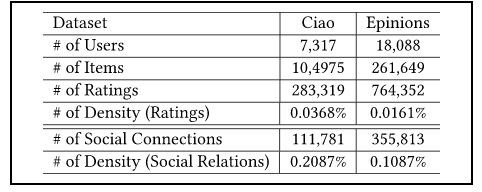
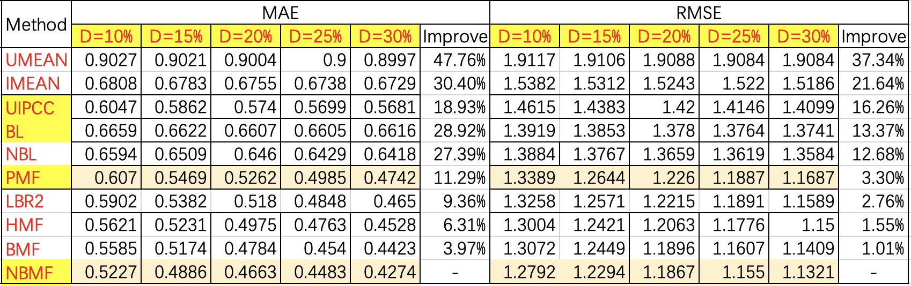

# 5 Experiments

在本节中，我们将在真实世界的Web服务质量数据集上进行广泛的实验来评估NBMF的性能。实验旨在解决以下问题：（1）NBMF方法与其他最先进的Qos预测方法相比如何？（2）网络偏置的权重 $\alpha$ 如何影响预测精度？（3）潜在特征向量的维度 $d$ 如何影响预测精度？（4）质量矩阵的稀疏程度如何影响预测精度？我们在python3.7中实现了我们的NBMF方法以及所有的基线方法，所有的实验都是在一台装有Intel i5-10400 2.9 GHz CPU 和 8GB内存的Linux服务器上进行的，运行64位Ubuntu 16.04。请注意，所有的源代码都已公开发布，可进行可重复的研究。

## 5.1 Dataset

为了评估本文方法的有效性，我们采用真实的Web服务数据集 WSDream 作为测试数据集[29]。如表2所示，该数据集包括 1974675 条Qos记录，这些记录是通过分布在137个自治域的 339 台计算机（用户）对分布在991个自治域的5825个 Web 服务进行调用得到的。每个用户和每个 Web 服务之间都有一条通过调用产生的Qos记录，在本文中，我们主要研究了Qos属性中的响应时间（RT）。同时，该数据集中还收集了这些用户和服务的IP、国家等信息。关于这个数据集的更多细节可以在[7]中找到。

## 5.2 Evaluation Metrics

为了评估本文方法的预测性能，我们采用平均绝对误差 (MAE) 和均方根误差 (RMSE) 作为评测指标，通过计算预测的Qos值与实际Qos值之间的偏差来度量预测的准确性。

MAE 的定义为：
$$
MAE = \cfrac{1}{N}\sum_{u,i} \vert Q_{ij} - \hat{Q}_{ij} \vert
$$
RMSE 的定义为：
$$
RMSE = \sqrt{\cfrac{1}{N}\sum_{u, i}(Q_{ij} - \hat{Q}_{ij})^2}
$$
其中，$Q_{ij}$ 和 $\hat{Q}_{ij}$ 分别表示用户 $i$ 调用服务 $j$ 的Qos真实值和预测值， $N$  表示预测的Qos值数量。从公式可以观察到 RMSE 对较大的误差反应比较敏感。。MAE 和 RMSE 的范围从 0到无限，它们的值越小表示预测方法的预测性能越好。

## 5.3 Accuracy Comparison

为了展示我们的NBMF方法的预测准确性，我们重新实现了9种最具代表性的Qos预测方法（包括两种也利用位置信息的最先进的基于MF的方法），并将NBMF方法与它们进行比较。以下是这些方法的简要介绍：

1）UMEAN：这种方法用目标用户的已知Qos值的平均值来预测该用户从未调用过的服务的QoS值。

2）IMEAN：这种方法用目标服务的已知Qos值的平均值来预测从未调用过该服务的用户的QoS值。

3）UIPCC：这种方法结合了基于用户和基于项目的协同过滤方法，它采用相似用户和相似服务来预测QoS值。

4）BL：这种方法是基于线性回归模型的预测方法，它用用户偏置和服务偏置来预测Qos值。

5）NBL：这种方法扩展了基于回归模型的预测方法，它用基于网络的用户偏置和服务偏置来预测Qos值

6）PMF：这种方法是基于概率的矩阵分解方法，它把矩阵分解为用户潜在特征矩阵和项目潜在特征矩阵来预测Qos值。

8）LBR2：这种方法首次使用额外的用户信息来协助预测，它用基于地理位置的正则化项来改进矩阵分解模型。

9）HMF：这种方法使用额外的用户和服务信息来协助预测，它用基于地理位置的聚类方法来改进矩阵分解模型。

7）BMF：这种方法扩展了基于概率的矩阵分解方法，它用用户偏置和服务偏置来改进矩阵分解模型。

10）NBMF：这种方法扩展了基于偏置的矩阵分解方法，它用基于网络的用户偏置和服务偏置来改进矩阵分解模型。

在现实世界中，用户服务矩阵通常非常稀疏，因为用户通常只调用过少量的Web服务。因此在本文中，为了模拟不同稀疏程度的矩阵环境，我们从数据集中随机删除一定数量的Qos值，生成密度为10%、15%、20%、25% 和 30% 的用户服务矩阵。例如，矩阵密度为10%意味着我们随机选择原始用户服务矩阵中10%的Qos值来预测其余90%的Qos值。移除的原始Qos值用作预期值，以评估不同方法所取得的预测精度。

在实验中，基线方法的参数被初始化为相应论文中的参数，然后被仔细调整以达到最佳性能。我们的NBMF方法参数被设置为 $\alpha = 0.5$， $d = 10$，$\lambda_u = \lambda_w = \lambda_b = \lambda_p = 0.02$，$\eta_u = \eta_w = \eta_b = \eta_p = 0.003$，矩阵分解过程中的最大迭代次数被设置为300次。此外，我们在模型的训练过程中执行早期停止策略，如果测试集上的RMSE连续5次增加，我们就停止训练。

表3提供了不同的方法在10%至30%矩阵密度下的预测精度。我们可以观察到，与其它较经典的预测方法相比，NBMF在MAE上实现了3.97∼47.76％的改进，在RMSE上实现了1.01∼37.34％的改进，本文提出的方法无论在何种矩阵密度下均具有更小的MAE和RMSE，这表明本文的方法具有最高的预测精度。与NBL方法相比，我们的NBMF方法在MAE和RMSE上分别实现了27.39%和12.68%的改进。这说明，仅靠线性回归模型并不能产生个性化推荐，因为它忽略了用户和服务之间的所有交互作用。为了把真正代表用户服务交互作用的那部分数据考虑进来，NBMF方法融合了一种更加适合用户偏好的模型，即矩阵分解模型。与BMF方法相比，我们的NBMF方法在MAE和RMSE上分别实现了3.97%和1.01%的改进。因为现实世界中的网络环境是非常复杂的，比起单纯的用户偏置和服务偏置，考虑基于网络的用户偏置和服务偏置要更加适用于真实的服务推荐系统。与HMF方法相比，我们的NBMF方法在MAE和RMSE上分别实现了6.31%和1.55%的改进。这是因为，HMF方法根据区域进行聚类，而NBMF方法根据通信路径进行聚类，对于复杂的网络环境具备很好的适应性。随着矩阵密度从10%增加到30%，所有方法的预测精度都显著提高。这表明，更多的质量信息可以促进更高的预测精度。

## 5.4 Impact of Parameter $\alpha$

参数 $\alpha$ 表示我们在Qos预测模型中使用多少网络偏置信息。$\alpha$ 是一个可调整的参数。如果 $\alpha$ 被设置为0，则表示我们的预测模型不考虑网络偏置，完全使用矩阵分解来进行预测，此时的NBMF等同于PMF；如果 $\alpha$ 被设置为1，则表示我们的预测模型不考虑用户和服务的交互作用，完全使用线性回归进行预测，此时的NBMF等同于NBL。为了研究 $\alpha$ 对我们模型的影响并找到一个最佳的模型，我们将维度设定为10，并将密度从10%调整到30%，步长为5%。

图4和图5向我们展示了在5个不同密度的矩阵环境下，当 $\alpha$ 的值从 0 调整到 1 时，MAE 和 RMSE 的变化。在预测精度达到最佳之前，随着 $\alpha$ 值的增加 MAE 和 RMSE 的值逐渐减小，说明预测精度提高。然而，当 $\alpha$ 的值超过某个阈值时，MAE 和 RMSE 的值反而减小，说明预测精度降低。我们观察到，在所有密度的矩阵环境下，MAE 和 RMSE 的阈值都在 $\alpha = 5$ 左右。阈值的存在证实了我们的直觉，即适当的结合矩阵分解模型和线性回归模型可以实现最佳的预测性能。此外，我们发现我们的NBMF方法是相当稳定的，因为它在所有的配置中对不同的标准都保持着类似的趋势。

## 5.5 Impact of Parameter $d$

在我们提出的方法中，参数 $d$ 表示用户潜在特征矩阵和服务潜在特征矩阵的维度，即矩阵分解中潜在特征的数量。如果这个参数很小，则表示只有几个关键的潜在特征决定了Qos值；如果这个参数很大，则表示有许多潜在特征共同决定了Qos值。为了研究参数 $d$ 对预测结果的影响，我们将参数 $\alpha$ 设定为0.5，并将密度从10%调整到30%，步长为5%。

图6和图7向我们展示了在5个不同密度的矩阵环境下，当维度 $d$ 从1调整到50时，MAE 和 RMSE 的变化。随着维度的增加，MAE和RMSE的值起初迅速下降。说明只有少数的潜在特征无法实现良好的预测结果。然而，当维度超过一定的阈值时，MAE和RMSE的值逐渐增加。因为较高的维度将导致过拟合问题，从而降低预测性能。

## 5.6 Impact of Matrix Density

如表2所示，我们的NBMF方法的预测精度受到了矩阵密度的影响。为了研究矩阵密度对预测结果的影响。我们将矩阵密度从10%调整为30%，步长为5%。在这个实验中我们将维度设定为10，并将 $\alpha$ 设定为0、0.5、1。

图6显示了实验结果，当矩阵密度从10%增长到20%时，MAE和RMSE都急剧下降，说明NBMF方法的预测精度明显提高。随着矩阵密度的进一步增加，预测精度提高的速度减慢了。这一观察结果表明，当矩阵非常稀疏时，通过收集更多的Qos信息，可以大大增强预测精度。

