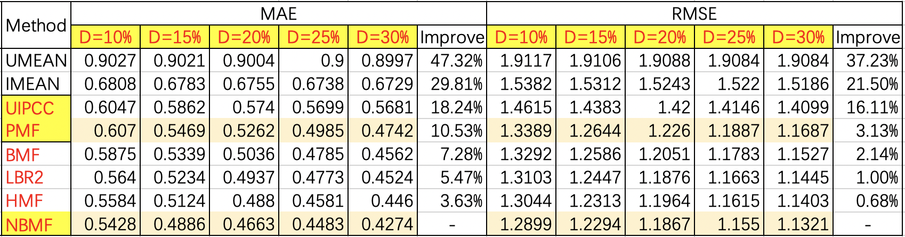

# 5 Experiments(OK)

在本节中，我们将在真实世界的Web服务质量数据集上进行广泛的实验来评估NBMF的性能。实验旨在解决以下问题：（1）NBMF方法与其他最先进的Qos预测方法相比如何？（2）质量矩阵的稀疏程度如何影响预测精度？（3）网络偏置的权重 $\alpha$ 如何影响预测精度？（4）潜在特征向量的维度 $d$ 如何影响预测精度？我们在python3.7中实现了我们的NBMF方法以及所有的基线方法，所有的实验都是在一台装有Intel i5-10400 2.9 GHz CPU 和 8GB内存的Linux服务器上进行的，运行64位Ubuntu 16.04。请注意，所有的源代码都已公开发布，可进行可重复的研究。

In this section, we conduct extensive experiments on a real-world QoS dataset to evaluate the performance of NBMF. The experiments are designed to address the following questions: (1) How does our NBMF method compare with other state-of-the-art baseline methods? (2) How does the matrix density affect the prediction accuracy? (3) How does the weight $\alpha$ of the network bias affect the prediction accuracy? (4) How does the dimension $d$ of the latent feature matrix affect the prediction accuracy? We implement our method and all baseline methods in Python 3.7, and all experiments were performed on a Linux server with Intel i5-10400 2.9GHz CPU and 16GB RAM running 64-bit Ubuntu 16.04. Note that all source code is publicly released for reproducible research.


## 5.1 Dataset(OK)

```
[7] Distributed QoS evaluation for real-world web services
```


为了评估本文方法的有效性，我们采用真实的Web服务数据集 WSDream 作为测试数据集[29]。如表2所示，该数据集包括 1974675 条Qos记录，这些记录是通过分布在137个自治域的 339 台计算机（用户）对分布在991个自治域的5825个 Web 服务进行调用得到的。每个用户和每个 Web 服务之间都有一条通过调用产生的Qos记录，在本文中，我们主要研究了Qos属性中的响应时间（RT）。同时，该数据集中还收集了这些用户和服务的IP、国家等信息。关于这个数据集的更多细节可以在[7]中找到。


We conduct all experiments on a publicly real-world QoS dataset named WS-DREAM. The dataset includes 1,974,675 QoS records, which were collected from 339 users in 30 regions on 5825 Web services in 73 regions. There is a QoS record between each user and each Web service, in this paper, we focus on the response time (RT) in the QoS attribute. Also, this dataset collects the IP, region and other information of these users and services. More details about this dataset can be found in [7].


## 5.2 Evaluation Metrics

为了评估本文方法的预测性能，我们采用平均绝对误差 (MAE) 和均方根误差 (RMSE) 作为评测指标，通过计算预测的Qos值与实际Qos值之间的偏差来度量预测的准确性。


To evaluate the prediction performance of our method, Mean Absolute Error (MAE) and Root Mean Square Error (RMSE) metrics are used to measure the accuracy of prediction by calculating the difference between the predicted QoS value and the actual QoS value.

MAE is defined as:

MAE 的定义为：
$$
MAE = \cfrac{1}{N}\sum_{u,i} \vert Q_{ij} - \hat{Q}_{ij} \vert
$$
RMSE is defined as:

RMSE 的定义为：
$$
RMSE = \sqrt{\cfrac{1}{N}\sum_{u, i}(Q_{ij} - \hat{Q}_{ij})^2}
$$
其中，$Q_{ij}$ 和 $\hat{Q}_{ij}$ 分别表示用户 $i$ 调用服务 $j$ 的Qos真实值和预测值， $N$  表示预测的Qos值数量。从公式可以观察到 RMSE 对较大的误差反应比较敏感。MAE 和 RMSE 的范围从 0到无限，它们的值越小表示预测方法的预测性能越好。


Where $Q_{ij}$ and $\hat{Q}_{ij}$ represent the actual and predicted QoS values of the user $i$ invoking service $j$, and $N$ denotes the number of predicted QoS values. It can be observed from the formula that RMSE is more sensitive to large errors. MAE and RMSE range from 0 to $\infty$, and their smaller values indicate better performance of the prediction method.


## 5.3 Accuracy Comparison

```
[18] WSRec: A collaborative filtering based web service recommender system
[19] Probabilistic matrix factorization
[20] Online QoS Prediction for Runtime Service Adaptation via Adaptive Matrix Factorization
[21] Location-based Hierarchical Matrix Factorization for Web Service Recommendation
```


为了展示我们的NBMF方法的预测准确性，我们复现了6种最具代表性的Qos预测方法，并将NBMF方法与它们进行比较。以下是这些方法的简要介绍：

To demonstrate the prediction accuracy of our method, we reproduce the 6 most representative QoS prediction methods and compare the NBMF with them.

1) UMEAN: This method uses the average QoS value of a user to predict the unknown QoS value.
2) IMEAN: This method uses the average QoS value of a server to predict the unknown QoS value.
3) UIPCC[18]: This method is user-based and service-based CF, which employs similar users and similar services for QoS prediction.
4) PMF[19]: This method is probability-based MF, which factorizes the matrix into two low-rank latent feature matrix for QoS prediction.
5) AMF[20]: This method improves the PMF with user bias and service bias.
6) HMF[21]: This method improves the PMF with location clustering.
7) NBMF: This method improves the PMF with network bias.


1）UMEAN：这种方法用目标用户的已知Qos值的平均值来预测该用户从未调用过的服务的QoS值。

2）IMEAN：这种方法用目标服务的已知Qos值的平均值来预测从未调用过该服务的用户的QoS值。

3）UIPCC：这种方法结合了基于用户和基于项目的协同过滤方法，它采用相似用户和相似服务来预测QoS值。

4）PMF：这种方法是基于概率的矩阵分解方法，它把矩阵分解为用户潜在特征矩阵和项目潜在特征矩阵来预测Qos值。

5）AMF：这种方法扩展了基于概率的矩阵分解方法，它用用户偏置和服务偏置来改进矩阵分解模型。

6）HMF：这种方法使用额外的用户和服务信息来协助预测，它用基于地理位置的聚类方法来改进矩阵分解模型。

7）NBMF：这种方法扩展了基于偏置的矩阵分解方法，它用基于网络的用户偏置和服务偏置来改进矩阵分解模型。

在现实世界中，用户服务矩阵通常非常稀疏，因为用户通常只调用过少量的Web服务。在本文中，为了模拟不同稀疏程度的矩阵环境，我们从数据集中随机删除一定数量的Qos值，生成密度为15%、20%、25% 和 30% 的用户服务矩阵。移除的原始Qos值用作预期值，以评估不同方法所取得的预测精度。例如，矩阵密度为15%意味着我们随机选择原始用户服务矩阵中15%的Qos值来预测其余85%的Qos值。

In the real world, the user-service matrix is very sparse, as users usually invoke only a small number of Web services. In this paper, to simulate the matrix environment with different densities, we randomly remove a certain number of QoS values from the dataset to generate the user-service matrix with densities of 15%, 20%, 25%, 30%. The removed QoS values are used as expected values to evaluate the prediction accuracy achieved by different methods. For example, a matrix density of 15% means that we randomly select 15% QoS values in the original matrix to predict the remaining 85% QoS values. 


```
\begin{table*}[htbp]
\caption{Table Type Styles}
\begin{center}
\begin{tabular}{c c c c}
\hline
\textbf{Table}&\multicolumn{3}{c}{\textbf{Table Column Head}} \\
\cline{2-4} 
\textbf{Head} & \textbf{\textit{Table column subhead}}& \textbf{\textit{Subhead}}& \textbf{\textit{Subhead}} \\
\hline
copy& More table copy$^{\mathrm{a}}$& &  \\
\hline
\multicolumn{4}{l}{$^{\mathrm{a}}$Sample of a Table footnote.}
\end{tabular}
\label{tab1}
\end{center}
\end{table*}
```


在实验中，基线方法的参数被初始化为相应论文中的参数，然后被仔细调整以达到最佳性能。我们的NBMF方法参数被设置为 $\alpha = 0.5$， $d = 10$，$\lambda_u = \lambda_w = \lambda_b = \lambda_p = 0.02$，$\eta_u = \eta_w = \eta_b = \eta_p = 0.003$，矩阵分解过程中的最大迭代次数被设置为300次。此外，我们在模型的训练过程中执行早期停止策略，如果测试集上的RMSE连续5次增加，我们就停止训练。


In the experiments, the parameters of the baseline methods are initialized according to the corresponding papers for optimal performance, and the parameters of our NBMF method are set to $\alpha = 0.6$, $d = 10$, $\lambda = 0.02$, $\eta = 0.003$, the maximum number of iterations in the model training is set to 300. In addition, we perform an early stopping strategy during the model training, where we stop training if the evaluation metrics on the test set increases for five consecutive times.


表3提供了不同的方法在10%至30%矩阵密度下的预测精度。我们可以观察到，与其它较经典的预测方法相比，NBMF在MAE上实现了3.63∼47.32％的改进，在RMSE上实现了0.68∼37.23％的改进，本文提出的方法无论在何种矩阵密度下均具有更小的MAE和RMSE，这表明本文的方法具有最高的预测精度。与BMF方法相比，我们的NBMF方法在MAE和RMSE上分别实现了7.28%和2.14%的改进。因为现实世界中的网络环境是非常复杂的，比起单纯的用户偏置和服务偏置，考虑基于网络的用户偏置和服务偏置要更加适用于真实的服务推荐系统。与HMF方法相比，我们的NBMF方法在MAE和RMSE上分别实现了3.63%和0.68%的改进。这是因为，HMF方法根据区域进行聚类，而NBMF方法根据通信路径进行聚类，对于复杂的网络环境具备很好的适应性。随着矩阵密度从10%增加到30%，所有方法的预测精度都显著提高。这表明，更多的质量信息可以促进更高的预测精度。


Table 1 provides the prediction accuracies of different methods at 15% to 30% matrix density. We can observe that NBMF achieves an improvement of 2.67~47.95% in MAE and 1.73~36.6% in RMSE compared with other classical prediction methods, and NBMF has smaller MAE and RMSE regardless of the matrix density, which indicates that our method has the best prediction accuracy. Compared with the AMF method, our NBMF method achieves 3.72% and 2.68% improvement in MAE and RMSE, respectively. Because the real-world network environment is very complex, it is more suitable to consider network bias than user bias and service bias for real QoS prediction systems. Compared with the HMF method, our NBMF method achieves 2.67% and 1.73% improvement in MAE and RMSE, respectively. Because the HMF method clusters based on regions, while the NBMF method clusters based on network paths, which is more adaptable to complex network environments. The prediction accuracy of all methods improved significantly as the matrix density increased from 15% to 30%, suggesting that more QoS information can contribute to higher prediction accuracy.





## 5.4 Impact of Parameter $\alpha$

参数 $\alpha$ 表示我们在Qos预测模型中使用多少网络偏置信息。$\alpha$ 是一个可调整的参数。如果 $\alpha$ 被设置为0，则表示我们的预测模型不考虑网络偏置，完全使用矩阵分解来进行预测，此时的NBMF等同于PMF；如果 $\alpha$ 被设置为1，则表示我们的预测模型不考虑用户和服务的交互作用，完全使用线性回归进行预测，此时的NBMF等同于NBL。为了研究 $\alpha$ 对我们模型的影响并找到一个最佳的模型，我们将维度设定为10，并将密度从10%调整到30%，步长为5%。

The parameter $\alpha$ measures the degree of network bias in our prediction model. If $\alpha$ is set to 0, our prediction model does not consider network bias, in which case NBMF is equivalent to PMF. If $\alpha$ is set to 1, our prediction model does not consider the user-service interaction and only uses linear regression for prediction. To evaluate the impact of $\alpha$ and find an optimal model, we set the dimension $d$ to 10 and set the density to 15% and 30%.


图4和图5向我们展示了在5个不同密度的矩阵环境下，当 $\alpha$ 的值从 0 调整到 1 时，MAE 和 RMSE 的变化。在预测精度达到最佳之前，随着 $\alpha$ 值的增加 MAE 和 RMSE 的值逐渐减小，说明预测精度提高。然而，当 $\alpha$ 的值超过某个阈值时，MAE 和 RMSE 的值反而减小，说明预测精度降低。我们观察到，在所有密度的矩阵环境下，MAE 和 RMSE 的阈值都在 $\alpha = 5$ 左右。阈值的存在证实了我们的直觉，即适当的结合矩阵分解模型和线性回归模型可以实现最佳的预测性能。此外，我们发现我们的NBMF方法是相当稳定的，因为它在所有的配置中对不同的标准都保持着类似的趋势。


Fig. 2 shows us the changes in MAE and RMSE when $\alpha$ is adjusted from 0 to 1. Before the prediction accuracy reaches the best, the values of MAE and RMSE decrease as the value of $\alpha$ increase, indicating that the prediction accuracy is improved. However, when the value of $\alpha$ exceeds a certain threshold, the values of MAE and RMSE increase instead, indicating a decrease in prediction accuracy. We observe that  the thresholds for both MAE and RMSE are around $\alpha = 0.6$ for all densities of the matrix environment. The existence of the thresholds confirm our intuition that the best prediction performance can be achieved by a proper combination of MF and network bias. In addition, we find that our NBMF method is quite stable, as it maintains similar trends for different criteria in all configurations.


## 5.5 Impact of Parameter $d$

在我们提出的方法中，参数 $d$ 表示用户潜在特征矩阵和服务潜在特征矩阵的维度，即矩阵分解中潜在特征的数量。如果这个参数很小，则表示只有几个关键的潜在特征决定了Qos值；如果这个参数很大，则表示有许多潜在特征共同决定了Qos值。为了研究参数 $d$ 对预测结果的影响，我们将参数 $\alpha$ 设定为0.5，并将密度从10%调整到30%，步长为5%。


In our proposed method, the parameter $d$ Denotes the dimension of the low-rank latent feature matrix, i.e., the number of latent features in matrix factorization. If $d$ is small, only a few key latent features determine the QoS value. If $d$ is large, many latent features jointly determine the QoS value. To investigate the impact of the parameter $d$ on the prediction results, we set the parameter $\alpha$ to 0.6 and set the density to 15% and 30%.


图6和图7向我们展示了在5个不同密度的矩阵环境下，当维度 $d$ 从1调整到50时，MAE 和 RMSE 的变化。随着维度的增加，MAE和RMSE的值起初迅速下降。说明只有少数的潜在特征无法实现良好的预测结果。然而，当维度超过一定的阈值时，MAE和RMSE的值逐渐增加。因为较高的维度将导致过拟合问题，从而降低预测性能。


图3向我们展示了在5个不同密度的矩阵环境下，当维度 $d$ 从1调整到50时，MAE 和 RMSE 的变化。随着维度的增加，MAE和RMSE的值起初迅速下降。说明只有少数的潜在特征无法实现良好的预测结果。然而，当维度超过一定的阈值时，MAE和RMSE的值逐渐增加。因为较高的维度将导致过拟合问题，从而降低预测性能。


Fig. 3 presents the changes in MAE and RMSE when the dimension $d$ is adjusted from 2 to 12. As the dimension increases, the values of MAE and RMSE decrease rapidly at first, indicating that only a few latent features cannot achieve good prediction results. However, when the dimension exceeds a certain threshold, the values of MAE and RMSE gradually increase. Because higer dimension leads to overfitting problems, which reduces the prediction performance.


