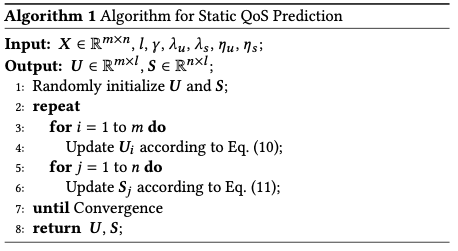
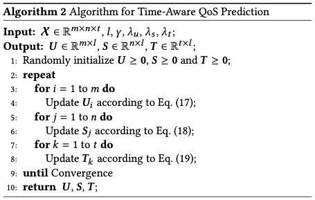

# 5 The Proposed Framework

考虑到现实世界中由于缺乏评分数据而无法做出可靠预测的情况，提供冷启动环境下的个性化Qos预测结果是至关重要的。为了实现这一目标，我们扩展了我们的方法，通过依次考虑自治域偏置、区域偏置、全局偏置，我们的框架全面的处理了包括三种情况的冷启动问题，即新引入的用户、新引入的服务和高稀疏度的矩阵环境。在这一节中，我们将首先概述所提出的框架NBMF，然后详细介绍NBMF训练模型的每个步骤，最后讨论NBMF如何提供冷启动环境下的个性化Qos预测结果。

## .1 An Overview of the Proposed Framework

> 参考：GNN、CNMF、LMF-PP

我们的方法概述如图1所示。在网络服务领域，可以从不同的用户和网络服务中收集历史QoS数据。通常情况下，由于难以获得大量的服务质量信息，这种数据集具有相当稀疏的矩阵形式。建议的方法假设历史数据集包含位置信息。这个假设是合理的，因为IP地址通常可以从用户和网络服务描述中获得。这些数据可以由LMF-PP按照以下顺序进行处理：位置分组、相似性计算和基于模型的协同过滤。由LMF-PP处理的输出矩阵包含所有的预测数据。预测的QoS值可用于选择满足非功能要求的服务。LMF-PP的每个步骤将在下面的小节中解释。

所提出模型的结构如图2所示。该模型由三个部分组成：用户建模、项目建模和评分预测。第一个部分是**用户建模**，即学习用户的潜在因素。由于社交推荐系统中的数据包括两个不同的图，即社交图和用户-项目图，我们获得了从不同角度学习用户表征的绝佳机会。因此，我们引入了两种聚合方式来分别处理这两种不同的图。一个是项目聚合，它可以被用来通过用户-项目图（或项目空间）中的用户和项目之间的互动来理解用户。另一个是社会聚合，即社会图中用户之间的关系，它可以帮助从社会角度（或社会空间）对用户进行建模。然后，通过结合项目空间和社会空间的信息，就可以直观地得到用户的潜在因素。第二部分是**项目建模**，也就是学习项目的潜因素。为了考虑用户-项目图中的互动和意见，我们引入了用户聚合，即在项目建模中聚合用户的意见。第三部分是**通过整合用户和项目建模组件**，通过预测学习模型参数。接下来，我们将详细介绍每个模型组件。

## .2 Network Grouping

Group by AS to AS

Group by region to region

// 概念说明 和 图例

## 5.3 Mean Computation

Form AS-AS matrix

Form region-region matrix

Calcalate the global mean

// 加入算法说明

## .4 Matrix Factorization

MF with AS bias

MF with region bias

MF with global bias

## 5.5 Prediction

