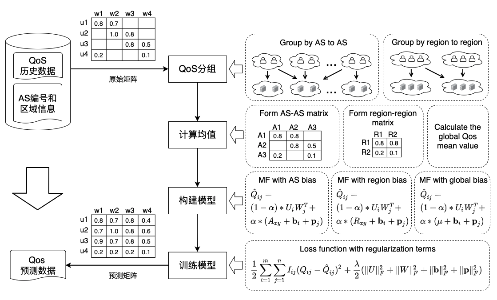
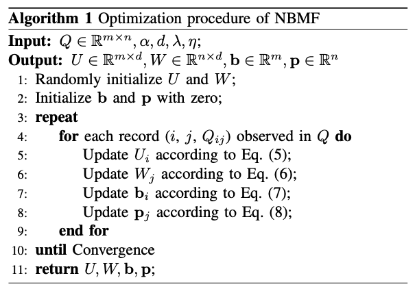

# 发明专利申请


## 一、扉页

#### 发明名称

一种基于网络偏置的Web服务质量预测方法


#### 摘要


## 二、权利要求书

1. 一种基于网络偏置的Web服务质量预测方法，其特征在于，该方法包括以下具体步骤：

   A. 收集用户调用服务的QoS历史数据、用户所属网络区域、服务所属网络区域；

   B. 根据用户所属的网络区域和服务所属的网络区域，对QoS历史数据进行分组；

   C. 根据QoS历史数据的分组，计算每两个网络区域间用户调用服务的QoS平均值；

   D. 根据每两个网络区域间的QoS平均值，构建基于网络偏置的矩阵因子分解模型；

   E. 根据用户调用服务的QoS历史数据，训练基于网络偏置的矩阵分解因子模型；

   F. 使用基于网络偏置的矩阵因子分解模型来预测用户调用服务的QoS未知值。

   

2. 根据权利要求1所述的基于网络偏置的Web服务质量预测方法，其特征在于，所述步骤D根据每两个网络区域间的QoS平均值，构建基于网络偏置的矩阵因子分解模型，具体步骤如下：

   D1. 定义网络偏置，网络偏置由用户偏置、服务偏置、两个网络区域间的QoS平均值组成；其中，用户偏置为用户感知到的QoS值普遍高于或低于同网络区域其他用户的偏差值，服务偏置为服务提供的QoS值普遍高于或低于同网络区域其他服务的偏差值，两个网络区域间的QoS平均值为用户所属网络区域中的所有用户调用服务所属网络区域中所有服务的QoS历史数据的平均值；

   

   D2. 构建网络偏置模型，网络偏置模型用来预测用户与服务之间的网络环境对QoS值的影响：
   $$
   \begin{split}
   \hat {Q}'_{ij} &= \mu_{xy} + \bold{b}_i + \bold{p}_j
   \end{split}
   \tag{1}
   $$
   其中，$x$ 为用户 $i$ 所在网络区域，$y$ 为服务 $j$ 所在网络区域，$\mu_{xy}$ 为网络区域 $x$ 与网络区域 $y$ 通信的Qos平均值；$\bold{b}_i (1\le i\le m)$ 表示用户 $i$ 所感知到的Qos值普遍高于或低于同网络区域其他用户的偏差值， $\bold{p}_j (1\le j\le n)$ 表示服务 $j$ 所提供的Qos值普遍高于或低于同网络区域其他服务的偏差值；

   

   D3. 构建矩阵分解模型，矩阵分解模型用来预测用户与服务之间的交互作用对QoS值的影响：
   $$
   \begin{split}
   \hat {Q}''_{ij} &= U_iW_j^T
   \end{split}
   \tag{2}
   $$
   其中， $U \in \mathbb{R}_{m \times d}$ 表示用户潜在特征矩阵，$W \in \mathbb{R}_{n \times d}$ 表示服务潜在特征矩阵；向量 $U_i (1\le i\le m)$ 表示用户 $i$ 的潜在特征向量，向量 $W_j (1\le j\le n)$ 表示服务 $j$ 的潜在特征向量；参数 $d$ 表示用户潜在特征矩阵和服务潜在特征矩阵的维度，即矩阵分解中潜在特征的数量；

   

   D4. 构建基于网络偏置的矩阵分解模型，基于网络偏置的矩阵分解模型既考虑了网络环境对QoS值的影响，又考虑了交互作用对QoS值的影响：
   $$
   \begin{split}
   \hat {Q}_{ij} &= \alpha \ (\mu_{xy} + \bold{b}_i + \bold{p}_j) + (1-\alpha) \ U_iW_j^T
   \end{split}
   \tag{3}
   $$
   在这个公式中，第一项为网络偏置模型，第二项为矩阵分解模型；权重 $\alpha (0\le\alpha\le 1)$ 表示在Qos预测模型中使用多少网络偏置信息；$\alpha $ 是一个可调整的参数，如果 $\alpha$ 被设置为0，则表示不考虑用户与服务之间的网络环境对QoS值的影响，完全使用矩阵分解来进行预测；如果 $\alpha$ 被设置为1，则表示不考虑用户与服务之间的交互作用对QoS值的影响，完全使用网络偏置来进行预测；$\hat{Q}_{ij}$表示用户 $i$ 调用服务 $j$ 的Qos预测值。


3. 根据权利要求1所述的基于网络偏置的Web服务质量预测方法，其特征在于，所述步骤E根据用户调用服务的QoS历史数据，训练基于网络偏置的矩阵分解因子模型，具体步骤如下：

   E1. 构建损失函数，损失函数用来衡量QoS预测模型对QoS历史数据的拟合程度，损失函数的值越小，表示QoS预测模型对样本数据的拟合程度越高；
   $$
   L = min_{U,W,\bold{b},\bold{p}}\frac{1}{2}\sum_{i=1}^{m}\sum_{j=1}^{n}I_{ij}(Q_{ij} - \hat{Q}_{ij})^2 \tag{4}
   $$
   其中， $I_{ij}$ 是指示函数，如果用户 $i$ 调用过服务 $j$，则返回1，否则返回0；$Q_{ij}$ 和 $\hat{Q}_{ij}$分别表示用户 $i$ 调用服务 $j$ 的QoS样本值和预测值，公式(3)给出了$\hat{Q}_{ij}$ 的预测函数；

   

   E2. 正则化损失函数，为了减小模型的过拟合倾向，以保证模型稳定性，在损失函数中加入四个与 $U、W$ 和 $\bold{b}、\bold{p}$ 相关的正则项：
   $$
   \begin{split}
   L &= min_{U,W,\bold{b},\bold{p}}\frac{1}{2}\sum_{i=1}^{m}\sum_{j=1}^{n}I_{ij}(Q_{ij} - \hat{Q}_{ij})^2 \\
   &+ \frac{\lambda}{2}(\Vert U\Vert^2_F + \Vert W\Vert^2_F + \Vert \bold{b}\Vert^2_F + \Vert \bold{p}\Vert^2_F)
   \end{split}
   \tag{4}
   $$
   其中，$\lambda > 0$ 控制正则化的程度，$\Vert \cdot \Vert^2_F$ 表示矩阵的 Frobenius 范数；

   

   E3. 随机梯度下降寻找最优解，使得损失函数的值最小；随机梯度下降根据单个样本的损失来计算梯度并更新参数，对于每条QoS历史数据，有以下更新规则：
   $$
   \begin{align}
   &U'_i = U_i - \eta \frac{\partial L}{\partial U_i} \\
   &W'_j = W_j - \eta \frac{\partial L}{\partial W_j} \\
   &\bold{b}'_i = \bold{b}_i - \eta \frac{\partial L}{\partial \bold{b}_i} \\
   &\bold{p}'_j = \bold{p}_j - \eta \frac{\partial L}{\partial \bold{p}_j}
   \end{align}
   $$
   其中 $\eta > 0$ 表示求解潜在特征矩阵和偏置向量的更新速率，并且
   $$
   \begin{split}
   &\frac{\partial L}{\partial U_i} = \lambda U_i - (Q_{ij}-\hat{Q}_{ij}) \ (1-\alpha) \ W_j \\
   &\frac{\partial L}{\partial W_j} = \lambda W_j - (Q_{ij}-\hat{Q}_{ij}) \ (1-\alpha) \ U_i \\
   &\frac{\partial L}{\partial \bold{b}_i} = \lambda\bold{b}_i - (Q_{ij}-\hat{Q}_{ij})\ \alpha \\
   &\frac{\partial L}{\partial \bold{p}_j} = \lambda\bold{p}_j - (Q_{ij}-\hat{Q}_{ij})\ \alpha
   \end{split}
   $$
   


## 三、权利说明书

#### 技术领域

本发明涉及服务计算，尤其涉及一种基于网络偏置的Web服务质量预测方法


#### 背景技术

面对大量具有相同功能的候选Web服务，调查服务的非功能属性成为服务选择的主要关注点。服务质量（QoS）代表了Web服务的非功能属性，比如：响应时间、吞吐量、可用性和可靠性等。然而，要获得所有候选服务的QoS值并不容易。首先，用户观察到的QoS值在很大程度上取决于Web服务的调用环境，不同的用户观察到的相同Web服务的QoS值可能非常不同；其次，考虑到高昂的时间成本和巨大的资源开销，用户不可能自己调用所有的Web服务来获得个性化的QoS值。因此，近年来，Web服务的QoS预测吸引了许多研究者的注意，并被认为是获得Web服务的QoS值的有效方法。

在最近的文献中，协同过滤(CF)已被广泛用于QoS预测。现有的基于CF的预测方法可以分为两大类：基于记忆的协同过滤和基于模型的协同过滤。基于记忆的协同过滤首先通过皮尔逊相关系数(PCC)来寻找相似用户或相似服务，然后使用相似用户或相似服务的QoS值对缺失值进行预测。然而，现实中的每个用户可能只调用过很少的服务，这就降低了用PCC计算相似度的准确性。基于模型的协同过滤根据观察到的历史调用数据建立一个全局模型来进行预测，并在处理稀疏的用户服务矩阵时表现良好。

作为最流行的基于模型的协同过滤技术之一，矩阵分解(MF)最近被应用于服务质量预测。MF试图捕捉用户和服务之间的交互作用，它将高维度的用户服务调用矩阵分解成两个低维度的特征矩阵，特征矩阵的内积代表了用户调用服务的QoS预测值。现有的MF方法侧重于利用用户的邻域信息来改进QoS预测，他们认为相似的用户在调用服务时存在相似的交互作用。然而，除了用户与服务之间的交互作用会对QoS值产生影响，用户与服务之间的网络环境也会对QoS值产生影响。以响应时间为例，用户感知到的服务响应时间必须包括处理时间和传输时间，而传输时间会根据用户与服务之间的网络环境而有很大的差异。


#### 发明内容

本发明的目的在于提供一种基于网络偏置的Web服务质量预测方法，该方法既考虑到了用户与服务之间的交互作用对QoS值的影响，又考虑到了用户与服务之间的网络环境对QoS值的影响。

本发明的技术方案如下：

//复制权利要求书

本发明的有益效果为：

1）定义了网络偏置的概念，在QoS的预测过程中考虑用户与服务之间的网络环境对QoS的影响

2）构建了网络偏置的模型，借助线性回归思想来预测用户与服务之间的网络环境对QoS的影响

3）构建了基于网络偏置的矩阵分解模型，能够在复杂的网络环境中预测用户调用服务的QoS值


#### 附图说明


```
我们知道了你发明了一种算法。我们想问：在什么场景下可以用到这个算法，并且在该场景下算法要怎么实现
```

#### 实施方式

下面结合说明书附图和具体实施例对本发明作进一步说明，需要指出的是，以下所述具体实施例旨在便于对本发明的理解，而对其不起任何限定作用。

1. 本实施例将在真实世界的Web服务质量数据集 WSDream 上应用本发明：

   WSDream 数据集包括 1974675 条Qos记录，这些记录是通过分布在30个区域的 339 台计算机（用户）对分布在73个区域的5825个 Web 服务进行调用得到的；每个用户和每个 Web 服务之间都有一条通过调用产生的Qos记录，本实施例重点研究了Qos属性中的响应时间（RT）；同时，该数据集中还收集了这些用户和服务的IP、自治系统（AS）、区域等信息。


2. 如图1所示，本实施例的整体流程包括以下部分：

   A. 收集用户调用服务的QoS历史数据、用户所属网络区域、服务所属网络区域；

   B. 根据用户所属的网络区域和服务所属的网络区域，对QoS历史数据进行分组；

   C. 根据QoS历史数据的分组，计算每两个网络区域间用户调用服务的QoS平均值；

   D. 根据每两个网络区域间的QoS平均值，构建基于网络偏置的矩阵因子分解模型；

   E. 根据用户调用服务的QoS历史数据，训练基于网络偏置的矩阵分解因子模型；

   F. 使用基于网络偏置的矩阵因子分解模型来预测用户调用服务的QoS未知值。


3. 收集用户调用服务的QoS历史数据、用户所属网络区域、服务所属网络区域，具体步骤如下：

   A1. 为了模拟不同稀疏程度的矩阵环境，本实施例从数据集中随机删除一定数量的Qos值，生成密度为15%、20%、25% 和 30% 的用户服务矩阵；

   A2. 移除的原始Qos值用作预期值，以评估本发明所取得的预测精度；例如，矩阵密度为15%意味着我们随机选择原始用户服务矩阵中15%的Qos值来预测其余85%的Qos值；

   A3. 同时，本实施例还收集了用户所属的AS编号和区域信息、服务所属的AS编号和区域信息。


4. 根据用户所属的网络区域和服务所属的网络区域，对QoS历史数据进行分组，具体步骤如下：

   B1. 根据用户所属的AS编号和服务所属的AS编号，对QoS历史数据进行分组，即用户所属的AS编号和服务所属的AS编号均相同的QoS历史数据分在同一组；

   B2. 根据用户所属区域和服务所属的区域，对QoS历史数据进行分组，即用户所属的区域和服务所属的区域均相同的QoS历史数据分在同一组。


5. 根据QoS历史数据的分组，计算每两个网络区域间用户调用服务的QoS平均值，具体步骤如下：

   C1. 根据步骤B1得到的QoS历史数据的分组，可以计算得出每两个AS编号间用户调用服务的QoS平均值；

   C2. 根据步骤B2得到的QoS历史数据的分组，可以计算得出每两个区域间用户调用服务的QoS平均值；

   C3. 根据已知的QoS历史数据，可以计算得出全局的QoS平均值。


6. 根据每两个网络区域间的QoS平均值，构建基于网络偏置的矩阵因子分解模型，具体步骤如下：

   D1. 根据每两个AS编号间用户调用服务的QoS平均值，构建基于AS偏置的矩阵因子分解模型：
   $$
   \begin{split}
   \hat {Q}_{ij} &= \alpha \ (A_{xy} + \bold{b}_i + \bold{p}_j) + (1-\alpha) \ U_iW_j^T
   \end{split}
   \tag{3}
   $$
   其中，$x$ 为用户 $i$ 所在AS编号，$y$ 为服务 $j$ 所在AS编号，$A_{xy}$ 为AS编号 $x$ 与AS编号 $y$ 通信的Qos平均值；

   

   D2. 根据每两个区域间用户调用服务的QoS平均值，构建基于区域偏置的矩阵因子分解模型：
   $$
   \begin{split}
   \hat {Q}_{ij} &= \alpha \ (R_{xy} + \bold{b}_i + \bold{p}_j) + (1-\alpha) \ U_iW_j^T
   \end{split}
   \tag{3}
   $$
   其中，$x$ 为用户 $i$ 所在区域，$y$ 为服务 $j$ 所在区域，$R_{xy}$ 为区域 $x$ 与区域 $y$ 通信的Qos平均值；

   

   D3. 根据全局的QoS平均值，构建基于全局偏置的矩阵因子分解模型：
   $$
   \begin{split}
   \hat {Q}_{ij} &= \alpha \ (\mu + \bold{b}_i + \bold{p}_j) + (1-\alpha) \ U_iW_j^T
   \end{split}
   \tag{3}
   $$
   其中，$\mu$ 为的全局的Qos平均值。


7. 根据用户调用服务的QoS历史数据，训练基于网络偏置的矩阵分解因子模型，具体步骤如下：

   E1. 构建损失函数，损失函数用来衡量QoS预测模型对QoS历史数据的拟合程度，损失函数的值越小，表示QoS预测模型对样本数据的拟合程度越高：
   $$
   L = min_{U,W,\bold{b},\bold{p}}\frac{1}{2}\sum_{i=1}^{m}\sum_{j=1}^{n}I_{ij}(Q_{ij} - \hat{Q}_{ij})^2 \tag{4}
   $$
   其中， $I_{ij}$ 是指示函数，如果用户 $i$ 调用过服务 $j$，则返回1，否则返回0；$Q_{ij}$ 和 $\hat{Q}_{ij}$分别表示用户 $i$ 调用服务 $j$ 的QoS样本值和预测值；如果 $\hat{Q}_{ij}$ 为公式(1)中的预测函数，则 $L$ 为基于AS偏置的矩阵分解模型的损失函数；如果 $\hat{Q}_{ij}$ 为公式(2)中的预测函数，则 $L$ 为基于区域偏置的矩阵分解模型的损失函数；如果 $\hat{Q}_{ij}$ 为公式(3)中的预测函数，则 $L$ 为基于全局偏置的矩阵分解模型的损失函数；

   

   E2. 正则化损失函数，为了减小模型的过拟合倾向，以保证模型稳定性，在损失函数中加入四个与 $U、W$ 和 $\bold{b}、\bold{p}$ 相关的正则项：
   $$
   \begin{split}
   L &= min_{U,W,\bold{b},\bold{p}}\frac{1}{2}\sum_{i=1}^{m}\sum_{j=1}^{n}I_{ij}(Q_{ij} - \hat{Q}_{ij})^2 \\
   &+ \frac{\lambda}{2}(\Vert U\Vert^2_F + \Vert W\Vert^2_F + \Vert \bold{b}\Vert^2_F + \Vert \bold{p}\Vert^2_F)
   \end{split}
   \tag{4}
   $$
   其中，$\lambda > 0$ 控制正则化的程度，$\Vert \cdot \Vert^2_F$ 表示矩阵的 Frobenius 范数；

   

   E2. 随机梯度下降寻找最优解，使得损失函数的值最小；随机梯度下降根据单个样本的损失来计算梯度并更新参数，对于每条QoS历史数据，有以下更新规则：
   $$
   \begin{align}
   &U'_i = U_i - \eta \frac{\partial L}{\partial U_i} \\
   &W'_j = W_j - \eta \frac{\partial L}{\partial W_j} \\
   &\bold{b}'_i = \bold{b}_i - \eta \frac{\partial L}{\partial \bold{b}_i} \\
   &\bold{p}'_j = \bold{p}_j - \eta \frac{\partial L}{\partial \bold{p}_j}
   \end{align}
   $$
   

   其中 $\eta > 0$ 表示求解潜在特征矩阵和偏置向量的更新速率，并且
   $$
   \begin{split}
   &\frac{\partial L}{\partial U_i} = \lambda U_i - (Q_{ij}-\hat{Q}_{ij}) \ (1-\alpha) \ W_j \\
   &\frac{\partial L}{\partial W_j} = \lambda W_j - (Q_{ij}-\hat{Q}_{ij}) \ (1-\alpha) \ U_i \\
   &\frac{\partial L}{\partial \bold{b}_i} = \lambda\bold{b}_i - (Q_{ij}-\hat{Q}_{ij})\ \alpha \\
   &\frac{\partial L}{\partial \bold{p}_j} = \lambda\bold{p}_j - (Q_{ij}-\hat{Q}_{ij})\ \alpha
   \end{split}
   $$
   

   随机梯度下降的算法过程在图2中给出；令 $r$ 表示算法实现收敛的迭代次数，令 $s$ 表示原始矩阵 $Q$ 中QoS历史数据的数量，令 $d$ 表示用户潜在特征矩阵和服务潜在特征矩阵的维度；算法的主要时间成本在于矩阵 $U、W$ 和向量 $\bold{b}, \bold{p}$ 的更新，在每一轮的迭代中，更新 $U、W$ 需要的时间成本为 $O(sd)$，更新 $\bold{b}、\bold{p}$ 需要的时间成本为 $O(s)$ 。因此随机梯度下降的整体时间复杂度可以用 $O(rsd)$ 表示。


F. 使用基于网络偏置的矩阵因子分解模型来预测用户调用服务的QoS未知值。

如果，则说明，否则

如果，则说明，否则


实践/举例/响应时间/实验怎么做/怎么实现/图








https://wenku.baidu.com/view/1b5ec425497302768e9951e79b89680203d86b80.html

https://www.javaroad.cn/questions/346275
