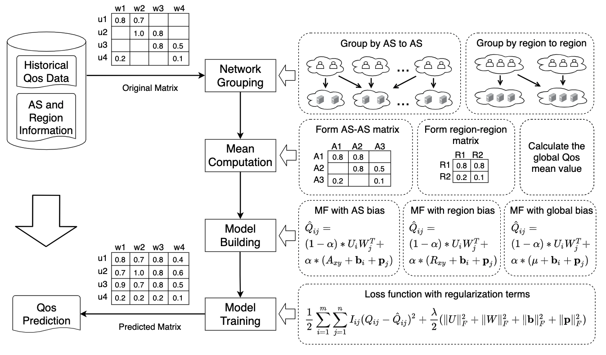

# 发明专利申请

## 一、扉页

#### 发明名称

一种基于网络偏置的Web服务质量预测方法

#### 摘要

先流程

再算法

再框架

## 二、权利要求书

1. 一种基于网络偏置的Web服务QoS预测方法，其特征在于，该方法包括以下具体步骤：

   A. 收集用户调用服务的QoS历史数据、用户所属网络区域、服务所属网络区域；

   B. 根据用户所属的网络区域和服务所属的网络区域，对QoS历史数据进行分组；

   C. 根据QoS历史数据的分组，计算每两个网络区域间用户调用服务的QoS平均值；

   D. 根据每两个网络区域间的QoS平均值，构建基于网络偏置的矩阵因子分解模型；

   E. 根据用户调用服务的QoS历史数据，训练基于网络偏置的矩阵分解因子模型；

   F. 使用基于网络偏置的矩阵因子分解模型来预测用户调用服务的QoS未知值。

   

2. 根据权利要求1所述的基于网络偏置的Web服务QoS预测方法，其特征在于，所述步骤D根据每两个网络区域间的QoS平均值，构建基于网络偏置的矩阵因子分解模型，具体步骤如下：

   D1. 定义网络偏置，网络偏置由用户偏置、服务偏置、两个网络区域间的QoS平均值组成；其中，用户偏置为用户感知到的QoS值普遍高于或低于同网络区域其他用户的偏差值，服务偏置为服务提供的QoS值普遍高于或低于同网络区域其他服务的偏差值，两个网络区域间的QoS平均值为用户所属网络区域中的所有用户调用服务所属网络区域中所有服务的QoS历史数据的平均值；

   

   D2. 构建网络偏置模型，网络偏置模型用来预测用户与服务之间的网络环境对QoS值的影响：
   $$
   \begin{split}
   \hat {Q}'_{ij} &= \mu_{xy} + \bold{b}_i + \bold{p}_j
   \end{split}
   \tag{1}
   $$
   其中，$x$ 为用户 $i$ 所在网络区域，$y$ 为服务 $j$ 所在网络区域，$\mu_{xy}$ 为网络区域 $x$ 与网络区域 $y$ 通信的Qos平均值；$\bold{b}_i (1\le i\le m)$ 表示用户 $i$ 所感知到的Qos值普遍高于或低于同网络区域其他用户的偏差值， $\bold{p}_j (1\le j\le n)$ 表示服务 $j$ 所提供的Qos值普遍高于或低于同网络区域其他服务的偏差值；

   

   D3. 构建矩阵分解模型，矩阵分解模型用来预测用户与服务之间的交互作用对QoS值的影响：
   $$
   \begin{split}
   \hat {Q}''_{ij} &= U_iW_j^T
   \end{split}
   \tag{2}
   $$
   其中， $U \in \mathbb{R}_{m \times d}$ 表示用户潜在特征矩阵，$W \in \mathbb{R}_{n \times d}$ 表示服务潜在特征矩阵；向量 $U_i (1\le i\le m)$ 表示用户 $i$ 的潜在特征向量，向量 $W_j (1\le j\le n)$ 表示服务 $j$ 的潜在特征向量；参数 $d$ 表示用户潜在特征矩阵和服务潜在特征矩阵的维度，即矩阵分解中潜在特征的数量；

   

   D4. 构建基于网络偏置的矩阵分解模型，基于网络偏置的矩阵分解模型既考虑了网络环境对QoS值的影响，又考虑了交互作用对QoS值的影响：
   $$
   \begin{split}
   \hat {Q}_{ij} &= \alpha \ (\mu_{xy} + \bold{b}_i + \bold{p}_j) + (1-\alpha) \ U_iW_j^T
   \end{split}
   \tag{3}
   $$
   在这个公式中，第一项为网络偏置模型，第二项为矩阵分解模型；权重 $\alpha (0\le\alpha\le 1)$ 表示在Qos预测模型中使用多少网络偏置信息；$\alpha $ 是一个可调整的参数，如果 $\alpha$ 被设置为0，则表示不考虑用户与服务之间的网络环境对QoS值的影响，完全使用矩阵分解来进行预测；如果 $\alpha$ 被设置为1，则表示不考虑用户与服务之间的交互作用对QoS值的影响，完全使用网络偏置来进行预测。

   

3. 根据权利要求1所述的基于网络偏置的Web服务QoS预测方法，其特征在于，所述步骤E根据用户调用服务的QoS历史数据，训练基于网络偏置的矩阵分解因子模型，具体步骤如下：

   E1. 损失函数

   E2. 损失函数加正则

   E3. 随机梯度下降找最优解

4. 根据权利要求1所述的基于网络偏置的Web服务QoS预测方法，其特征在于，所述步骤F使用基于网络偏置的矩阵因子分解模型来预测用户调用服务的QoS未知值，具体步骤如下：

## 三、权利说明书

* 技术领域
* 背景技术
  * 背景
  * 意义
  * 传统方法
  * 不足之处
* 发明内容：理论
* 附图说明
* 实施方式：实践/举例/响应时间/实验怎么做/怎么实现/图

