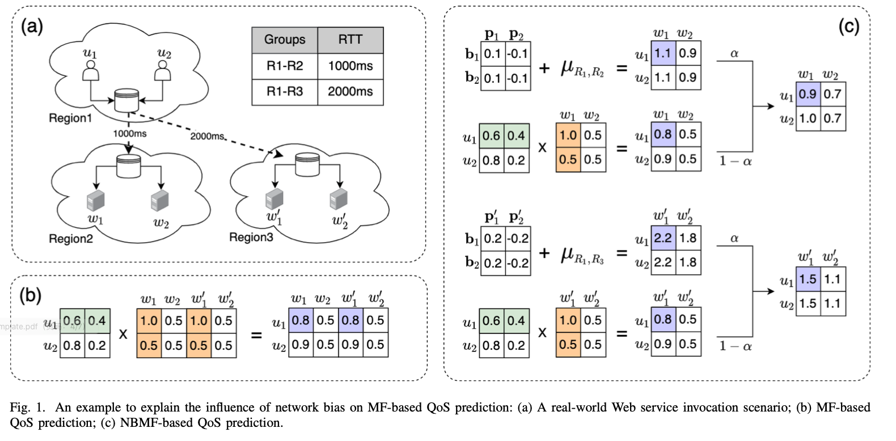
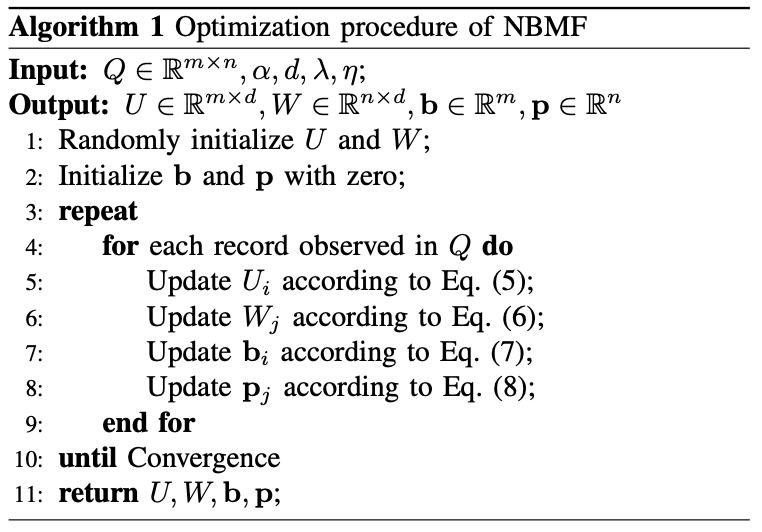
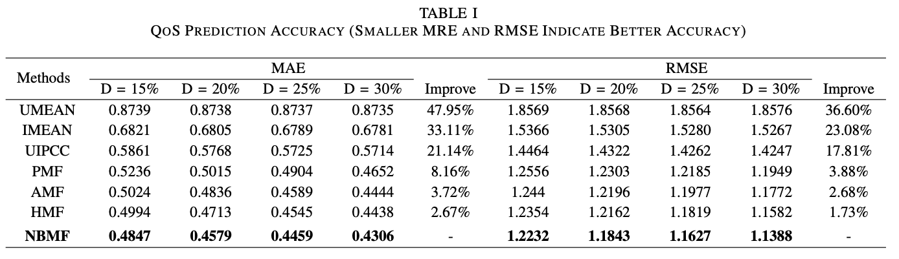
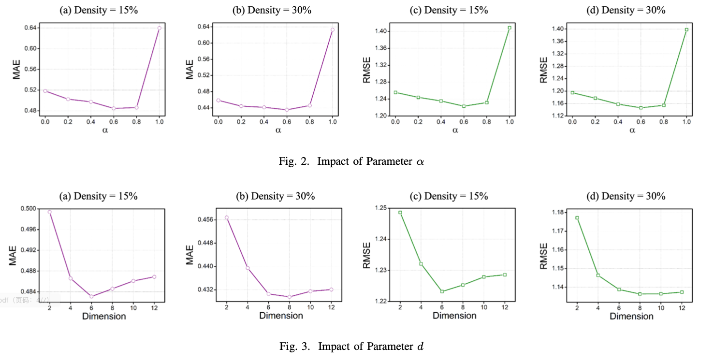

# Collaborative Web Service Quality Prediction via Network Biased Matrix Factorization


## abstract

Facing a large number of candidate Web services with the same function, users hope to select the most appropriate one. Quality-of-Service (QoS) represents non-functional attributes of Web services and it has become a major concern for service selection. It is time-consuming and resource-consuming to assess all the QoS values by invoking candidate services one by one, Thus, QoS prediction is considered an effective method to obtain QoS information. Although various QoS prediction methods have been proposed to capture the interaction between users and services, few of them have taken non-interaction into consideration, especially the non-interaction from the network environment. In this paper, we refer to the non-interaction factors from the network environment as network bias, and propose a network biased matrix factorization (NBMF) method for QoS prediction. Our method packages network bias into a linear regression model, while putting the part of data representing user-service interaction into a matrix factorization model, which makes our method adaptable to complex network environment. Finally, We conduct extensive experiments on a real-world QoS dataset. The result demonstrates that our method can achieve better performance than the state-of-the-art baseline methods.


## 1 Introduction

在互联网环境下利用Web技术可以构造各种各样的应用，这些应用可能运行在不同的机器和操作系统上，而且还可能部署在不同的国家和地域。为了在各种应用之间进行数据集成和数据交换，Web服务[1]应运而生。由在线Web服务存储库 Programmable Web 发布的统计数据表明，过去几年中已经发布的Web服务数量快速增长。Web服务的流行允许构建不同的面向服务的应用程序和系统，以满足日益复杂的业务需求。

为了确保面向服务的应用程序和系统的可靠性，需要调查其组成部分Web服务的质量。Web服务的质量可以通过其功能和非功能属性来描述。服务质量（Qos）代表了Web服务的非功能方面，如：响应时间、吞吐量、可用性和可靠性等[3,4]。由于网络上有许多功能相当或相似的服务，调查非功能的Qos属性成为服务选择的主要关注点[5, 6]。在实践中，要获得所有候选服务的Qos值并不容易。首先，用户观察到的Qos值在很大程度上取决于网络服务的调用环境，不同的用户观察到的同一Web服务的质量可能非常不同[7]。其次，考虑到高时间成本和巨大的资源开销，用户不可能自己调用所有的Web服务来获得个性化的Qos值[8,9]。因此，近年来，网络服务的质量预测吸引了许多研究者的注意，并被认为是获得Web服务质量信息的有效方法。

在最近的文献中，协同过滤(CF)已被广泛用于质量预测[2, 12]。现有的基于CF的预测方法可以分为两大类：基于记忆的协同过滤和基于模型的协同过滤。基于记忆的协同过滤首先通过皮尔逊相关系数(PCC)来寻找相似用户或相似服务[7, 13]，然后使用相似用户或相似服务的QoS值对缺失值进行预测。然而，现实中的每个用户可能只调用过很少的服务，这就降低了用PCC计算相似度的准确性。基于模型的协同过滤根据观察到的历史调用数据建立一个全局模型来进行预测，并在处理稀疏的用户服务矩阵时表现良好。作为最流行的基于模型的协同过滤技术之一，矩阵分解(MF)最近被应用于服务质量预测[10, 11]。MF试图捕捉用户和服务之间的交互作用，它将高维度的用户服务调用矩阵分解成两个低维度的特征矩阵[2, 5]，特征矩阵的内积代表了用户调用服务的QoS预测值。除了用户和服务之间的交互作用，在实际的预测过程中还存在许多与交互作用无关的因子。尽管Zhu等人[14]提出使用用户偏置和服务偏置来捕获用户和服务之间的非交互作用，但是他们并没有考虑到网络环境带来的非交互影响。以响应时间为例，用户感知到的服务响应时间必须包括网络延迟[15]，而网络延迟会根据通信路径的不同而有很大的差异。

在本文中，我们将网络环境带来的非交互影响称为网络偏置，并提出了一种带有网络偏置的矩阵分解模型来进行Qos预测。我们的方法既考虑了与用户服务交互作用相关的因子，又考虑了与用户服务交互作用无关的因子。在与用户服务交互作用无关的因子中，我们重点研究了网络偏差对Qos预测的影响。具体来说，我们的方法把与用户服务交互作用无关的网络偏置封装到线性回归模型中，而把真正代表用户-服务交互作用的那部分数据放到矩阵分解模型中。这使得我们的方法对于复杂的网络环境具备很好的适应性。考虑到现实世界中由于缺乏评分数据而无法做出可靠预测的情况，提供冷启动[14]环境下的个性化Qos预测结果是至关重要的。通过对网络偏置进行准确的建模，我们的方法能够提供冷启动环境下的个性化Qos预测结果。

综上所述，本文的主要贡献包括：

* 我们提出了一种基于网络偏置的矩阵分解模型来进行Qos预测。我们的方法既考虑了与用户服务交互作用相关的因子，又考虑了与用户服务交互作用无关的因子。这使得我们的方法对复杂的网络环境具备很好的适应性。
* 我们在真实世界的Web服务质量数据集上进行了广泛的实验俩来评估我们方法的性能。结果表明，我们的方法可以达到比最先进的基线方法更好的性能。

The remainder of this paper is organized as follows. In Section 2, we explain the motivation of this work. In Section 3, we introduce the proposed method. In Section 4, we discuss the cold-start issue in our method. In Section 5, we conduct experiments on real-world datasets to illustrate the effectiveness of the proposed method. In Section 6, we review work related to our method. Finally, we conclude our work with future directions in Section 7.


## 2 Motivation

传统的MF不能产生个性化的QoS预测，因为它忽略了用户和服务之间的非交互偏差，特别是来自网络环境的非交互偏差。为了详细解释这个问题，本节首先介绍了基于MF的QoS预测，然后给出一个简单的例子来说明网络偏差对基于MF的QoS预测的影响。


### 2.1 Matrix Factorization

矩阵分解使用因子模型来拟合用户服务矩阵进行预测，它将高维度的用户服务调用矩阵分解成两个低维度的特征矩阵来进行预测。低维度的特征矩阵试图通过描述用户和服务在各个因子（如系统结构、指令系统、硬件组成、软件配置）上的特征来解释Qos值。例如，服务隐向量的每个维度值的大小代表了该服务具备这些因子的程度，用户隐向量的每个维度值的大小代表了用户对这些因子的感知程度，用户隐向量和服务隐向量的点积代表了用户和服务之间的交互作用，也就是用户调用服务的Qos值。因此，基于MF的QoS预测方法的一般目标函数可以被推导为：
$$
\begin{split}
\hat {Q}_{ij} &= {U_iW_j^T}
\end{split}
\tag{1}
$$
其中 $U \in R_{m \times d}$ 表示用户潜在特征矩阵，$W \in R_{n \times d}$ 表示服务潜在特征矩阵。向量 $U_i (1\le i\le m)$ 表示用户 $i$ 的潜在特征向量，向量 $W_j (1\le j\le n)$ 表示服务 $j$ 的潜在特征向量，他们的维度为d。用户 $i$ 调用服务 $j$ 的Qos预测值为$\hat{Q}_{ij}$。


### 2.2 Motivating Example

为了解释网络偏差对基于MF的QoS预测的影响，图1中给出了一个直接的例子。在这个例子中，我们需要预测用户$u_1, u_2$对服务$w_1,w_2,w'_1,w'_2$的QoS评分。假设用户$u_1$，$u_2$位于区域$R_1$中，服务$w_1$，$w_2$位于区域$R_2$中，服务$w'_1$，$w'_2$位于区域$R_3$中。其中，服务$w_1$，$w_2$和服务$w'_1$，$w'_2$的性能指标完全相同，区域$R_1$与区域$R_2$通信的平均响应时间为1s，区域$R_1$与区域$R_3$通信的平均响应时间为2s。

传统矩阵分解的Qos预测过程如图1(b)所示，我们假设用户调用服务的Qos值由两种潜在因子决定，这两种潜在因子分别为硬件组成和软件配置。以用户$u_1$和服务$w_1$，$w'_1$为例。用户$u_1$对硬件组成因子的感知程度为0.6，对软件配置因子的感知程度为0.4，服务$w_1$对硬件组成因子的具备程度为1.0，对软件配置因子的具备程度为0.5，用户$u_1$与服务$w_1$的点积代表了用户$u_1$调用服务$w_1$的Qos值，为0.8。由于服务$w_1$和$w'_1$的性能指标完全相同，它们对潜在因子的具备程度也完全相同，因此用户$u_1$调用服务$w'_1$的Qos值也为0.8。 

然而，传统的矩阵分解方法并没有考虑到用户和服务之间的非交互作用，特别是网络偏差对Qos预测的影响。以响应时间为例，用户感知到的服务响应时间必须包括网络延迟，而网络延迟会根据通信路径的不同而有很大的差异[12]。换句话说，虽然服务$w_1$和服务$w'_1$的性能指标完全相同，但是它们所属区域不同（服务$w_1$位于$R_2$，服务$w'_1$位于$R_3$），用户调用它们的Qos值也会有很大不同。因此，在这种情况下，以前的工作所做的 QoS 预测是不准确的。





## 3 Method

由于这些网络偏置值在观察到的评分中占很大比例，因此对他们进行准确的建模就显得至关重要。为了实现这一目标，我们提出了一种基于网络偏置的矩阵分解模型来进行Qos预测。本节将首先介绍我们提出的基于网络偏置的矩阵分解模型，接着给出一个简单的例子用来说明改进后的模型预测过程，最后讲述了模型的训练和参数优化过程。


### 3.1 Network Biased Matrix Factorization

如果我们将网络偏置看作是连续的值而不是离散的值，那么就可以借助线性回归来预测用户与服务之间的网络偏置。按照以上思路，我们提出了基于网络偏置的矩阵分解模型。我们的建模方法把这些与用户服务交互作用无关的网络偏置封装到线性回归模型中，而把真正代表用户-服务交互作用的那部分数据放到矩阵分解模型中。 因此，基于NBMF的Qos预测方法的一般目标函数可以被推导为：
$$
\begin{split}
\hat {Q}_{ij} &= \alpha \ (\mu_{xy} + \bold{b}_i + \bold{p}_j) + (1-\alpha) \ U_iW_j^T
\end{split}
\tag{2}
$$
在这个公式中，第一项 $\alpha \ (\mu_{xy} + \bold{b}_i + \bold{p}_j)$ 为线性回归模型，用来预测用户 $i$ 与服务 $j$ 之间的网络偏置值。其中，$x$ 为用户 $i$ 所在网络，$y$ 为服务 $j$ 所在网络，$\mu_{xy}$ 为网络 $x$ 与网络 $y$ 通信的平均Qos值。$\bold{b}_i (1\le i\le m)$ 表示用户 $i$ 所感知到的Qos值普遍高于或低于同网络其他用户的偏置值， $\bold{p}_j (1\le j\le n)$ 表示服务 $j$ 所具备的Qos值普遍高于或低于同网络其他服务的偏置值。

公式第二项 $(1-\alpha) \ U_iW_j^T$ 为矩阵分解模型，用来捕捉用户 $i$ 和服务 $j$ 之间的交互作用。其中，向量 $U_i (1\le i\le m)$ 表示用户 $i$ 的潜在特征向量，向量 $W_j (1\le j\le n)$ 表示服务 $j$ 的潜在特征向量，他们的点积 $U_iW_j^T$ 表示用户和服务之间的交互作用。$\hat{Q}_{ij}$表示用户 $i$ 调用服务 $j$ 的Qos预测值。

权重 $\alpha (0\le\alpha\le 1)$ 表示我们在Qos预测模型中使用多少网络偏置信息。$\alpha $ 是一个可调整的参数，如果 $\alpha$ 被设置为0，则表示我们的预测模型不考虑网络偏置，完全使用矩阵分解来进行预测。如果 $\alpha$ 被设置为1，则表示我们的预测模型不考虑用户和服务的交互作用，完全使用线性回归来进行预测。为了研究 $\alpha$ 对我们模型的影响并找到一个最佳的模型，本文将在第5节对 $\alpha$ 的值进行评估。


### 3.2 Method Example

改进后的评分预测过程如图1(c)所示，我们以用户$u_1$调用服务$w_1$，$w'_1$为例进行说明。首先是网络偏置值的预测部分。假设区域 $R_1$ 与区域 $R_2$ 通信的平均Qos值 $\mu_{R_1,R_2}$ 为1，区域 $R_1$ 与区域 $R_3$ 通信的平均Qos值 $\mu_{R_1,R_3}$ 为2。用户 $u_1$ 所感知到的Qos值普遍高于或低于同区域其他用户的偏置值 $\bold{b}_1$ 为0，服务 $w_1$ 所具有的Qos值普遍高于或低于同区域其他服务的偏置值 $\bold{p}_1$ 为0.1，服务 $w'_1$ 所具有的Qos值普遍高于或低于同区域其他服务的偏置值 $\bold{p}'_1$ 为0.2。则用户 $u_1$ 调用服务$w_1$ 的网络偏置值 $\mu_{R_1,R_2} + \bold{b}_1 + \bold{p}_1$ 为1.1，用户 $u_1$ 调用服务$w'_1$ 的网络偏置值 $\mu_{R_1,R_3} + \bold{b}_1 + \bold{p}'_1$ 为2.2。其次是矩阵分解的预测部分，关于这部分的预测过程可以参考2.2。

参数 $\alpha$ 默认设置为0.5，我们将用户调用服务的网络偏置值加上只依赖与用户和服务交互作用的预测值，可以得到用户 $u_1$ 调用服务 $w_1$ 的最终Qos预测值为0.9，用户 $u_1$ 调用服务 $w'_1$ 的最终Qos预测值为1.5。

虽然服务$w_1$和服务$w'_1$的性能指标完全相同，但是它们所属区域不同（服务$w_1$位于$R_2$，服务$w'_1$位于$R_3$），用户调用它们的Qos值也会有很大不同。可见我们的方法对复杂的网络环境具备很好的适应性。


### 3.3 Model Training

公式(2)中的潜在特征矩阵 $U、W$ 和网络偏置向量 $\bold{b}、\bold{p}$ 都可以通过统计学习理论来构建。为了估计矩阵 $U、W$ 和向量 $\bold{b}、\bold{p}$ 的值，我们利用如下目标函数对原始质量矩阵 $Q$ 进行近似拟合，最小化公式如下：
$$
L = min_{U,W,\bold{b},\bold{p}}\frac{1}{2}\sum_{i=1}^{m}\sum_{j=1}^{n}I_{ij}(Q_{ij} - \hat{Q}_{ij})^2 \tag{3}
$$
其中 $I_{ij}$ 是指示函数，如果用户 $i$ 调用过服务 $j$，则返回1，否则返回0。为了避免过度拟合得到最优的矩阵 $U、W$ 和向量 $\bold{b}、\bold{p}$ 逼近原始矩阵 $Q$，我们加入了四个与 $U、W$ 和 $\bold{b}、\bold{p}$ 相关的正则项：
$$
\begin{split}
L &= min_{U,W,\bold{b},\bold{p}}\frac{1}{2}\sum_{i=1}^{m}\sum_{j=1}^{n}I_{ij}(Q_{ij} - \hat{Q}_{ij})^2 \\
&+ \frac{\lambda_u}{2}\Vert U\Vert^2_F + \frac{\lambda_w}{2}\Vert W\Vert^2_F + \frac{\lambda_b}{2}\Vert \bold{b}\Vert^2_F + \frac{\lambda_p}{2}\Vert \bold{p}\Vert^2_F
\end{split}
\tag{4}
$$
其中$\Vert \cdot \Vert$ 表示 Frobenius 范数[16]， 参数 $\lambda$ 控制正则化程度。目标函数 L 使用二次正则项来最小化平方误差和。因为他不是凸的，所以设计一个算法来找到全局最小是不现实的。我们选择采用随机梯度下降法[17]求解矩阵 $U、W$ 和向量 $\bold{b}、\bold{p}$ 的最优解。对于用户$i$调用服务$j$时的每个Qos记录，我们有以下更新规则。
$$
\begin{align}
&U'_i = U_i - \eta_u \frac{\partial L}{\partial U_i} \\
&W'_j = W_j - \eta_w \frac{\partial L}{\partial W_j} \\
&\bold{b}'_i = \bold{b}_i - \eta_b \frac{\partial L}{\partial \bold{b}_i} \\
&\bold{p}'_j = \bold{p}_j - \eta_p \frac{\partial L}{\partial \bold{p}_j}
\end{align}
\tag{5,6,7,8}
$$
其中 $\eta > 0$ 表示求解潜在特征矩阵和网络偏置向量的学习速率。
$$
\begin{split}
&\frac{\partial L}{\partial U_i} = \lambda_uU_i - (Q_{ij}-\hat{Q}_{ij}) \ (1-\alpha) \ W_j \\
&\frac{\partial L}{\partial W_j} = \lambda_wW_j - (Q_{ij}-\hat{Q}_{ij}) \ (1-\alpha) \ U_i \\
&\frac{\partial L}{\partial \bold{b}_i} = \lambda_b\bold{b}_i - (Q_{ij}-\hat{Q}_{ij})\ \alpha \\
&\frac{\partial L}{\partial \bold{p}_j} = \lambda_p\bold{p}_j - (Q_{ij}-\hat{Q}_{ij})\ \alpha
\end{split}
\tag{6}
$$
我们方法的整体优化过程在算法1中给出。令 $r$ 表示算法1实现收敛的迭代次数，令 $s$ 表示原始质量矩阵 $Q$ 中有效调用记录的数量，令 $d$ 表示用户潜在特征矩阵和服务潜在特征矩阵的维度。算法1的主要时间成本在于矩阵 $U、W$ 和向量 $\bold{b}, \bold{p}$ 的更新，在每一轮的迭代中，更新 $U、W$ 需要的时间成本为 $O(sd)$，更新 $\bold{b}、\bold{p}$ 需要的时间成本为 $O(s)$ 。因此NBMF算法的整体时间复杂度可以用 $O(rsd)$ 表示。



## 4 Discussion

考虑到现实世界中由于缺乏评分数据而无法做出可靠预测的情况，提供冷启动环境下的个性化Qos预测结果是至关重要的。冷启动问题是指由于缺乏评分数据而不可能做出可靠预测的情况[14]，例如，新引入的用户、新引入的服务和高稀疏度的矩阵环境。尽管Lo等人[19]提出使用用户的地理距离信息来解决冷启动问题，但是地理位置相近的用户有着相似的Qos体验并不是因为他们对每个维度的潜在因子有着相似的感知程度，而是因为地理位置相近的用户在调用服务时有着相似的网络偏置。此前相关工作在处理冷启动问题时完全忽略了这个问题。

通过对网络偏置进行准确的建模，我们的方法能够提供冷启动环境下的个性化Qos预测结果。当引入新的用户和新的服务时，我们会把公式(2)中的参数 $\alpha$ 设置为1。这表示我们的预测模型不考虑用户和服务的交互作用，完全使用线性回归模型来进行预测。此时，Qos预测的目标函数如下：
$$
\begin{split}
\hat {Q}_{ij} &= \mu_{xy} + \bold{b}_i + \bold{p}_j
\end{split}
\tag{7}
$$
其中，$x$ 为用户 $i$ 所在网络，$y$ 为服务 $j$ 所在网络，$\mu_{xy}$ 为网络 $x$ 与网络 $y$ 通信的平均Qos值。向量 $\bold{b}$ 表示用户网络偏置向量，向量 $\bold{p}$ 表示服务网络偏置向量。根据研究的颗粒度和数据集的信息类型，网络的级别可能不同。在本文中，我们认为是区域级别，因为Zheng[3]解释说，用户调用服务的Qos可能会根据用户和服务的区域位置而改变。


## 5 Experiments

在本节中，我们将在真实世界的Web服务质量数据集上进行广泛的实验来评估NBMF的性能。实验旨在解决以下问题：（1）NBMF方法与其他最先进的Qos预测方法相比如何？（2）质量矩阵的稀疏程度如何影响预测精度？（3）网络偏置的权重 $\alpha$ 如何影响预测精度？（4）潜在特征向量的维度 $d$ 如何影响预测精度？我们在python3.7中实现了我们的NBMF方法以及所有的基线方法，所有的实验都是在一台装有Intel i5-10400 2.9 GHz CPU 和 8GB内存的Linux服务器上进行的，运行64位Ubuntu 16.04。请注意，所有的源代码都已公开发布，可进行可重复的研究。


### 5.1 Dataset

为了评估本文方法的有效性，我们采用真实的Web服务数据集 WSDream 作为测试数据集[29]。如表2所示，该数据集包括 1974675 条Qos记录，这些记录是通过分布在30个区域的 339 台计算机（用户）对分布在73个区域的5825个 Web 服务进行调用得到的。每个用户和每个 Web 服务之间都有一条通过调用产生的Qos记录，在本文中，我们主要研究了Qos属性中的响应时间（RT）。同时，该数据集中还收集了这些用户和服务的IP、国家等信息。关于这个数据集的更多细节可以在[18]中找到。


### 5.2 Evaluation Metrics

为了评估本文方法的预测性能，我们采用平均绝对误差 (MAE) 和均方根误差 (RMSE) 作为评测指标，通过计算预测的Qos值与实际Qos值之间的偏差来度量预测的准确性。

MAE 的定义为：
$$
MAE = \cfrac{1}{N}\sum_{u,i} \vert Q_{ij} - \hat{Q}_{ij} \vert
$$
RMSE 的定义为：
$$
RMSE = \sqrt{\cfrac{1}{N}\sum_{u, i}(Q_{ij} - \hat{Q}_{ij})^2}
$$
其中，$Q_{ij}$ 和 $\hat{Q}_{ij}$ 分别表示用户 $i$ 调用服务 $j$ 的Qos真实值和预测值， $N$  表示预测的Qos值数量。从公式可以观察到 RMSE 对较大的误差反应比较敏感。MAE 和 RMSE 的范围从 0到无限，它们的值越小表示预测方法的预测性能越好。


### 5.3 Accuracy Comparison

为了展示我们的NBMF方法的预测准确性，我们复现了6种最具代表性的Qos预测方法，并将NBMF方法与它们进行比较。以下是这些方法的简要介绍：

1）UMEAN：这种方法用目标用户的已知Qos值的平均值来预测该用户从未调用过的服务的QoS值。

2）IMEAN：这种方法用目标服务的已知Qos值的平均值来预测从未调用过该服务的用户的QoS值。

3）UIPCC：这种方法结合了基于用户和基于项目的协同过滤方法，它采用相似用户和相似服务来预测QoS值。

4）PMF：这种方法是基于概率的矩阵分解方法，它把矩阵分解为用户潜在特征矩阵和项目潜在特征矩阵来预测Qos值。

5）AMF：这种方法扩展了基于概率的矩阵分解方法，它用用户偏置和服务偏置来改进矩阵分解模型。

6）HMF：这种方法使用额外的用户和服务信息来协助预测，它用基于地理位置的聚类方法来改进矩阵分解模型。

7）NBMF：这种方法扩展了基于偏置的矩阵分解方法，它用基于网络的用户偏置和服务偏置来改进矩阵分解模型。

在现实世界中，用户服务矩阵通常非常稀疏，因为用户通常只调用过少量的Web服务。在本文中，为了模拟不同稀疏程度的矩阵环境，我们从数据集中随机删除一定数量的Qos值，生成密度为15%、20%、25% 和 30% 的用户服务矩阵。移除的原始Qos值用作预期值，以评估不同方法所取得的预测精度。例如，矩阵密度为15%意味着我们随机选择原始用户服务矩阵中15%的Qos值来预测其余85%的Qos值。

在实验中，基线方法的参数被初始化为相应论文中的参数，然后被仔细调整以达到最佳性能。我们的NBMF方法参数被设置为 $\alpha = 0.5$， $d = 10$，$\lambda = 0.02$，$\eta_u = 0.003$，矩阵分解过程中的最大迭代次数被设置为300次。此外，我们在模型的训练过程中执行早期停止策略，如果测试集上的MAE连续5次增加，我们就停止训练。

表1提供了不同的方法在15%至30%矩阵密度下的预测精度。我们可以观察到，与其它较经典的预测方法相比，NBMF在MAE上实现了2.67∼47.95％的改进，在RMSE上实现了1.73∼36.60％的改进，本文提出的方法无论在何种矩阵密度下均具有更小的MAE和RMSE，这表明本文的方法具有最高的预测精度。与AMF方法相比，我们的NBMF方法在MAE和RMSE上分别实现了3.72%和2.68%的改进。因为现实世界中的网络环境是非常复杂的，比起单纯的用户偏置和服务偏置，考虑基于网络的用户偏置和服务偏置要更加适用于真实的服务推荐系统。与HMF方法相比，我们的NBMF方法在MAE和RMSE上分别实现了2.67%和1.73%的改进。这是因为，HMF方法根据区域进行聚类，而NBMF方法根据通信路径进行聚类，对于复杂的网络环境具备很好的适应性。随着矩阵密度从15%增加到30%，所有方法的预测精度都显著提高。这表明，更多的质量信息可以促进更高的预测精度。




### 5.4 Impact of Parameter $\alpha$

参数 $\alpha$ 表示我们在Qos预测模型中使用多少网络偏置信息。$\alpha$ 是一个可调整的参数。如果 $\alpha$ 被设置为0，则表示我们的预测模型不考虑网络偏置，完全使用矩阵分解来进行预测，此时的NBMF等同于PMF；如果 $\alpha$ 被设置为1，则表示我们的预测模型不考虑用户和服务的交互作用，完全使用线性回归进行预测，此时的NBMF等同于NBL。为了研究 $\alpha$ 对我们模型的影响并找到一个最佳的模型，我们将维度设定为10，并将密度设定为15%和30%。

图2向我们展示了在不同密度的矩阵环境下，当 $\alpha$ 的值从 0 调整到 1 时，MAE 和 RMSE 的变化。在预测精度达到最佳之前，随着 $\alpha$ 值的增加 MAE 和 RMSE 的值逐渐减小，说明预测精度提高。然而，当 $\alpha$ 的值超过某个阈值时，MAE 和 RMSE 的值反而减小，说明预测精度降低。我们观察到，在所有密度的矩阵环境下，MAE 和 RMSE 的阈值都在 $\alpha = 0.6$ 左右。阈值的存在证实了我们的直觉，即适当的结合矩阵分解模型和线性回归模型可以实现最佳的预测性能。此外，我们发现我们的NBMF方法是相当稳定的，因为它在所有的配置中对不同的标准都保持着类似的趋势。


### 5.5 Impact of Parameter $d$

在我们提出的方法中，参数 $d$ 表示用户潜在特征矩阵和服务潜在特征矩阵的维度，即矩阵分解中潜在特征的数量。如果这个参数很小，则表示只有几个关键的潜在特征决定了Qos值；如果这个参数很大，则表示有许多潜在特征共同决定了Qos值。为了研究参数 $d$ 对预测结果的影响，我们将参数 $\alpha$ 设定为0.5，并将密度设定为15%和30%。

图3和向我们展示了在不同密度的矩阵环境下，当维度 $d$ 从1调整到50时，MAE 和 RMSE 的变化。随着维度的增加，MAE和RMSE的值起初迅速下降。说明只有少数的潜在特征无法实现良好的预测结果。然而，当维度超过一定的阈值时，MAE和RMSE的值逐渐增加。因为较高的维度将导致过拟合问题，从而降低预测性能。





## 6 Related work

待完成...

## 7 Conclusion

我们提出了一种基于网络偏置的矩阵分解模型来进行Qos预测。我们的方法既考虑了与用户服务交互作用相关的因子，又考虑了与用户服务交互作用无关的因子。在与用户服务交互作用无关的因子中，我们重点研究了网络偏差对Qos预测的影响。这使得我们的方法对复杂的网络环境具备很好的适应性。此外，通过对网络偏置进行准确的建模，我们的方法能够提供冷启动环境下的个性化Qos预测结果。我们在真实世界的Web服务质量数据集上进行了广泛的实验俩来评估我们方法的性能。结果表明，我们的方法可以达到比最先进的基线方法更好的性能。

在未来，我们打算从以下方面来改进目前的工作。第一，我们将进行实验来评估我们的方法在其他Qos属性上的预测性能。第二，考虑到web服务的动态特性，我们将尝试用基于时间偏好的加权因子来实现Qos实时预测。


```
[1] Service-oriented computing: Concepts, characteristics and directions
[2] Covering-based Web service quality prediction via neighborhood-aware matrix factorization.
[3] Service-oriented computing: State of the art and research challenges
[4] Collaborative Web Service QoS Prediction via Neighborhood Integrated Matrix Factorization
[5] Outlier-Resilient Web Service Qos Prediction
[6] TQoS: Transactional and QoS-aware selection algorithm for automatic Web service composition
[7] Personalized QoS prediction for Web services via collaborative filtering
[8] QoS prediction of Web services based on two-phase k-means clustering
[9] Location-based Hierarchical Matrix Factorization for Web Service Recommendation
[10] A Survey on Web Service QoS Prediction Methods.
[11] Web Service QoS Prediction via Collaborative Filtering: A Survey.
[12] Qos-aware web service recommendation by collaborative filtering
[13] A scalable hybrid collaborative filtering algorithm for personalized Web service recommendation
[14] Location-Based Web Service QoS Prediction via Preference Propagation to Address Cold Start Problem
[15] Towards network-aware service composition in the cloud
[16] Guaranteed minimum-rank solutions of linear matrix equations via nuclear norm minimization
[17] Large-scale machine learning with stochastic gradient descent
[18] Distributed QoS evaluation for real-world web services
```

