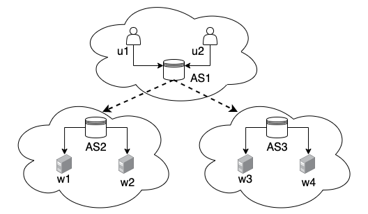
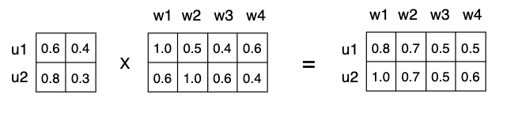
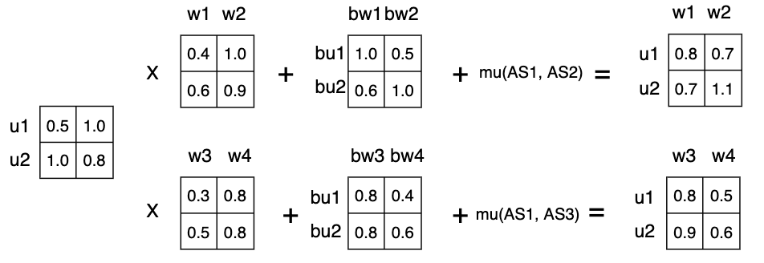
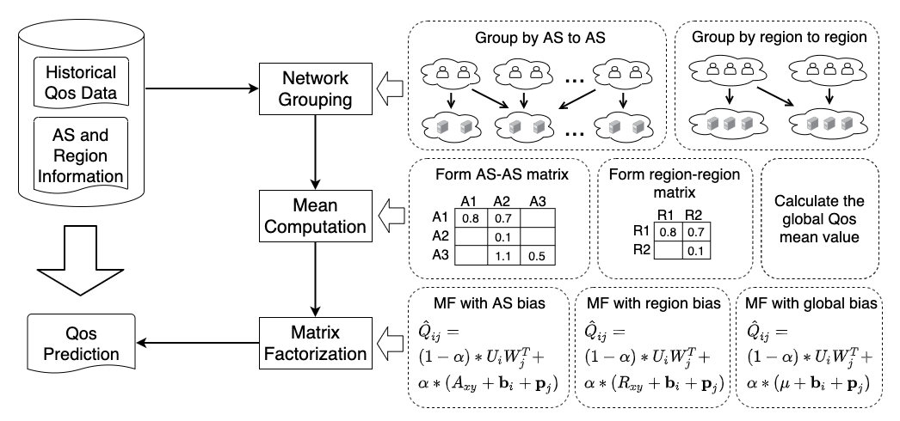
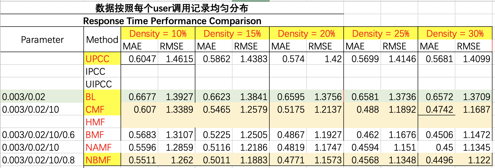

Collaborative Web Service Quality Prediction via Matrix Factorization with Network Bias

## Abstract

## Introduction


## Example

已知用户服务的调用关系如图，用户 u1，u2 位于自治域 AS1 中，服务 w1，w2 位于自治域 AS2 中，服务 w3，w4 位于自治域 AS3 中。那么我们要如何预测用户u1，u2 对服务w1，w2，w3，w4 的Qos值呢？




### 传统的方法

* example



* 评分预测公式

$$
Q \approx UW^T \tag{1}
$$

* 损失函数

$$
L = min_{U,W}\frac{1}{2}\sum_{i=1}^{m}\sum_{j=1}^{n}I_{ij}(Q_{ij} - U_iW_j^T)^2 + \frac{\lambda_1}{2}\Vert U\Vert^2_F + \frac{\lambda_2}{2}\Vert W\Vert^2_F \tag{2}
$$


缺点：当AS1和AS3的通信距离很远时，用户u1和用户u2调用服务w3和服务w4时的通信延迟较高，这种较高的通信延迟将极大程度的影响服务w3和服务w4的特征隐向量。显然，服务w3和服务w4的特征向量值将产生正向的偏离，那么在预测距离AS3较近的其他用户对服务w3和服务w4的响应时间时，我们的预测值往往会高于真实的响应评分。


### 我们的方法


* example




* 评分预测公式

$$
\hat{Q}_{ij} = \alpha * (G_{xy} + \bold{b}_i + \bold{p}_j) + (1-\alpha) *{U_iW_j^T} \tag{3}
$$

* 损失函数

$$
L = min_{\bold{b},\bold{p}}\frac{1}{2}\sum_{i=1}^{m}\sum_{j=1}^{n}I_{ij}(Q_{ij} - \alpha * (G_{xy} + \bold{b}_i + \bold{p}_j) - (1-\alpha) *{U_iW_j^T})^2
\\
+ \frac{\lambda_1}{2}\Vert U\Vert^2_F + \frac{\lambda_1}{2}\Vert W\Vert^2_F + \frac{\lambda_2}{2}\Vert \bold{b}\Vert^2_F + \frac{\lambda_2}{2}\Vert \bold{p}\Vert^2_F\tag{4}
$$

* 贡献
  * 适用于Qos预测场景，考虑了网络偏置
  * 冷启动问题
  * 复杂度


## Framework



## Datasets

This dataset describes real-world QoS evaluation results from 339 users on 5,825 Web services. Note that we have recently updated the location 
information (e.g., IP, AS, Latitude, Longitude) of users and services into the dataset.

```
userlist.txt  - information of 339 service users. Format: | User ID |  
                IP Address | Country | Continent | AS | Latitude | Longitude |
                Region | City |
wslist.txt    - information of the 5,825 Web services. Format: | Service ID |  
                WSDL Address | Service Provider | IP Address | Country | 
                Continent | AS | Latitude | Longitude | Region | City |
rtMatrix.txt  - 339 * 5825 user-item matrix of response-time. 
tpMatrix.txt  - 339 * 5825 user-item matrix for throughput.
readme.txt    - descriptions of the dataset. 
```


## Experiments



