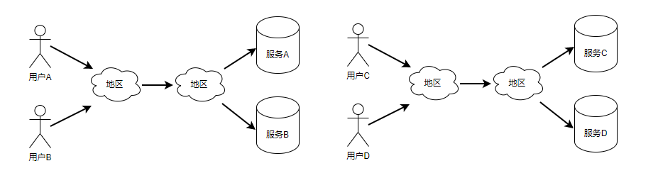

# 算法思路

QoS prediction：Baseline based matrix factorization to fix network difference

## Introduction

// 总览

## Background

### Motivation

// todo 举例子 

// 描述具体问题

// 为什么一般的矩阵分解方法不行

### 

### 矩阵分解模型

> 此处可以对Cost项进行详细解释，参照已有素材

MF是预测矩阵中缺失值最流行和有效的方法。矩阵分解使用因子模型来拟合用户服务矩阵进行预测。它将高维度的用户服务评分矩阵分解成两个低维度的特征矩阵来进行预测。这种分解的前提有少量的潜在因数影响用户对 Web 服务的偏好。另外，每个潜在因素对用户在 Web 服务上的体验和偏好有很大的影响，而且所有的潜在特征向量都可以通过统计学习理论来构建。MF模型中最重要的一步是通过构建目标函数来获得两个独立的特征空间。

我们用 Q 表示用户-服务的质量矩阵，并尝试接近 Q。
$$
Q \approx UW^T
$$
其中 $U \in R_{m \times d}$ 表示用户潜在特征矩阵，$W \in R_{n \times d}$ 表示服务潜在特征矩阵。向量 $U_i (1\le i\le m)$ 表示用户潜在特征向量，向量 $W_j (1\le j\le n)$ 表示服务潜在特征向量，他们的维度为d，维度是一个超参数，需要在实验评估中得最为合适的值。

现在，需要估计矩阵 $U$ 和 $W$ 的值。利用如下目标函数使 $U$ 和 $W$ 对原始质量矩阵 $Q$ 进行近似拟合，最小化公式如下：
$$
L = min_{U,W}\frac{1}{2}\sum_{i=1}^{m}\sum_{j=1}^{n}I_{ij}(Q_{ij} - U_iW_j^T)^2
$$
其中 $I_{ij}$ 是指示函数，如果用户 $u$ 调用过服务 $w$，则返回1，否则返回0。为了避免过度拟合得到最优的 $U$ 和 $W$ 逼近原始矩阵 $Q$，我们加入了两个与 $U$ 和 $I$ 相关的正则项：
$$
L = min_{U,W}\frac{1}{2}\sum_{i=1}^{m}\sum_{j=1}^{n}I_{ij}(Q_{ij} - U_iW_j^T)^2 + \frac{\lambda_1}{2}\Vert U\Vert^2_F + \frac{\lambda_2}{2}\Vert W\Vert^2_F
$$
其中$\Vert \cdot \Vert$ 表示 Frobenius 范数[45]， $\lambda_1$ 和 $\lambda_2$ 两个参数控制正则化程度。目标函数 L 使用二次正则项来最小化平方误差和。因为他不是凸的，所以设计一个算法来找到全局最小是不现实的。我们选择采用随机梯度下降法求解$U$ 和 $W$ 的近似最优解。
$$
U'_i = U_i - \alpha_1 \frac{\partial L}{\partial U_i}
\\W'_j = W_j - \alpha_1 \frac{\partial L}{\partial W_j}
$$
其中 $\alpha_1 > 0$ 和 $\alpha_2 > 0$ 表示学习速率。 


## Baseline based matrix   factorization

```
算法部分
1. 完成具体公式部分，以及符号表
2. 完成小节介绍部分，以及相关论文引用
2. 完成公式描述部分，务必参考相关论文，并进行引用
3. 完成作图部分，务必参考相关论文，并进行引用
4. 小节排版
```


###  用户偏置和服务偏置

MF模型试图捕捉用户和服务之间的交互作用，正是这些交互作用产生了不同的质量评分。然而，实际上大部分观察到的评分值要么和用户相关，要么和服务相关，而与用户和物品之间的交互作用无关。比如，某些用户因为所在地的高速带宽，而偏向于给出更高的质量评分；某些服务因为所在地的高速带宽，而偏向于得到更高的质量评分。

我们将这些与用户-服务交互作用无关的因子称为偏置，并把偏置封装到基准预测中。由于这些基准预测值在观察到的评分中占很大比例，因此对他们进行准确的建模就显得至关重要。这样的建模方法把真正代表用户-服务交互作用的那部分数据隔离开来，而把这部分数据放到更适合用户偏好的模型中，比如，矩阵分解预测模型。

a) 应用场景


b) 预测的评分：

设 $\mu$ 为总体平均分，未知评分 $\hat{q_{ij}}$ 的基准预测 $b_{ij}$ 综合考虑了用户偏置和服务偏置。
$$
b_{ij} = \mu + b^U_i + b^W_j
$$
参数 $b^U_i$ 和参数 $b^W_j$ 分别表示用户$i$ 和服务 $j$ 与评分均值的偏差


### 区域偏置

在服务预测的过程中，用户和服务往往所属不同区域，而区域与区域间通信路径的差异会很大程度上影响用户的质量评分。比如，相同的服务部署在不同的区域，给用户带来的体验是完全不同的；同理，相同的用户在不同的区域调用相同的服务，用户所观察到的服务质量也是完全不同的。为了全方位的考虑与用户-物品交互作用无关的因子，除了之前提到的的用户偏置和服务偏置，我们还将考虑不同区域间相互通信所带来的影响，即区域偏置。

用户或服务偏置基于自身网络状况的不同，而区域偏置是基于两两区域之间的路径差异，也就是说每一对区域之间都存在这样的偏置。为了便于在公式中进行表示，我们对每两个区域间的全部通信时间进行平均处理，然后结合用户和目标服务各自的偏置，即可得到服务预测中的基准预测值。

* 应用场景

  

* 构建区域评分表：对区域 $x$ 的所有用户对区域 $y$ 的所有服务的调用评分，以及区域 $y$ 的所有用户对区域 $x$ 的所有服务的调用评分，取它们的均值作为区域间的响应评分。
  $$
  p_{x, y} = \frac{\sum_{i\in x}\sum_{j\in y}q_{i,j} + \sum_{i\in y}\sum_{j\in x}q_{i,j}}{\sum_{i\in x}\sum_{j\in y}|q_{i,j}| + \sum_{i\in y}\sum_{j\in x}|q_{i,j}|}
  $$
  
* 预测的评分：设 $x$ 为 用户 $i$ 所在区域，$y$ 为服务 $j$ 所在区域，区域间的响应评分为 $p_{xy}$，参数 $b_u$ 和参数 $b_i$ 分别表示用户$u$ 和物品 $i$ 与评分均值的误差，未知评分 $\hat{r_{ui}}$ 的基准预测 $b_{ui}$ 综合考虑了用户偏置和物品偏置以及区域偏置。
  $$
  b'_{ij} = p_{xy} + b^U_i + b^W_j
  $$
  
* L2正则化
  $$
  Cost = \sum_{i,j\in Q}(q_{ij} - p_{xy} + b^U_i + b^W_j) + \lambda (\sum_{i}(b^U_i)^2 + \sum_{j}(b^W_j)^2)
  $$

### Baseline based matrix factorization

矩阵分解模型把用户和服务两方面的信息映射到一个维度为d的联合隐语义空间中，因此，用户服务的交互作用可以由该空间中的内积来建模。相应的，每一个用户 $i$ 都与一个 d 维向量 $U_i$ 相关联，每一个服务 $j$ 都与一个 d 维向量 $Wj$ 相关联。给定一个服务 $j$，$W_j$ 向量的每个维度值的大小代表了该服务具备这些因子的程度。给定一个用户 $i$，$U_i$ 向量的每个维度值代表了用户对这些因子的偏好程度，这些值的大小反映了用户对这些因子的积极或者消极的评价。点积 $U_iW_j^T$ 记录了用户和服务之间的交互，也就是用户对服务的总体兴趣，加上之前提到的只依赖于与用户-物品交互作用无关因子的基准预测，可以得到最终的评分。

* 预测的评分
  $$
  \begin{split}
  \hat {q}_{ij} &=p_{xy} + b^U_i + b^W_j +{U_iW_j^T}
  \end{split}
  $$

* 构建损失函数


* L2正则化


* 求导


### 预测

增量


## Experimental


## Related work


## Conclusion and future work


### 待定部分


* 用户相似度计算
  $$
  sim(i, a) = \cfrac{\sum_{j\in W(i, a)}(q_{ij} - b'_{ij})(q_{aj} - b'_{aj})}{\sqrt{\sum_{j\in W(i,a)}(q_{ij} - b'_{ij})^2 \cdot \sum_{j\in W(i,a)}(q_{aj} - b'_{aj})^2 }}
  $$

* 归一化处理
  $$
  sim'(i,a) = sim(i, a) \times 0.5 + 0.5
  $$
  
  
  
* 服务相似度计算

$$
sim(j, c) = \cfrac{\sum_{i\in U(j, c)}(q_{ij} - b'_{ij})(q_{ic} - b'_{ic})}{\sqrt{\sum_{i\in U(j,c)}(q_{ij} - b'_{ij})^2 \cdot \sum_{i\in U(j,c)}(q_{ic} - b'_{ic})^2 }}
$$

* 归一化处理
  $$
  sim'(j, c) = sim(j, c) \times 0.5 + 0.5
  $$


