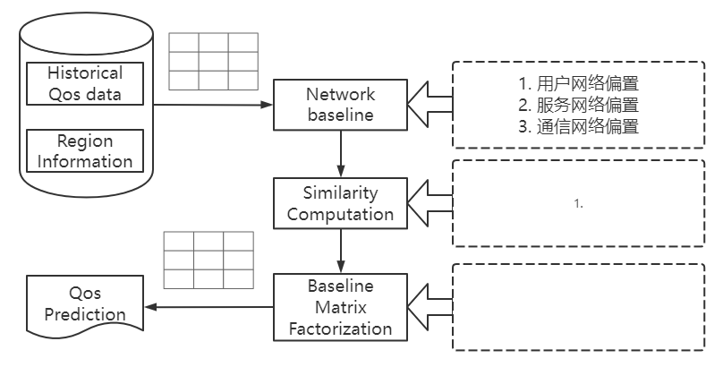

# 算法思路

QoS prediction：Baseline based matrix factorization to fix network distance


## Introduction

// 总览


## 问题定义

// todo 举例子 

// 描述具体问题

// 为什么一般的矩阵分解方法不行

### 


```
算法部分
1. > 完成具体公式部分，以及符号表，基于相关论文 <
2. 完成小节介绍部分，以及相关论文引用
2. 完成公式描述部分，务必参考相关论文，并进行引用
3. 完成作图部分，务必参考相关论文，并进行引用
4. 完成小节草稿后，进行排版
```


## matrix factorization model

> 此处可以对Cost项进行详细解释，参照已有素材

MF是预测矩阵中缺失值最流行和有效的方法。矩阵分解使用因子模型来拟合用户服务矩阵进行预测。它将高维度的用户服务评分矩阵分解成两个低维度的特征矩阵来进行预测。这种分解的前提有少量的潜在因素影响用户对 Web 服务的偏好。另外，每个潜在因素对用户在 Web 服务上的体验和偏好有很大的影响，而且所有的潜在特征向量都可以通过统计学习理论来构建。MF模型中最重要的一步是通过构建目标函数来获得两个独立的特征空间。

我们用 Q 表示用户-服务的质量矩阵，并尝试接近 Q。
$$
Q \approx UW^T \tag{1}
$$
其中 $U \in R_{m \times d}$ 表示用户潜在特征矩阵，$W \in R_{n \times d}$ 表示服务潜在特征矩阵。向量 $U_i (1\le i\le m)$ 表示用户潜在特征向量，向量 $W_j (1\le j\le n)$ 表示服务潜在特征向量，他们的维度为d，维度是一个超参数，需要在实验评估中得最为合适的值。

现在，需要估计矩阵 $U$ 和 $W$ 的值。利用如下目标函数使 $U$ 和 $W$ 对原始质量矩阵 $Q$ 进行近似拟合，最小化公式如下：
$$
L = min_{U,W}\frac{1}{2}\sum_{i=1}^{m}\sum_{j=1}^{n}I_{ij}(Q_{ij} - U_iW_j^T)^2 \tag{2}
$$
其中 $I_{ij}$ 是指示函数，如果用户 $u$ 调用过服务 $w$，则返回1，否则返回0。为了避免过度拟合得到最优的 $U$ 和 $W$ 逼近原始矩阵 $Q$，我们加入了两个与 $U$ 和 $I$ 相关的正则项：
$$
L = min_{U,W}\frac{1}{2}\sum_{i=1}^{m}\sum_{j=1}^{n}I_{ij}(Q_{ij} - U_iW_j^T)^2 + \frac{\lambda_1}{2}\Vert U\Vert^2_F + \frac{\lambda_2}{2}\Vert W\Vert^2_F \tag{3}
$$
其中$\Vert \cdot \Vert$ 表示 Frobenius 范数[12.26.01]， $\lambda_1$ 和 $\lambda_2$ 两个参数控制正则化程度。目标函数 L 使用二次正则项来最小化平方误差和。因为他不是凸的，所以设计一个算法来找到全局最小是不现实的。我们选择采用随机梯度下降法求解$U$ 和 $W$ 的近似最优解。
$$
U'_i = U_i - \alpha_1 \frac{\partial L}{\partial U_i}
\\W'_j = W_j - \alpha_2 \frac{\partial L}{\partial W_j} \tag{4}
$$
其中 $\alpha_1 > 0$ 和 $\alpha_2 > 0$ 表示学习速率。 


## Baseline based matrix factorization


 

### Definiton and Notation

参考论文

```
Graph Neural Networks for Social Recommendation
```


### Overview




参考论文：

```
Location-Based Web Service Qos Prediction via Preference Progagation to Address Cold Start Problem
```


###  Network Baseline

MF模型试图捕捉用户和服务之间的交互作用，正是这些交互作用产生了不同的质量评分。然而，实际上大部分观察到的评分值要么和用户相关，要么和服务相关，要么和用户与服务之间的网络距离相关，而与用户和服务之间的交互作用无关。比如，某些用户因为所在地的高速带宽，而偏向于给出更高的质量评分；某些服务因为所在地的高速带宽，而偏向于得到更高的质量评分；某些用户因为和目标服务有着相近的网络距离，而偏向于给出更高的质量评分。

我们将这些与用户-服务交互作用无关的因子称为偏置，并把偏置封装到基准预测中。由于这些基准预测值在观察到的评分中占很大比例，因此对他们进行准确的建模就显得至关重要。这样的建模方法把真正代表用户-服务交互作用的那部分数据隔离开来，而把这部分数据放到更适合用户偏好的模型中，比如，矩阵分解预测模型。

基准预测的设计思想来源于线性回归模型，如果我们将评分看作是一个连续的值而不是离散的值，那么就可以借助线性回归思想来预测目标用户对某服务的评分。传统的基线模型使用如下步骤来预测评分，先计算所有服务的平均评分，即全局平均分 $\mu$，之后分别计算每个用户 $i$ 所给出的评分普遍高于或低于其他用户的偏置值 $\bold{b}_i$，以及每个服务 $j$ 所接受的评分普遍高于或低于其他服务的偏置值 $\bold{p}_j$，传统基线模型的评分预测公式如下：
$$
\hat{Q}_{ij} = \mu + \bold{b}_i + \bold{p}_j \tag{5}
$$
然而传统的基线模型仅仅考虑到了用户偏置和服务偏置，并未考虑到用户和服务的网络距离。在服务预测的过程中，用户对服务的调用往往涉及到两个区域的通信，而区域与区域间网络距离的差异会很大程度上影响用户的质量评分。比如，相同的服务部署在不同的区域，给用户带来的体验是完全不同的；同理，相同的用户在不同的区域调用相同的服务，用户所观察到的服务质量也是完全不同的。

为了全方位的考虑与用户-物品交互作用无关的因子，我们提出了基于网络的基准预测模型。基于网络的基准预测模型对传统基准预测模型进行改进，不但考虑了用户侧的网络偏置和服务侧的网络偏置，还将考虑用户与服务间的网络距离所带来的评分影响。改进后的评分预测过程如下，设 $x$ 为 用户 $i$ 所在区域，$y$ 为服务 $j$ 所在区域，先计算区域 $x$ 对区域 $y$ 的平均评分 $G_{xy}$，然后结合用户 $i$ 和服务 $j$ 对其所属区域的网络偏置，即可得到考虑网络距离的基准预测值。
$$
\hat{Q}_{ij} = G_{xy} + \bold{b}_i + \bold{p}_j \tag{6}
$$
其中 $\bold{b}_i$ 表示用户 $i$ 对其所属区域的网络偏置，$\bold{p}_j$ 表示服务 $j$ 对其所属区域的网络偏置。对于所有区域间的评分矩阵 $G$ 是直接能计算出来的
$$
G_{xy} = \frac{\sum_{i\in N(x),j\in W(y)}I_{ij}Q_{ij}}{\sum_{i\in N(x),j\in W(y)}I_{ij}} \tag{7}
$$
其中，$N(x)$ 表示所属区域为 $x$ 的用户集合，$W(y)$ 表示所属区域为 $y$ 的服务集合， $I_{ij}$ 是指示函数，如果用户 $i$ 调用过服务 $j$，则返回1，否则返回0。

现在，问题的关键在于需要估计向量 $\bold{b}$ 和向量 $\bold{p}$ 的值，利用如下目标函数使 $\bold{b}$ 和 $\bold{p}$ 对原始质量矩阵 $Q$ 进行近似拟合，最小化公式如下
$$
L = min_{\bold{b},\bold{p}}\frac{1}{2}\sum_{i=1}^{m}\sum_{j=1}^{n}I_{ij}(Q_{ij} - G_{xy} - \bold{b}_i - \bold{p}_j)^2 \tag{8}
$$
为了避免过度拟合得到最优的 $\bold{b}$ 和 $\bold{p}$ 逼近原始矩阵 $Q$，我们加入了两个与 $\bold{b}$ 和 $\bold{p}$ 相关的正则项：
$$
L = min_{\bold{b},\bold{p}}\frac{1}{2}\sum_{i=1}^{m}\sum_{j=1}^{n}I_{ij}(Q_{ij} - \mu - \bold{b}_i - \bold{p}_j)^2 + \frac{\lambda_1}{2}\Vert \bold{b}\Vert^2_F + \frac{\lambda_2}{2}\Vert \bold{p}\Vert^2_F\tag{9}
$$
其中$\lambda_1$ 和 $\lambda_2$ 两个参数控制正则化程度。目标函数 L 使用二次正则项来最小化平方误差和。因为他不是凸的，所以设计一个算法来找到全局最小是不现实的。我们选择采用随机梯度下降法求解$U$ 和 $W$ 的近似最优解。
$$
\bold{b}'_i = \bold{b}_i - \beta_1 \frac{\partial L}{\partial \bold{b}_i}
\\\bold{p}'_j = \bold{p}_j - \beta_2 \frac{\partial L}{\partial \bold{p}_j} \tag{10}
$$
其中 $\beta_1 > 0$ 和 $\beta_2 > 0$ 表示学习速率。 


### Similarity Computation

> 这里可以开始参考相关文献了


### Baseline based matrix factorization

仅靠基准预测并不能产生个性化推荐，因为他忽略了用户和物品之间的所有交互。在某种意义上来说，它只是抓住了与建立推荐不是很相关的那部分数据。为了把真正代表用户服务交互作用的那部分数据考虑进来，我们需要融合一种更加适合用户偏好的模型，即矩阵分解模型。

矩阵分解模型把用户和服务两方面的信息映射到一个维度为d的联合隐语义空间中，因此，用户服务的交互作用可以由该空间中的内积来建模。相应的，每一个用户 $i$ 都与一个 d 维向量 $U_i$ 相关联，每一个服务 $j$ 都与一个 d 维向量 $Wj$ 相关联。给定一个服务 $j$，$W_j$ 向量的每个维度值的大小代表了该服务具备这些因子的程度。给定一个用户 $i$，$U_i$ 向量的每个维度值代表了用户对这些因子的偏好程度，这些值的大小反映了用户对这些因子的积极或者消极的评价。点积 $U_iW_j^T$ 记录了用户和服务之间的交互，也就是用户对服务的总体兴趣，加上之前提到的只依赖于与用户-物品交互作用无关因子的基准预测，可以得到最终的评分。

* 预测的评分
  $$
  \begin{split}
  \hat {q}_{ij} &=p_{xy} + b^U_i + b^W_j +{U_iW_j^T}
  \end{split}
  $$

* 构建损失函数


* L2正则化
  $$
  L = min_{\bold{b},\bold{p}}\frac{1}{2}\sum_{i=1}^{m}\sum_{j=1}^{n}I_{ij}(Q_{ij} - \mu - \bold{b}_i - \bold{p}_j)^2 + \frac{\lambda_1}{2}\Vert \bold{b}\Vert^2_F + \frac{\lambda_2}{2}\Vert \bold{p}\Vert^2_F\tag{7}
  $$
  
* 求导


### 预测

增量


## Experimental


## Related work


## Conclusion and future work


### 待定部分 可以反向利用，也就是加上偏置

利用张以文的覆盖算法


* 用户相似度计算
  $$
  sim(i, a) = \cfrac{\sum_{j\in W(i, a)}(q_{ij} - b'_{ij})(q_{aj} - b'_{aj})}{\sqrt{\sum_{j\in W(i,a)}(q_{ij} - b'_{ij})^2 \cdot \sum_{j\in W(i,a)}(q_{aj} - b'_{aj})^2 }}
  $$

* 归一化处理
  $$
  sim'(i,a) = sim(i, a) \times 0.5 + 0.5
  $$
  
  
  
* 服务相似度计算

$$
sim(j, c) = \cfrac{\sum_{i\in U(j, c)}(q_{ij} - b'_{ij})(q_{ic} - b'_{ic})}{\sqrt{\sum_{i\in U(j,c)}(q_{ij} - b'_{ij})^2 \cdot \sum_{i\in U(j,c)}(q_{ic} - b'_{ic})^2 }}
$$

* 归一化处理
  $$
  sim'(j, c) = sim(j, c) \times 0.5 + 0.5
  $$

