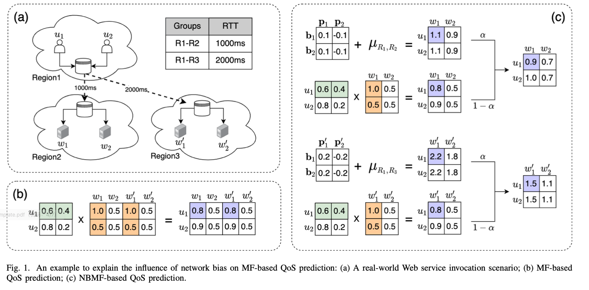
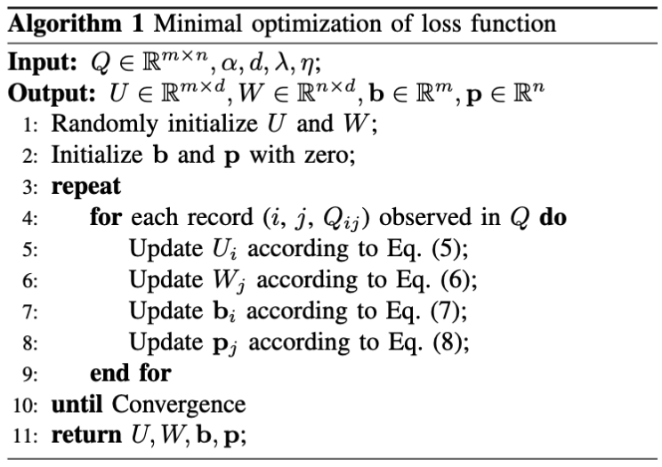

# 第三章 基于网络偏置和矩阵分解的QoS预测方法

尽管大多数QoS预测方法声称能够捕获用户与服务之间的交互特征，但是很少有方法考虑到用户与服务之间的非交互特征，特别是来自网络环境中的非交互特征。在本章节中，我们将来自网络环境的非交互特征称为网络偏置，并提出了一种基于网络偏置和矩阵分解的QoS预测方法（NBMF）。NBMF将用户与服务之间的交互特征和网络偏置分别封装到矩阵分解模型和线性回归模型中，能够在复杂的网络环境中预测用户调用服务的QoS值，以及在冷启动环境下提供个性化的Qos预测结果。在现实世界的QoS数据集上，NBMF与现有方法进行了比较。根据实验结果，NBMF在热启动环境和冷启动环境中都显示出比现有方法更好的性能。


## 一、研究动机

矩阵分解能够很好的捕获用户与服务之间的交互特征，却忽略了用户与服务之间的非交互特征，特别是来自网络环境中的非交互特征。为了详细的解释这个问题，本节首先介绍了基于矩阵分解的QoS预测方法，然后通过一个直观的案例说明了用户与服务之间的网络环境对基于矩阵分解的QoS预测方法的影响。


### 1.1 矩阵分解

矩阵分解使用因子模型来拟合QoS历史矩阵，它将高维度的用户服务调用矩阵分解成两个低维度的特征矩阵。低纬度的特征矩阵试图通过描述用户或服务在各种潜在特征（如系统结构、硬件组成、软件配置）上的值来解释QoS数据。例如，用户特征矩阵的每一行为用户的潜在特征向量，用户的潜在特征向量代表了该用户感知每个特征的程度；服务特征矩阵的每一行为服务的潜在特征向量，服务的潜在特征向量代表了该服务具备每个特征的程度；用户潜在特征向量和服务潜在特征向量的点积代表了用户与服务之间的交互作用，也就是用户调用服务的QoS值。因此，基于矩阵分解的QoS预测方法的一般目标函数可以被推导为：
$$
\begin{split}
\hat {Q}_{ij} &= {U_iW_j^T}
\end{split}
\tag{1}
$$
其中，$U \in \mathbb{R}_{m \times d}$ 表示用户潜在特征矩阵，$W \in \mathbb{R}_{n \times d}$ 表示服务潜在特征矩阵；向量 $U_i (1\le i\le m)$ 表示用户 $i$ 的潜在特征向量，向量 $W_j (1\le j\le n)$ 表示服务 $j$ 的潜在特征向量；参数 $d$ 表示用户潜在特征矩阵和服务潜在特征矩阵的维度，即矩阵分解中潜在特征的数量；$\hat{Q}_{ij}$ 表示用户 $i$ 调用服务 $j$ 的Qos预测值。

矩阵分解能够很好的捕获用户与服务之间的交互特征，却忽略了用户与服务之间的非交互特征，特别是来自网络环境中的非交互特征。以QoS属性中的响应时间为例，响应时间通常由服务时间和延迟时间构成，矩阵分解可以预测服务处理不同用户请求的时间，却无法预测用户调用服务的延迟时间。因为延迟时间和用户、服务没有直接的关系，延迟时间取决于网络环境的影响。


### 1.2 案例说明

为了说明用户与服务之间的网络环境对基于矩阵分解的QoS预测方法的影响，图1给出了一个直观的案例。在这个案例中，我们需要预测用户 $u_1$、$u_2$ 调用服务 $w_1$、$w_2$、$w'_1$、$w'_2$ 的响应时间。图1(a) 为一个现实世界中的服务调用场景，我们假设用户 $u_1$、$u_2$ 位于区域 $R_1$，服务 $w_1$、$w_2$ 位于区域 $R_2$，服务 $w'_1$、$w'_2$ 位于区域 $R_3$。其中，服务 $w_1$、$w_2$ 和服务 $w'_1$、$w'_2$ 的性能配置完全相同，区域 $R_1$ 与区域 $R_2$ 通信的平均响应时间为1s，区域$R_1$与区域$R_3$通信的平均响应时间为2s。

图1(b)展示了基于矩阵分解的QoS预测方法。我们假设用户调用服务的响应时间由两种潜在特征决定，这两种潜在特征分别为硬件组成和软件配置。以用户 $u_1$ 调用服务 $w_1$、$w'_1$ 为例，用户 $u_1$ 对硬件组成的感知程度为0.6，对软件配置的感知程度为0.4，服务 $w_1$ 对硬件组成的具备程度为1.0，对软件配置的具备程度为0.5。用户 $u_1$ 与服务 $w_1$ 的点积为0.8，代表用户 $u_1$ 调用服务 $w_1$ 的矩阵分解预测值。由于服务 $w_1$ 和 $w'_1$ 的性能配置完全相同，它们对潜在特征的具备程度也完全相同，因此，用户 $u_1$ 调用服务 $w'_1$ 的矩阵分解预测值也为0.8。

然而，矩阵分解并没有考虑到响应时间中的延迟时间。因为延迟时间和用户、服务没有直接的关系，延迟时间取决于网络环境的影响。在本案例中，虽然服务 $w_1$、 $w'_1$ 的性能配置完全相同，但是服务 $w_1$、 $w'_1$ 部署的区域不同，用户 $u_1$ 调用服务 $w_1$、$w'_1$ 的响应时间必定不同。由此可见，在复杂的网络环境中，矩阵分解预测值并不等同于响应时间预测值。





## 二、技术方案

为了捕获用户与服务之间的非交互特征，特别是来自网络环境中的非交互特征，我们提出了一种基于网络偏置和矩阵分解的QoS预测方法。该方法将用户与服务之间的非交互特征和交互特征分别封装到网络偏置模型和矩阵分解模型中，能够在复杂的网络环境中预测用户调用服务的QoS值，以及在冷启动环境下提供个性化的Qos预测结果。本节首先构建了基于网络偏置和矩阵分解的QoS预测模型，其次介绍了模型训练和参数优化的过程，最后说明了在热启动和冷启动环境下的QoS预测方法。


### 2.1 构建模型

（1）基于网络偏置的QoS预测模型

网络偏置是指来自网络环境中的非交互特征，如果我们将网络偏置看作是连续的值而不是离散的值，那么就可以借助线性回归模型来预测用户与服务之间的网络偏置。按照以上思路，我们首先提出了基于网络偏置的QoS预测模型，该模型包括个三部分，用户对其所在网络的偏置、服务对其所在网络的偏置，以及两个网络间用户调用服务的QoS平均值。
$$
\begin{split}
\hat {Q}_{ij} &= \mu_{xy} + \bold{b}_i + \bold{p}_j
\end{split}
\tag{2}
$$
其中，$x$ 为用户 $i$ 所在网络区域，$y$ 为服务 $j$ 所在网络区域，$\mu_{xy}$ 为网络区域 $x$ 与网络区域 $y$ 通信的Qos平均值；$\bold{b}_i (1\le i\le m)$ 表示用户 $i$ 所感知到的Qos值普遍高于或低于同网络区域其他用户的偏差值， $\bold{p}_j (1\le j\le n)$ 表示服务 $j$ 所提供的Qos值普遍高于或低于同网络区域其他服务的偏差值。


（2）基于网络偏置和矩阵分解的QoS预测模型

为了同时考虑用户与服务之间的网络环境和交互作用对QoS值的影响，我们进一步提出了基于网络偏置和矩阵分解的QoS预测模型（NBMF）。NBMF 将用户与服务之间的非交互特征和交互特征分别封装到网络偏置模型和矩阵分解模型中，该方法的一般目标函数可以被推导为：
$$
\begin{split}
\hat {Q}_{ij} &= \alpha \ (\mu_{xy} + \bold{b}_i + \bold{p}_j) + (1-\alpha) \ U_iW_j^T
\end{split}
\tag{3}
$$
在这个公式中，第一项为网络偏置模型，第二项为矩阵分解模型，权重 $\alpha (0\le\alpha\le 1)$ 表示在Qos预测模型中使用多少网络偏置信息。$\alpha $ 是一个可调整的参数，如果 $\alpha$ 被设置为0，则表示不考虑用户与服务之间的网络环境对QoS值的影响，完全使用矩阵分解来进行预测；如果 $\alpha$ 被设置为1，则表示不考虑用户与服务之间的交互作用对QoS值的影响，完全使用网络偏置来进行预测。$\hat{Q}_{ij}$表示用户 $i$ 调用服务 $j$ 的Qos预测值。


（3）案例说明

图1(c) 展示了NBMF的预测过程，我们以用户 $u_1$ 调用服务 $w_1$、$w'_1$ 为例进行说明。首先是网络偏置模型的预测部分，用户 $u_1$ 所感知到的响应时间普遍高于或低于同网络区域其他用户的偏差值 $\bold{b}_1$ 为0，服务 $w_1$ 所提供的响应时间普遍高于或低于同网络区域其他服务的偏差值 $\bold{p}_1$ 为0.1，服务 $w'_1$ 所提供的响应时间普遍高于或低于同网络区域其他服务的偏差值 $\bold{p}'_1$ 为0.2；区域 $R_1$ 与区域 $R_2$ 通信的平均响应时间 $\mu_{R_1,R_2}$ 为1，区域 $R_1$ 与区域 $R_3$ 通信的平均响应时间 $\mu_{R_1,R_3}$ 为2。根据公式(2)可得，用户 $u_1$ 调用服务 $w_1$ 的网络偏置预测值为1.1，用户 $u_1$ 调用服务 $w'_1$ 的网络偏置预测值为2.2。

其次是矩阵分解模型的预测部分，用户 $u_1$ 对硬件组成的感知程度为0.6，对软件配置的感知程度为0.4，服务 $w_1$ 对硬件组成的具备程度为1.0，对软件配置的具备程度为0.5。由于服务 $w_1$ 和 $w'_1$ 的性能配置完全相同，它们对潜在特征的具备程度也完全相同。根据公式(1)可得，用户 $u_1$ 调用服务 $w_1$、$w'_1$ 的矩阵分解预测值均为0.8。

默认情况下，参数 $\alpha$ 被设置为0.5。通过对网络偏置预测值进行加权，我们可以得到响应时间中的延迟时间；通过对矩阵分解预测值进行加权，我们可以得倒响应时间中的服务时间。根据公式(3)可得，用户 $u_1$ 调用服务 $w_1$ 的响应时间预测值为0.9，用户 $u_1$ 调用服务 $w'_1$ 的响应时间预测值为1.5。


### 2.2 训练模型

（1）构建损失函数

损失函数用来衡量QoS预测模型对样本数据的拟合程度，损失函数的值越小，表示QoS预测模型对样本数据的拟合程度越高。为了训练公式(3)中的特征矩阵 $U、W$ 和偏置向量 $\bold{b}、\bold{p}$ ，我们构建损失函数如下：
$$
L = min_{U,W,\bold{b},\bold{p}}\frac{1}{2}\sum_{i=1}^{m}\sum_{j=1}^{n}I_{ij}(Q_{ij} - \hat{Q}_{ij})^2 \tag{4}
$$
其中， $I_{ij}$ 是指示函数，如果用户 $i$ 调用过服务 $j$，则返回1，否则返回0；$Q_{ij}$ 和 $\hat{Q}_{ij}$分别表示用户 $i$ 调用服务 $j$ 的QoS样本值和预测值，公式(3)给出了$\hat{Q}_{ij}$ 的预测函数。


（2）正则化损失函数

为了减小模型的过拟合倾向，以保证模型稳定性，我们在损失函数中加入四个与 $U、W$ 和 $\bold{b}、\bold{p}$ 相关的正则项：
$$
\begin{split}
L &= min_{U,W,\bold{b},\bold{p}}\frac{1}{2}\sum_{i=1}^{m}\sum_{j=1}^{n}I_{ij}(Q_{ij} - \hat{Q}_{ij})^2 \\
&+ \frac{\lambda}{2}(\Vert U\Vert^2_F + \Vert W\Vert^2_F + \Vert \bold{b}\Vert^2_F + \Vert \bold{p}\Vert^2_F)
\end{split}
\tag{5}
$$
其中，$\lambda > 0$ 控制正则化的程度，$\Vert \cdot \Vert^2_F$ 表示矩阵的 Frobenius 范数。


（3）求解损失函数

考虑到损失函数是非凸函数，设计一个算法来找到全局最小是不现实的。我们选择采用随机梯度下降法来寻找最优的特征矩阵 $U、W$ 和偏置向量 $\bold{b}、\bold{p}$ ，使得损失函数的值达到局部最小。随机梯度下降根据单个样本的损失来计算梯度并更新参数，对于每条QoS历史数据，有以下更新规则：
$$
\begin{align}
&U'_i = U_i - \eta \frac{\partial L}{\partial U_i} \\
&W'_j = W_j - \eta \frac{\partial L}{\partial W_j} \\
&\bold{b}'_i = \bold{b}_i - \eta \frac{\partial L}{\partial \bold{b}_i} \\
&\bold{p}'_j = \bold{p}_j - \eta \frac{\partial L}{\partial \bold{p}_j}
\end{align}
$$
其中 $\eta > 0$ 表示求解潜在特征矩阵和偏置向量的更新速率，并且
$$
\begin{split}
&\frac{\partial L}{\partial U_i} = \lambda U_i - (Q_{ij}-\hat{Q}_{ij}) \ (1-\alpha) \ W_j \\
&\frac{\partial L}{\partial W_j} = \lambda W_j - (Q_{ij}-\hat{Q}_{ij}) \ (1-\alpha) \ U_i \\
&\frac{\partial L}{\partial \bold{b}_i} = \lambda\bold{b}_i - (Q_{ij}-\hat{Q}_{ij})\ \alpha \\
&\frac{\partial L}{\partial \bold{p}_j} = \lambda\bold{p}_j - (Q_{ij}-\hat{Q}_{ij})\ \alpha
\end{split}
$$

随机梯度下降的算法过程在算法1中给出。令 $r$ 表示算法实现收敛的迭代次数，令 $s$ 表示原始矩阵 $Q$ 中QoS历史数据的数量，令 $d$ 表示用户潜在特征矩阵和服务潜在特征矩阵的维度；算法的主要时间成本在于矩阵 $U、W$ 和向量 $\bold{b}$、$\bold{p}$ 的更新，在每一轮的迭代中，更新 $U、W$ 需要的时间成本为 $O(sd)$，更新 $\bold{b}、\bold{p}$ 需要的时间成本为 $O(s)$ 。因此随机梯度下降的整体时间复杂度可以用 $O(rsd)$ 表示。




### 2.3 预测QoS

对于存在调用记录的用户，我们使用用户偏置、服务偏置、两个网络区域间的QoS平均值来预测网络环境对QoS值的影响，使用用户潜在特征向量、服务潜在特征向量来预测交互作用对QoS值的影响，具体的预测函数在公式(3)中给出。

对于不存在调用记录的新用户，我们使用服务偏置、两个网络区域间的QoS均值来预测网络环境对QoS值的影响，使用新用户所在网络区域的用户潜在特征向量、服务潜在特征向量来预测交互作用对QoS值的影响：
$$
\begin{split}
\hat {Q}_{ij} &= \alpha \ (\mu_{xy} + \bold{p}_j) + (1-\alpha) \ \frac{1}{\vert N_u(x)\vert}\sum_{k \in N_u(x)} U_kW_j^T
\end{split}
\tag{7}
$$
其中，$x$ 为用户 $i$ 所在网络区域，$y$ 为服务 $j$ 所在网络区域，$\mu_{xy}$ 为网络区域 $x$ 与网络区域 $y$ 通信的Qos平均值，$N_u(x)$ 为网络区域 $x$ 的用户集合；


## 三、实验评估


### 3.1 数据集


### 3.2 评估指标


### 3.3 方法对比


### 3.4 参数分析


## 四、本章小结

```
1. 写作思路：先写主题部分，再加入分支部分（相关符号定义、问题定义）
2. 参考素材：中文论文、发明专利

小点用(1)(2)标号

面对大量具有相同功能的候选Web服务，调查服务的非功能属性成为服务选择的主要关注点。服务质量（QoS）代表了Web服务的非功能属性，比如：响应时间、吞吐量、可用性和可靠性等。然而，考虑到高昂的时间成本和巨大的资源开销，用户不可能自己调用所有的Web服务来获得个性化的QoS值。近年来，Web服务的QoS预测吸引了许多研究者的注意，并被认为是获得Web服务的QoS值的有效方法。
```

