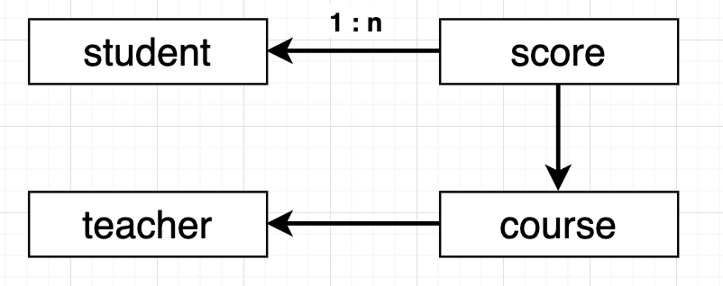

# 表设计

## 目录

1. 表关系
2. 表字段

## 一、表关系

| 表名称  | 说明   | one-to-many | many-to-one    |
| ------- | ------ | ----------- | -------------- |
| student | 学生表 | scores      |                |
| course  | 课程表 | scores      | teacher        |
| teacher | 老师表 | courses     |                |
| score   | 成绩表 |             | student/course |

## 二、表字段

* student：学生表

| 字段名称 | 类型   | 说明 |
| -------- | ------ | ---- |
| id       | Int    | 编号 |
| name     | String | 姓名 |
| age      | Int    | 年龄 |
| sex      | Int    | 性别 |

* course：课程表

| 字段名称   | 类型   | 说明           |
| ---------- | ------ | -------------- |
| id         | Int    | 编号           |
| name       | String | 名称           |
| teacher_id | Int    | 课程从属的老师 |

* teacher：老师表

| 字段名称 | 类型   | 说明 |
| -------- | ------ | ---- |
| id       | Int    | 编号 |
| name     | String | 姓名 |

* score：成绩表

| 字段名称   | 类型 | 说明           |
| ---------- | ---- | -------------- |
| id         | Int  | 编号           |
| score      | Int  | 分数           |
| student_id | Int  | 成绩从属的学生 |
| course_id  | Int  | 课程从属的课程 |

