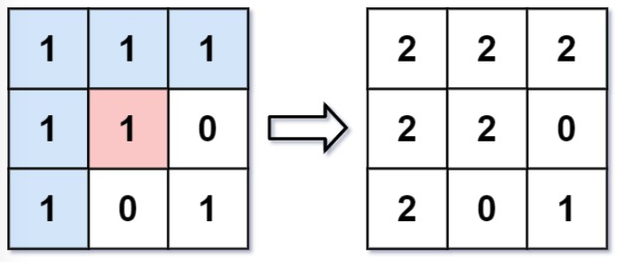

# 图的广度搜索

## 目录

1. 图像渲染
2. 岛屿数量


## 一、图像渲染

[题目链接](https://leetcode.cn/problems/flood-fill/)

**需求：**

从像素 `image[sr][sc]` 开始对图像进行上色填充，最后返回经过上色渲染后的图像



**思路：**

对图进行广度优先搜索，相邻点为未访问过的同色点

```java
class Solution {

    private int[][] map = new int[][] {
        {-1, 0}, {0, 1}, {1, 0}, {0, -1}
    };

    public int[][] floodFill(int[][] image, int sr, int sc, int newColor) {
        int m = image.length;
        int n = image[0].length;

        int target = image[sr][sc];
        boolean[][] visited = new boolean[m][n];
        ArrayDeque<Node> queue = new ArrayDeque<>();
        visited[sr][sc] = true;
        image[sr][sc] = newColor;
        queue.offer(new Node(sr, sc));
        while (!queue.isEmpty()) {
            Node p = queue.poll();
            for (int i = 0; i < 4; i++) {
                int nr = p.x + map[i][0];
                int nc = p.y + map[i][1];
                if (nr >= 0 && nr < m && nc >= 0 && nc < n && image[nr][nc] == target && !visited[nr][nc]) {
                    visited[nr][nc] = true;
                    image[nr][nc] = newColor;
                    queue.offer(new Node(nr, nc));
                }
            }
        }
        return image;
    }
}

class Node {
    int x;
    int y;
    Node (int x, int y) {
        this.x = x;
        this.y = y;
    }
}
```


## 二、岛屿数量

[题目链接](https://leetcode.cn/problems/number-of-islands/)

**需求：**

给定一个由`1（陆地）`和`0（水）`组成的二维网格，求网格中岛屿的数量

```java
输入：grid = [
  ["1","1","0","0","0"],
  ["1","1","0","0","0"],
  ["0","0","1","0","0"],
  ["0","0","0","1","1"]
]
输出：3
```


**思路：**

对图进行广度优先搜索，相邻点为未访问过的同色点

```java
class Solution {

    private int[][] map = new int[][] {
        {-1, 0}, {0, 1}, {1, 0}, {0, -1}
    };

    public int numIslands(char[][] grid) {
        int m = grid.length;
        int n = grid[0].length;

        boolean[][] visited = new boolean[m][n];
        int res = 0;
        for (int i = 0; i < m; i++) {
            for (int j = 0; j < n; j++) {
                if (!visited[i][j] && grid[i][j] == '1') {
                    bfs(grid, visited, i, j);
                    res++;
                }
            }
        }
        return res;
    }

    public void bfs(char[][] grid, boolean[][] visited, int r, int c) {
        int m = grid.length;
        int n = grid[0].length;

        ArrayDeque<Node> queue = new ArrayDeque<>();
        visited[r][c] = true;
        queue.offer(new Node(r, c));
        while (!queue.isEmpty()) {
            Node p = queue.poll();
            for (int i = 0; i < 4; i++) {
                int nr = p.x + map[i][0];
                int nc = p.y + map[i][1];
                if (nr >= 0 && nr < m && nc >= 0 && nc < n 
                    && grid[nr][nc] == '1' && !visited[nr][nc]) {
                    visited[nr][nc] = true;
                    queue.offer(new Node(nr, nc));
                }
            }
        }
    }
}

class Node {
    int x;
    int y;
    Node (int x, int y) {
        this.x = x;
        this.y = y;
    }
}
```

