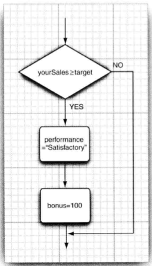
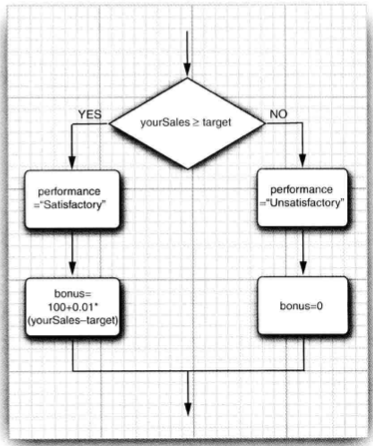
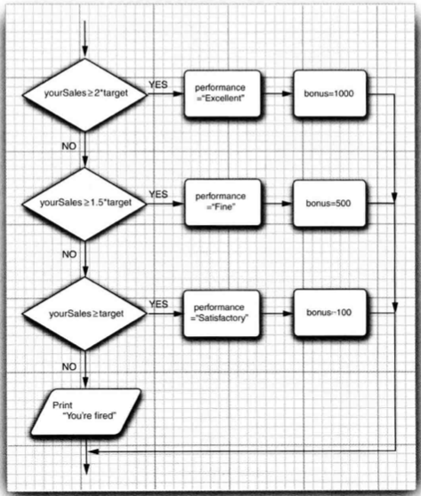
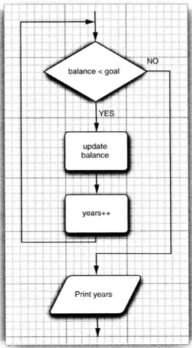
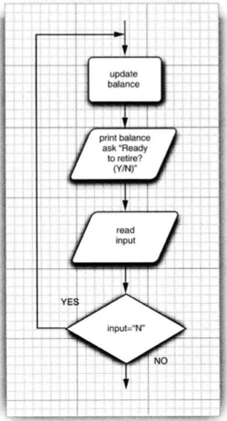
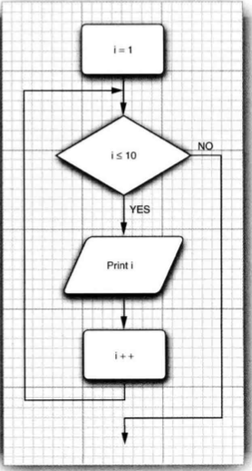
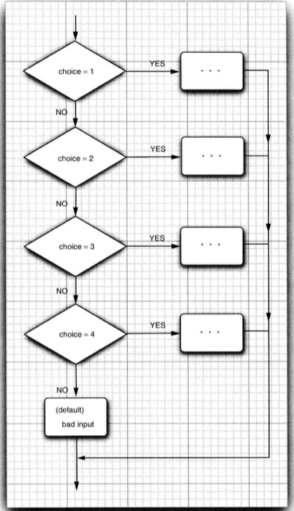

# 2.4 控制流程


## 目录

1. 块作用域
2. 条件语句
3. 循环
4. 确定循环
5. 多重循环
6. 中断控制流程


## 1. 块作用域

块作用域是指由一对大括号括起来的若干条语句，其确定了变量的作用域。在Java的使用中，不允许在嵌套的两个块中出现互相重复的两个变量。


## 2. 条件语句

if语句的格式：

```java
if(condition) statement;
```




If/else语句的格式：

```java
if(condition) 
  statement;
 else
  statement;
```




条件语句的格式如下：

```java
if(condition) 
  statement;
else if(condition)
  statement;
else 
  statement;
```




## 3. 循环

while循环的格式：

```java
while(condition)
	statement;
```



while循环首先执行判断条件，因此循环体中的statement可能不被执行，若要保证循环体至少被执行一次，则需要使用do while

```java
do 
	statement;
while(condition);
```




## 4. 确定循环

for循环语句是用于支持迭代的一种通用性结构，每次迭代后会更新计数器来控制迭代次数。

```java
for(int i=1; i<=10; i++) {
  System.out.println(i);
}
```



for循环语句通常有一条默认的规则：for 语句的三个部分应该对同一个计数器变量进行初始化、检测和更新。若不遵守这一规则，程序将变得晦涩难懂。

在循环中检测两个浮点数是否相等需要额外小心。


## 5. 多重选择

使用switch语句进行多重选择，switch语句的结构如下：

```java
switch(choice) {
  case 1:
    break;
  case 2:
    break;
  default:
    break;
}
```



switch语句将从与选项值相等的case处开始执行，直到遇到break语句结束，或者是执行到switch语句结束为止。如果没有匹配的case语句，则执行default语句。

case标签可以是：

* 类型为char、byte、short或int的常量表达式
* 枚举常量
* 字符串字面量


## 6. 中断控制流程

Java提供了两种break语句，带标签的break和不带标签的break。

* 不带标签的break，与用于退出switch语句的break一样，也可以用来退出循环。

* 带标签的break，用于跳出多重嵌套的循环语句。注意其标签必须放在希望跳出去的最外层循环之前，并且需要紧跟一个冒号。


Java提供了continue语句，它将中断正常的控制流程，并将控制转移到最内层循环的首部。