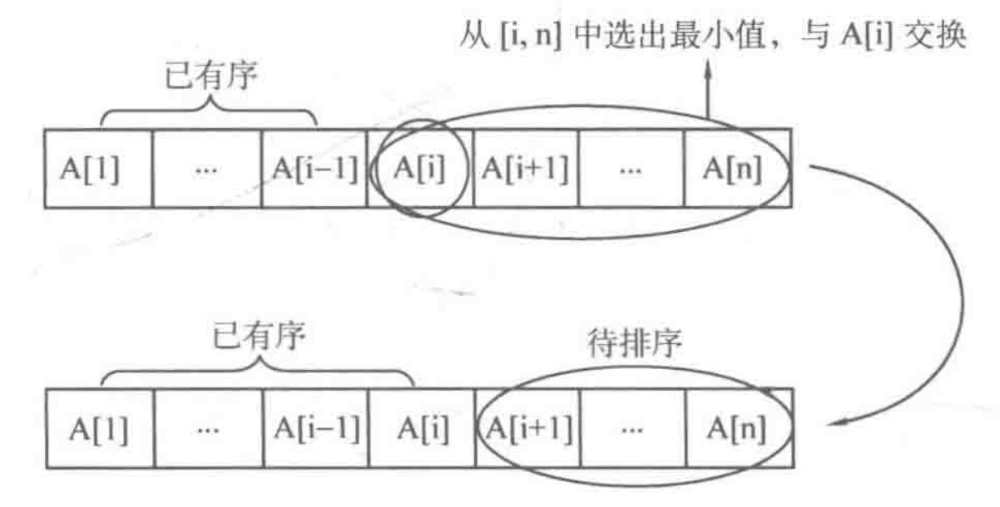
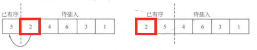

# 4.1 排序

## 目录

1. 选择排序
2. 插入排序
3. 排序函数的应用
4. PAT A1025


## 选择排序

简单选择排序是指，不断地在无序集合中，选择并排除最小值，最终得到的最小值集合将构成有序序列。



代码如下：

```java
private static void selectSort(int[] a, int head, int tail) {
  //滑动窗口
  for (int i = head; i < tail; i++) {
    int minIndex = i;
    for (int j = i + 1; j < tail; j++) {
      if (a[j] < a[minIndex]) {
        minIndex = j;
      }
    }
    int temp = a[i];
    a[i] = a[minIndx];
    a[minIndex] = temp;
  }
}
```


## 插入排序

直接插入排序是指，不断地将无序集合中的数字，按照顺序插入到有序集合中



代码如下：

```java
private static void insertSort(int[] a, int head, int tail) {
  for (int i = head + 1; i < tail; i++) {
    int index = i;
    int temp = a[index];
    while(index > head && temp < a[index-1]) {
      a[index] = a[index-1];
      index--;
    }
    a[index] = temp;
  }
}
```


## 排序函数的应用

由于大部分的题目只要求得到一个排序结果，而忽略排序的过程，因此推荐使用Java自带的sort函数进行排序。

默认排序

```java
//对数组下标部分[fromIndex, toIndex)进行排序
Arrays.sort(int[] a, int fromIndex, int toIndex)
```

自定义排序

```java
//使用内部类回调，自定义底层排序比较规则
Arrays.sort(a, new Comparator<Integer>() {
  @Override
  public int compare(Integer o1, Integer o2) {
    return o2.compareTo(o1);
  }
});
```

Lambda自定义比较器

```java
Arrays.sort(a, (x, y) -> (y.compareTo(x)));
```


## PAT A1025

**题目描述：**

合并所有考场的排名，并且产生最终的排名

**输入格式：**

正整数N(<=100)表示考场的数量，对于每一个考场，正整数K(<=300)表示考生的数量，接下来的K名考生包括，考生编号和考生得分。

**输出格式：**

首先打印考生总数，然后按照如下格式打印最终排名

```
考生编号 最终排名 考场编号 考场排名
```

其中考场编号由1~N递增，按照最终排名的升序序列进行打印，相同得分的考生排名也相同。最终排名相同时，按照考生编号升序排列

**代码：**

```java
import java.io.*;
import java.util.*;

public class A1025 {

    private static final int MAXN = 30100;

    public static void main(String[] args) {
        Scanner in = new Scanner(new BufferedInputStream(System.in));
        int n = in.nextInt();

        Student[] total = new Student[MAXN];
        int toIndex = 0;
        for (int i = 1; i <= n; i++) {
            // 构造第一个考场
            int k = in.nextInt();
            Student[] location = new Student[k];
            for (int j = 0; j < k; j++) {
                // 输入第一个考生
                Student stu = new Student();
                stu.id = in.next();
                stu.score = in.nextInt();
                location[j] = stu;
                total[toIndex++] = stu;
            }
            // 进行第一个考场排序
            Arrays.sort(location, new Comparator<Student>() {
                public int compare(Student o1, Student o2) {
                    return o2.score - o1.score;
                }
            });
            // 为每个生记录考场信息
            int rank = 1;
            for (int j = 0; j < k; j++) {
                if (j > 0 && location[j].score != location[j-1].score) {
                    rank = j + 1;
                }
                location[j].locRank = rank;
                location[j].locNum = i;
            }
        }
        // 对所有考生进行排序
        Arrays.sort(total, 0, toIndex,new Comparator<Student>() {
            public int compare(Student o1, Student o2) {
                if (o1.score == o2.score) {
                    return o1.id.compareTo(o2.id);
                }
                return o2.score - o1.score;
            }
        });

        //按顺序打印考生信息
        System.out.println(toIndex);
        int rank = 1;
        for (int i = 0; i < toIndex; i++) {
            StringBuilder builder = new StringBuilder();
            builder.append(total[i].id + " ");
            if (i > 0 && total[i].score != total[i-1].score) {
                rank = i + 1;
            }
            builder.append(rank + " ");
            builder.append(total[i].locNum + " ");
            builder.append(total[i].locRank);
            System.out.println(builder);
        }
    }
}

class Student {
    public String id; //考生编号
    public int score; //考生分数
    public int locNum; //考场编号
    public int locRank; //考场排名
}
```

