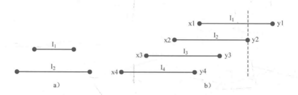

## 4.4 贪心

### 目录

1. 知识点
2. PAT B1020
3. PAT B1023
4. 区间贪心问题


### 知识点

贪心是用来解决一类最优化问题，并希望由局部最优策略来推导全局最优结果的算法思想。贪心算法适用的问题一定满足最优子结构性质，即一个问题的最优解可以由它的子问题最优解有效的构造出来。


### PAT B1020

**题目描述：**

给定所有种类月饼的库存量、总售价、以及市场的最大需求量，求最大收益。

**输入格式：**

正整数N(<1000)表示月饼的种类数，正整数D(<500)表示市场的最大需求量。随后一行N个正数表示每种月饼的库存量，最后一行N个正数表示每种月饼的总售价。

**输出格式：**

输出最大收益，并精确到小数点后两位。

**代码：**

```java
import java.util.*;
import java.io.*;

public class B1020 {
    public static void main(String[] args) throws IOException {
        BufferedReader br = new BufferedReader(new InputStreamReader(System.in));
        String[] l1 = br.readLine().split(" ");
        int n = Integer.parseInt(l1[0]);
        int d = Integer.parseInt(l1[1]);

        Cake[] cakes = new Cake[n];
        String[] l2 = br.readLine().split(" ");
        String[] l3 = br.readLine().split(" ");

        for (int i = 0; i < cakes.length; i++) {
            double store = Double.parseDouble(l2[i]);
            double sell = Double.parseDouble(l3[i]);
            double price = sell / store;
            cakes[i] = new Cake(store, sell, price);
        }

        Arrays.sort(cakes, new Comparator<Cake>() {
            @Override
            public int compare(Cake o1, Cake o2) {
                return o2.price < o1.price ? -1 : 1;
            }
        });

        double left = d;
        double total = 0;
        for (int i = 0; i < cakes.length; i++) {
            if (cakes[i].store <= left) {
                total += cakes[i].sell;
                left -= cakes[i].store;
            } else {
                total += cakes[i].price * left;
                left = 0;
            }
        }

        System.out.printf("%.2f\n", total);
    }
}

class Cake {
    double store; //库存量
    double sell; //总售价
    double price; //单价

    Cake(double store, double sell, double price) {
        this.store = store;
        this.sell = sell;
        this.price = price;
    }
}

```


### PAT B1023

**题目描述：**

给定数字0~9各若干个，可以任意顺序排列这些数字，但必须全部使用，目标是使得最后得到的数尽可能小，其中首位不能为0。

**输入格式：**

在一行中给出十个非负整数，顺序表示数字0、数字1...数字9的个数。十个数字的总和不超过50，且至少拥有一个非零的数字。

**输出格式：**

在一行中输出能够组成的最小的数。

**代码：**

```java
import java.io.*;

public class B1023 {

    private static final int TEN = 10;
    private static final int MAXN = 50;

    public static void main(String[] args) throws IOException {
        BufferedReader br = new BufferedReader(new InputStreamReader(System.in));
        String[] in = br.readLine().split(" ");
        int[] hashtable = new int[TEN];
        for (int i = 0; i < TEN; i++) {
            hashtable[i] = Integer.parseInt(in[i]);
        }

        //先找非零数做首位
        int[] list = new int[MAXN];
        int index = 0;
        for (int i = 1; i < TEN; i++) {
            if (hashtable[i] > 0) {
                list[index++] = i;
                hashtable[i]--;
                break;
            }
        }

        //贪心
        for (int i = 0; i < TEN; i++) {
            while (hashtable[i] > 0) {
                list[index++] = i;
                hashtable[i]--;
            }
        }

        StringBuilder builder = new StringBuilder();
        for (int i = 0; i < index; i++) {
            builder.append(list[i]);
        }
        System.out.println(builder);
    }
}
```


### 区间贪心问题

**题目描述：**

给出N个开区间(x, y)，从中选择尽可能多的区间，使得这些开区间两两没有交集。

**思路：**

在不相交的情况下，优先选择左端点最大的区间



**代码：**

```java
import java.util.*;

public class Main {
    public static void main(String[] args) {
        Scanner in = new Scanner(System.in);
        int n = in.nextInt();

        //输入n个开区间
        int[][] lines = new int[n][2];
        for (int i = 0; i < n; i++) {
            lines[i][0] = in.nextInt();
            lines[i][1] = in.nextInt();
        }
        Arrays.sort(lines, new Comparator<int[]>() {
            @Override
            public int compare(int[] o1, int[] o2) {
                return o2[1] - o1[1];
            }
        });

        //从上往下开始
        int count = 1;
        int lastX = lines[0][0];
        for (int i = 1; i < n; i++) {
            if (lines[i][1] <= lastX) {
                count++;
                lastX = lines[i][0];
            }
        }

        System.out.println(count);
    }
}
```

