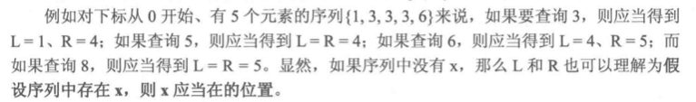
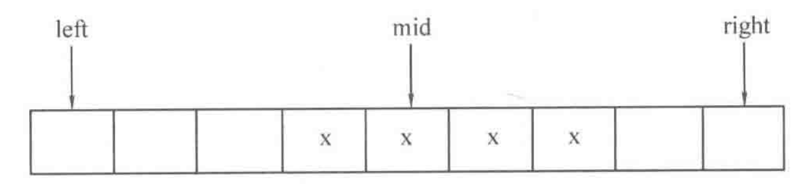
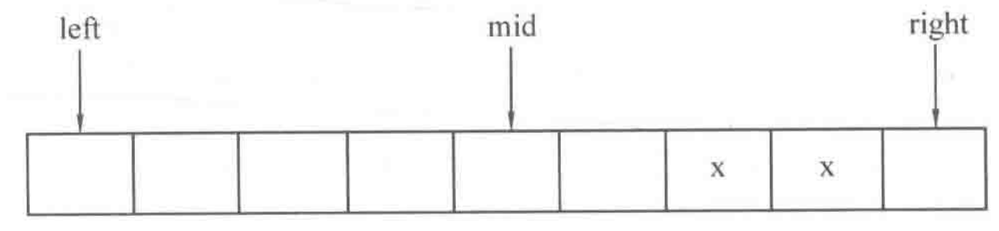
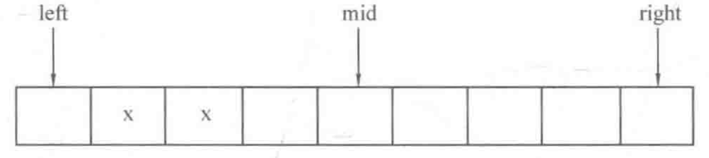
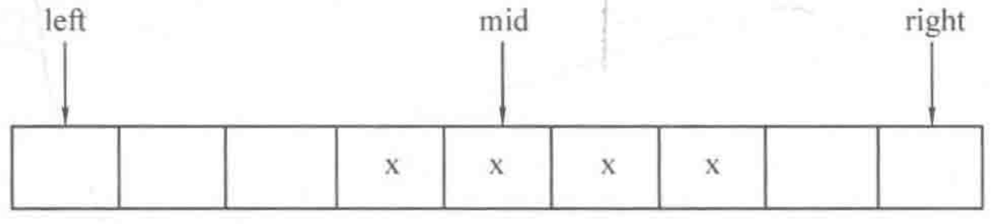
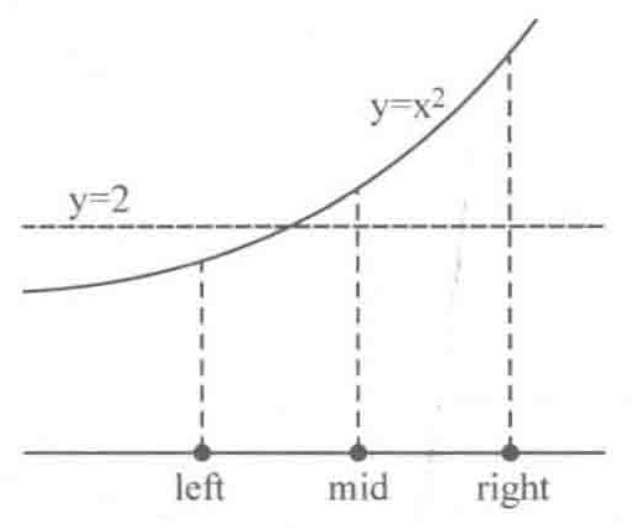
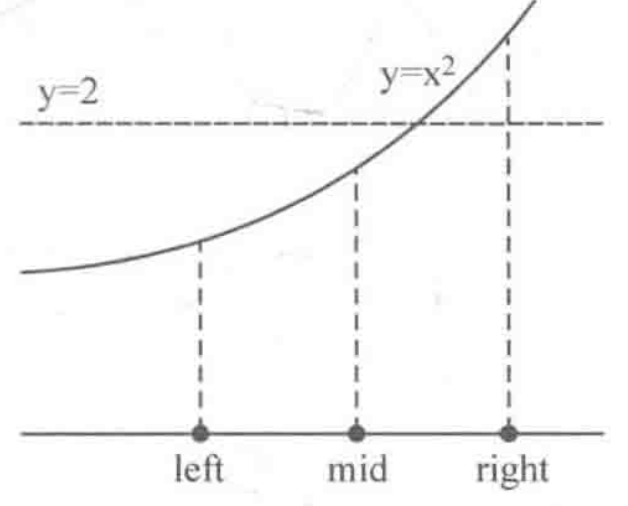

## 4.5 二分

### 目录

1. 知识点
2. 例子1~5


### 知识点

二分查找是基于有序序列的查找算法。该算法一开始令[left, right]为整个序列的下标区间，然后取当前区间的中间下标mid = (left + right) / 2，判断A[mid]与待查询元素x的大小。

* 若A[mid] == x，说明查询成功，退出查询
* 若A[mid] > x，说明x在mid位置的左边，因此往左子区间[left, mid - 1]继续查找
* 若A[mid] < x，说明x在mid位置的右边，因此往右子区间[mid + 1, right]继续查找

```java
//A[]为递增序列，x为待查询的元素，函数返回x元素的位置
private static int binarySearch(int A[], int left, int right, int x) {
  int mid;
  while (left <= right) {
    mid = left + (right - left) / 2;
    if (A[mid] > x) {
      right = mid - 1;
    } else if (A[mid] < x) {
      left = mid + 1;
    } else {
      return mid;
    }
  }
  return -1;
}
```


探讨：

如果递增序列A中的元素可能重复，求出序列中第一个大于等于x的元素的位置L，以及第一个大于x的元素的位置R，这样元素x在序列中的存在区间就是[L, R)




### 例子1

**问题描述：**

求序列中的第一个大于等于x的元素的位置

**思路：**

* 如果A[mid] >= x，说明第一个大于等于x的元素的位置一定在mid处或mid的左侧，则应往左子区间[left, mid]继续查询



* 如果A[mid] < x，说明第一个大于等于x的元素的位置一定在mid的右侧，则应往右子区间[mid+1, right]继续查询

  

**代码：**

****

```java
//A[]为递增序列，x为欲查询的数，函数返回第一个大于等于x的元素的位置
private static int lower_bound(int A[], int left, int right, int x) {
  int mid;
  while (left < right) {
    mid = left + (right - left) / 2;
    if (A[mid] >= x) {
      right = mid;
    } else {
      left = mid + 1;
    }
  }
  return left;
}
```


### 例子2

**问题描述：**

求序列中的第一个大于x的元素的位置

**思路：**

* 如果A[mid] > x， 说明第一个大于x的元素的位置一定在mid处或mid的左侧，则应该往左子区间[left, mid]继续查询



* 如果A[mid] <= x，说明第一个大于x的元素的位置一定在mid的右4侧，则应该往右子区间[mid+1, right]继续查询



**代码：**

```java
//A[]为递增序列，x为欲查询的数，函数返回第一个大于x的元素的位置
private static int upper_bound(int A[], int left, int right, int x) {
  int mid;
  while (left < right) {
    mid = left + (right - left) / 2;
    if (A[mid] > x) {
      right = mid;
    } else {
      left = mid + 1;
    }
  }
  return left;
}
```


### 例子3

**问题描述：**

计算$$\sqrt{2}$$的近似值，要求精确到$10^{-5}$

**思路：**

令初始区间为[1, 2]，然后根据left和right的中点mid处，$mid^2$与2的大小来选择子区间进行逼近

* 如果$mid^2 > 2$，说明$mid > \sqrt{2}$，目标值在mid左侧，应当往左子区间[left，mid]继续查询



* 如果$mid^2 < 2$，说明$mid < \sqrt{2}$，目标值在mid右侧，应当往右子区间[mid，right]继续查询



**说明：**

显然，计算$\sqrt{2}$的近似值等价于求$f(x)=x^2 - 2 = 0$在[1, 2]范围内的根，我们可以对此类问题进行扩展：给定一个定义在[L, R]上的单调函数f(x)，求方程f(x) = 0 的根，相似的二分求解问题还有装水问题和木棒切割问题。


**代码：**

```java
private static final double EPS = 1e-5;

public static double calSqrt(double left, double right, int y) {
  double mid;
  while (right  - left > EPS) {
    mid = left + (right - left) / 2;
    if (fun(mid) > y) {
      right = mid;
    } else {
      left = mid;
    }
  }
  return mid;
}

private static double fun(double x) {
  return x * x;
}


```


### 例子4

**问题描述：**

给定三个正整数a、b、m（a < 10^9, b < 10^6, 1 < m < 10^9），求$$a^b\%m$$

**思路：**

求幂递归式：$a^b\%m = [(a^{b-1}\%m) * a] \%m$

求幂递归界：$a^0\%m = 1$

**代码：**

```java
//从下往上迭代
public static long pow(long a, long b, long m) {
  int ans = 1;
  for (int i = 0; i < b; i++) {
    ans = ans * a % m;
  }
  return ans;
}

//从上往下递归
public static long pow(long a, long b, long m) {
  if (b==0) return 1;
  return pow(a, b - 1, m) * a % m;
}

```


### 例子5

**问题描述：**

给定三个正整数a、b、m（a < 10^9, b < 10^18, 1 < m < 10^9），求$$a^b\%m$$

**思路：**

快速幂递归式：

* 若b是奇数：$a^b\%m = [(a^{b-1}\%m) * a] \%m$

* 若b是偶数：$a^b\%m = [(a^{b/2}\%m)^2]\%m$

快速幂递归界：$a^0\%m = 1$

**代码：**

```java
public static long binaryPow(long a, long b, long m) {
  if (b == 0) return 1;
  else if (b & 1) return binaryPow(a, b-1, m) * a % m;
  else {
    long spd = binaryPow(a, b/2, m);
    return spd * spd % m;
  }
}
```

