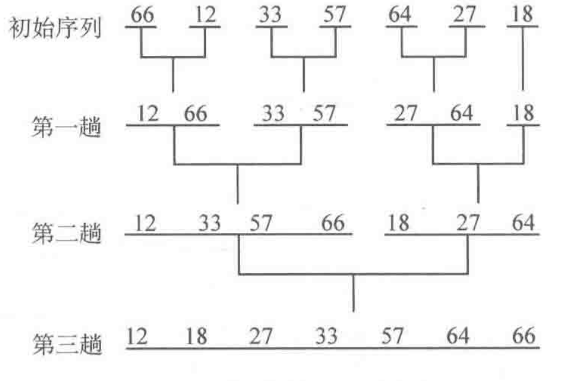
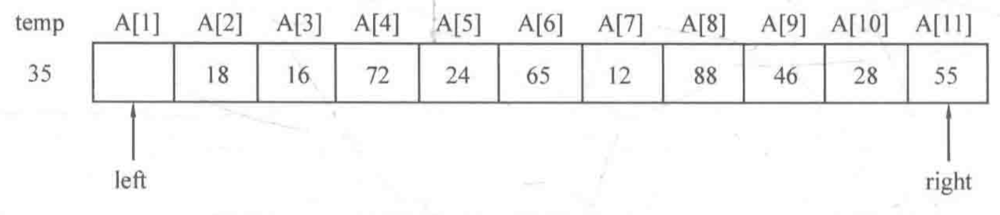
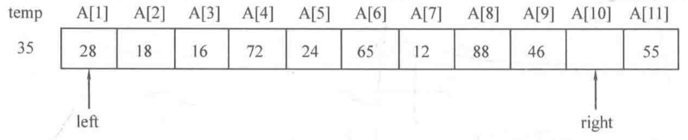
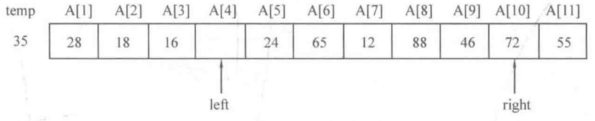
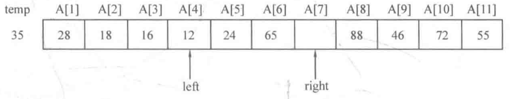
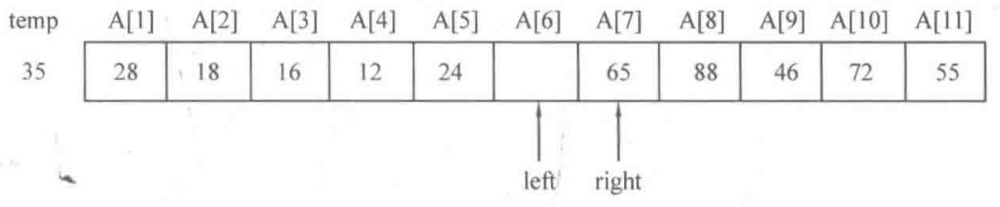

# 4.6 双指针

## 目录

1. 序列枚举
2. 序列合并
3. 归并排序
4. 序列划分
5. 快速排序


## 序列枚举

**问题描述：**

给定一个递增的正整数序列和一个正整数M，求序列的两个不同位置的数a和b，使得他们的和恰好为M，输出满足条件的所有方案。

**思路：**

如果采用暴力枚举，这种做法的时间复杂度为$O(n^2)$，对n在$10^5$的规模时是不可承受的。此处采用双指针算法进行贪心枚举，利用序列递增的性质，时间复杂度为$O(n)$，可以承受的n的规模上限为$10^9$

**代码：**

```java
public static void fun(int[] A, int m) {
  int left = 0, right = A.length - 1;
  while (left < right) {
    int sum = A[left] + A[right];
    if (sum == m) System.out.printf("%d %d\n", left, right);
    else if (sum < m) left++;
    else right--;
  }
}
```


## 序列合并

**问题描述：**

假设有两个递增序列A和B，要求将他们合并为一个递增序列C

**代码：**

```java
public static int[] merge(int[] A, int[] B, int[] C) {
  int la = A.lengh, lb = B.lengh;
  int i = 0, j = 0, index = 0;
  
  while (i < la && j < lb) {
    if (A[i] < B[j]) {
      C[index++] = A[i++];
    } else {
      C[index++] = B[j++];
    }
  }
  
  while (i < la) C[index++] = A[i++];
  while (j < lb) C[index++] = B[j++];

  return C;
}
```


## 归并排序

**问题描述：**

对序列{66, 12, 33, 57, 64, 27, 18}，进行2路归并排序

**思路：**



2路归并排序的原理是，将元素两两归并，生成n/2个组，组内单独排序；然后将这些组再两两归并，生成n/4个组，组内在单独排序；以此类推，直到只剩下一个组为止。

归并排序的核心在于如何将两个有序序列合并为一个有序序列，也就是上一个序列合并问题。

**代码1：**

```java
//2路归并排序的非递归实现
public static void mergeSort(int[] a) {
  int len = a.length;
  for (int step = 1; step < len; step *= 2) {
    for (int i = 0; i + step < len; i += step * 2) {
      if (i + step * 2 <= len)
        merge(a, i, i + step - 1, i+step, i+ step * 2 - 1);
      else
        merge(a, i, i + step - 1, i+ step, len - 1);
    }
  }
}

private static void merge(int[] a, int l1, int r1, int l2, int  r2) {
  int[] c = new int[r2 - l1 + 1];
  int i = l1, j = l2, index = 0;

  while (i <= r1 && j <= r2) {
    if (a[i] < a[j]) {
      c[index++] = a[i++];
    } else {
      c[index++] = a[j++];
    }
  }

  while (i <= r1) c[index++] = a[i++];
  while (j <= r2) c[index++] = a[j++];

  for (int k = 0; k < index; k++) {
    a[l1+k] = c[k];
  }
}
```


**代码2：**

```java
//2路归并排序的递归实现
public static void mergeSort(int[] a, int left, int right) {
  if (left < right) {
    int mid = left + (right - left) / 2;
    mergeSort(a, left, mid);
    mergeSort(a, mid+1, right);
    merge(int[] a, left, mid, mid+1, right);
  }
}

private static void merge(int[] a, int l1, int r1, int l2, int  r2) {
  int[] c = new int[r2 - l1 + 1];
  int i = l1, j = l2, index = 0;

  while (i <= r1 && j <= r2) {
    if (a[i] < a[j]) {
      c[index++] = a[i++];
    } else {
      c[index++] = a[j++];
    }
  }

  while (i <= r1) c[index++] = a[i++];
  while (j <= r2) c[index++] = a[j++];

  for (int k = 0; k < index; k++) {
    a[l1+k] = c[k];
  }
}
```


## 序列划分

**问题描述：**

现有序列{35, 18, 16, 72, 24, 65, 12, 88, 46, 28, 55}，调整元素位置，使得元素35的左侧所有元素均不超过35、右侧所有元素均大于35。

**思路：**











‘

**代码：**

```java
private static int partition(int[] a, int left, int right) {
  int temp = a[left];
  while (left < right) {
    while (a[right] > temp && left < right) right--;
    a[left] = a[right];
    while (a[left] <= tmp && left < right) left++;
    a[right] = a[left];
  }
  return left;
}

```


## 快速排序

**代码：**

```java
public static void quickSort(int[] a, int left, int right) {
  if (left < right) {
    int pos = partition(a, left, right);
    quickSort(a, left, pos - 1);
    quickSort(a, pos + 1, right);
  }
}

private static int partition(int[] a, int left, int right) {
  int temp = a[left];
  while (left < right) {
    while (a[right] > temp && left < right) right--;
    a[left] = a[right];
    while (a[left] <= tmp && left < right) left++;
    a[right] = a[left];
  }
  return left;
}
```


