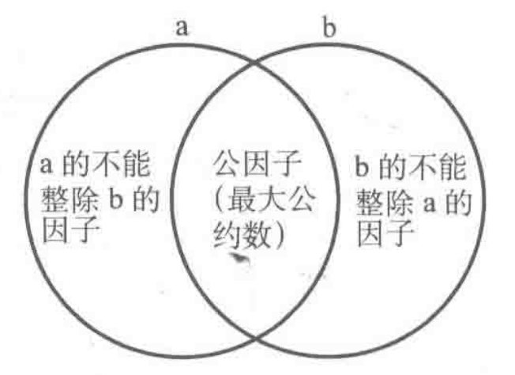

# 5.2 最大公约数与最小公倍数

## 知识点

**最大公约数**

最大公约数是指，两个正整数的所有公约数中最大的公约数，并且零和任意一个正整数的最大公约数都是该整数本身，求解最大公约数常用欧几里得算法。

* 最大公约数递归式：$gcd(a, b) = gcd(b, a\%b)$

* 最大公约数递归界：$gcd(a, 0) = a$

**最小公倍数**

最小公倍数是指，两个正整数的所有公倍数中最小的公倍数，最小公倍数的求解在最大公约数的基础上进行。

* 最小公倍数：$lcm(a, b) = a * b / gcd(a, b)$

