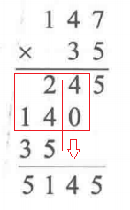
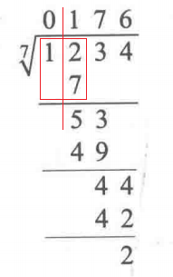

# 5.6 大整数运算

实际上，Java已经提供了BigInteger和BigDecimal等专门用于大数运算的类，但是本文希望对大数运算进行手动实现。

## 目录

1. 大整数的表示
2. 大整数加法
3. 大整数减法
4. 大整数乘法
5. 大整数除法


## 大整数的表示

大数的存储规则为：低位对低位，高位对高位。即整数的低位存储在数组的低位，整数的高位存储在数组的高位。

```java
class Bign {
  int[] d;
  int len;
  
  public Bign() {
		d = new int[1000];
    len = 0;
  }

	public Bign(char[] chs) {
    d = new int[1000];
    len = chars.length;
    
    for (int i = 0; i < len; i++) {
      d[i] = chs[len - i - 1] - '0';
    }
  }
  
  //比较两个大整数的大小
  public int compare(Bign bign) {
    if (len > bign.len) return 1;
    else if (len < bign.len) return -1;
    else {
      //长度相等则从高位开始比价
      for (int i = 0; i < len; i++) {
        if (d[len - 1 - i] > bign.d[len - 1 - i]) return 1;
        else return -1;
      }
      return 0;
    }
  }
}
```


## 大整数加法

大整数加法的步骤为：将低位上的两个数字和进位相加，得到的结果取个位数作为该位结果，取十位数作为新的进位。

```java
public Bign add(Bign bign) {
  Bign res = new Bign();
  
  int carry = 0;
  for (int i = 0; i  < len || i < bign.len; i++) {
    int x = d[i] + bign.d[i] + carry;
    res.d[res.len++] = x % 10;
    carry = x / 10;
  }
  
  if (carry != 0) {
    res.d[res.len++] = carry;
  }
  
  return res;
}
```


## 大整数减法

大整数的减法步骤为：将低位上的两个数字相减，如果不够则进行借位，被减数的高位减1，当前位加10。需要注意的是，两数相减可能会在高位产生多余的零，需要忽略它们，同时要保证结果至少有一位数

```java
public Bign sub(Bign bign) {
    Bign res = new Bign();
	
    int borrow = 0;
    for (int i = 0; i < len || i < bign.len; i++) {
		int x = d[i] - bign.d[i] - borrow;
        res.d[res.len++] = (x + 10) % 10;
        if (x >= 0) borrow = 0;
        else borrow = 1;
    }
    
    // 去除多余的零
    while (res.d[res.len - 1] == 0 && res.len > 1) {
        res.len--;
    }
    
    return res;
}
```


总结一下，大整数的运算都是从低位开始运算，这一点需要牢记。

## 大整数乘法

大整数的乘法步骤为：将int型整数与bign的低位相乘，再与进位相加，得到的结果取个位数作为该位的结果，取高位部分作为新的进位。



```java
public Bign multi(int b) {
    Bign res = new Bign();
    // 从低位到高位遍历大整数
    int carry = 0;
    for (int i = 0; i < len; i++) {
        int x = d[i] * b + carry;
        res.d[res.len++] = x % 10;
        carry = x / 10;
    }
	// 处理剩余的进位
    while(carry > 0) {
        res.d[res.len++] = carry % 10;
        carry /= 10;
    }
    
    return res;
}
```


## 大整数除法

大整数的除法步骤为：从最高位开始，将余数乘以10加上当前位，再与int型整数相除，得到的商作为该位的结果，得到的余数作为新的余数。



```java
public Bign divide(int b) {
    Bign res = new Bign();
    
    //从最高位开始，进行除法
    int left = 0;
    for (int i = 0; i < len; i++) {
        int x = d[len - 1 - i] + left * 10;
        res.d[len - 1 - i] = x / b;
        left = x % b;
    }
    
    //去除多余的零，且至少保留一位
    res.len = len;
    while (res[len - 1] == 0 && res.len > 1) {
        res.len--;
    }
    
    return res;
}
```
