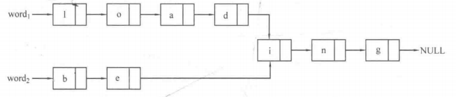

## 6.1 线性表

### 目录

1. 知识框架
2. 线性表的概念
3. 顺序表的操作
4. 链表的操作


### 知识框架

| 数据结构 | 存储结构               | 操作实现                       | 应用         |
| -------- | ---------------------- | ------------------------------ | ------------ |
| 线性表   | 顺序存储<br />链式存储 | insert<br />delete<br />search | 栈<br />队列 |


### 线性表的概念

线性表是一种逻辑结构，表示元素之间一对一的相邻关系。根据存储结构，线性表可以分两种，其中顺序表可以用数组来实现，从内存中取出一块连续的地址来存放给定长度的数组，而链表则使用若干结点组成，且结点在内存中的存储位置通常是不连续的。

顺序表存储结构：

```java
class SqList {
    int[] list;
    int len;
}
```

链表存储结构：

```java
class Node {
    int data;
    Node next;
}

class LinkList {
    Node head;
    int len
}
```

静态链表存储结构：

```java
class Node {
    int data;
    int next;
}

class LinkList {
    Node[] list;
}
```


### 顺序表的操作

```java
class SqList {
    int[] list;
    int len;
    
    SqList() {
        list = new int[1000];
        len = 0;
    }
    
    //插入元素
    public void insert(int pos, int x) {
        for (int i = len; i > pos; i--) {
            list[i] = list[i - 1];
        }
        list[pos] = x;
        len++;
    }
    //删除元素
    public void delete(int pos, int x) {
        for (int i = pos; i < len - 1; i++) {
            list[i] = list[i + 1];
        }
        len--;
    }
    //查找元素
    public int search(int x) {
        for (int i = 0; i < len; i++) {
            if (list[i] == x) {
                return i;
            }
        }
        return -1;
    }
}
```


### 链表的操作

```java
class Node {
    int data;
    Node next;
    
    Node(int x) {
        data = x;
    }
}

class LinkList {
    Node head;
    int len;
    
    LinkList() {
        head = new Node();
        len = 0;
    }
    //插入元素
    public void insert(int pos, int x) {
        Node ptr = head;
        for (int i = 0; i < pos - 1; i++) {
            ptr = ptr.next;
        }
        Node node = new Node(x);
        node.next = ptr.next;
        ptr.next = node;
        len++;
    }
    //删除元素
    public void delete(int pos, int x) {
        Node ptr = head;
        for (int i = 0; i < post - 1; i++) {
            ptr = ptr.next
        }
        ptr.next = ptr.next.next;
        len--;
    }
    //查找元素
    public int search(int x) {
        Node ptr = head;
        for (int i = 0; i < len; i++) {
            ptr = ptr.next;
            if (ptr.data == x) {
                return i + 1;
            }
        }
        return -1;
    }
}
```


### PAT A1032

**题意：**

给出两条链表的首地址，以及若干结点的地址、数据、下一个结点的地址，求两条链表首个公共结点的地址，如果公共结点不存在，则输出-1。



**思路：**

步骤1：遍历第一条链表，并访问每个结点。

步骤2：遍历第二条链表，若遇到访问过的结点，则输出该节点位置。

**代码：**

```java
import java.util.*;
import java.io.*;

public class A1032 {
    public static void main(String[] args) {
        Scanner in = new Scanner(new BufferedInputStream(System.in));
        int start1 = in.nextInt();
        int start2 = in.nextInt();
        int n = in.nextInt();

        // 构造静态链表
        Node[] linkList = new Node[100000];
        for (int i = 0; i < n; i++) {
            int address = in.nextInt();
            char data = in.next().charAt(0);
            int next = in.nextInt();
            linkList[address] = new Node(data, next);
        }

        // 遍历第一条链表，并访问每个结点
        for (int address = start1; address != -1;address = linkList[address].next) {
            linkList[address].visit = true;
        }

        // 遍历第二条链表
        int res = -1;
        for (int address = start2; address != -1; address = linkList[address].next) {
            if (linkList[address].visit) {
                res = address;
                break;
            }
        }
        if (res == -1) {
            System.out.println(-1);
        } else {
            System.out.printf("%05d\n", res);
        }
    }
}

class Node {
    char data;
    int next;
    boolean visit;

    Node (char data, int next) {
        this.data = data;
        this.next = next;
    }
}
```


### PAT A1052

**题意：**

给出静态链表的起始位置，以及若干结点的地址、key、下一个结点的地址，要求按照key的递增顺序，输出静态链表的每一个结点。

**思路：**

步骤1：遍历静态链表，顺序存储每一个结点

步骤2：对结点进行排序，重构静态链表

**代码：**

```java
import java.io.*;
import java.util.*;

public class A1052 {
    public static  void main(String[] args) {
        Scanner in = new Scanner(new BufferedInputStream(System.in));
        int n = in.nextInt();
        int start = in.nextInt();

        // 构造静态链表
        Node[] linkList = new Node[100000];
        for (int i = 0; i < n; i++) {
            int address = in.nextInt();
            int key = in.nextInt();
            int next = in.nextInt();
            linkList[address] = new Node(address, key, next);
        }

        // 遍历静态链表，顺序存储每一个结点
        Node[] sortList = new Node[n];
        int index = 0;
        for (int address = start; address != -1; address = linkList[address].next) {
            sortList[index++] = linkList[address];
        }

        // 对结点进行排序
        Arrays.sort(sortList, 0, index, new Comparator<Node>() {
            @Override
            public int compare(Node o1, Node o2) {
                return o1.key - o2.key;
            }
        });

        if (index == 0) {
            System.out.printf("%d %d\n", index, -1);
        } else {
            System.out.printf("%d %05d\n", index, sortList[0].address);
            for (int i = 0; i < index; i++) {
                Node node = sortList[i];
                if (i < index - 1) {
                    System.out.printf("%05d %d %05d\n", node.address, node.key, sortList[i+1].address);
                } else {
                    System.out.printf("%05d %d %d\n", node.address, node.key, -1);
                }
            }
        }
    }

    static class Node {
        int address;
        int key;
        int next;

        Node(int address, int key, int next) {
            this.address = address;
            this.key = key;
            this.next = next;
        }
    }
}

```


