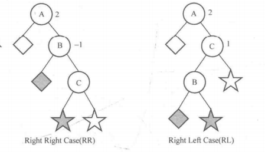

## 7.3 平衡二叉树

### 目录

1. 知识框架
2. 平衡二叉树的概念
3. 平衡二叉树的操作


### 知识框架

| 数据结构   | 存储结构 | 操作实现                                                     | 应用 |
| ---------- | -------- | ------------------------------------------------------------ | ---- |
| 平衡二叉树 | 链式存储 | 查找操作<br />左旋操作<br />右旋操作<br />插入操作<br />建树操作 |      |


### 平衡二叉树的概念

平衡二叉树仍然是一颗二叉查找树，只是在其基础上增加了“平衡”的限制。所谓平衡是指，对于平衡二叉树的任意结点，其左子树与右子树的高度差不超过1，其中左子树与右子树的高度之差称为该结点的平衡因子。

为何要"平衡"？

需要保证树的高度在每次操作之后，仍然能够保持$O(logn)$，这样能让查询复杂度保持$O(logn)$。

链式存储结构：

```java
class Node {
    int data; //权值
    int height; //高度
    Node left;
    Node right;
}
```


### 平衡二叉树的操作

#### 查找操作

思路：

* 如果根结点为空，说明查找失败
* 如果根结点不空，则与x进行比较
  * 若等于x，说明找到目标结点
  * 若小于x，说明x在右子树
  * 若大于x，说明x在左子树

代码：

```java
/**
 * 在平衡二叉树中，查找权值为x的结点
 *
 * @param root 为平衡二叉树的根结点
 * @param x 为查找的权值
 * return 找到的结点
 */
public static Node search(Node root, int x) {
    if (root == null) {
        return null;
    }
    if (root.data == x) {
        return root;
    } else if (root.data < x) {
        return search(root.right, x);
    } else {
        return search(root.left, x);
    }
}
```


#### 左旋操作

思路：


代码：

```java
/**
 * 平衡二叉树的左旋转
 *
 * @param root 为平衡二叉树的根结点
 * return 左旋后的平衡二叉树
 */
public static Node left(Node root) {
    Node temp = root.right;
    root.right = temp.left;
    temp.left = root;
    updateHeight(root);
    updateHeight(temp);
    return temp;
}

/**
 * 更新树高
 */
private static void updateHeight(Node root) {
    int lh = root.left == null ? 0 : root.left.height;
    int rh = root.right == null ? 0 : root.right.height;
    root.height = Math.max(lh, rh) + 1;
}
```


#### 右旋操作

思路：


代码：

```java
/**
 * 平衡二叉树的右旋
 *
 * @param root 为平衡二叉树的根结点
 * @return 右旋后的平衡二叉树
 */
public static Node right(Node root) {
    Node temp = root.left;
    root.left = temp.right;
    temp.right = root;
    updateHeight(root);
    updateHeight(temp);
    return temp;
}
```


#### 插入操作

分析：

* 当平衡二叉树因为插入结点而变得失衡时，需要把最靠近插入结点的失衡结点A，调整到正常。


* 如果结点A的平衡因子为2，那么A的树型为LL型或LR型。当左孩子的平衡因子为1时，A的树型为LL，当左孩子的平衡因子为-1时，A的树型为LR。


* 如果结点A的平衡因子为-2，那么A的树型为RR型或RL型。当右孩子的平衡因子为-1时，A的树型为RR，当右孩子的平衡因子为1时，A的树型为RL。



思路：


代码：

```java
/**
 * 平衡二叉树的插入操作
 *
 * @param root 为平衡二叉树的根结点
 * @param x 为插入的权值
 * @return 插入后的平衡二叉树
 */
public static Node insert(Node root, int x) {
    if (root == null) {
        return new Node(x);
    }
    if (root.data > x) {
        root.left = insert(root.left, x);
        updateHeight(root);
        //判断是否为LR
        if (balFactor(root) == 2 && balFactor(root.left) == -1) {
            //对root.left进行左旋
            root.left = left(root.left);
        }
        //判断是否为LL
        if (balFactor(root) == 2 && balFactor(root.left) == 1) {
            //对root进行右旋
            root = right(root);
        }
    } else {
        root.right = insert(root.right, x);
        updateHeight(root);
        //判断是否为RL
        if (balFactor(root) == -2 && balFactor(root.right) == 1) {
            //对root.right进行右旋
            root.right = right(root.right);
        }
        //判断是否为RR
        if (balFactor(root) == -2 && balFactor(root.right) == -1) {
            //对root进行左旋
            root = left(root);
        }
    }
    return root;
}

/**
 * 获取结点平衡因子
 */
private static int balFactor(Node root) {
    int lh = root.left == null ? 0 : root.left.height;
    int rh = root.right == null ? 0 : root.right.height;
    return lh - rh;
}
```


#### 建树操作

思路：

* 依次插入结点序列

代码：

```java
/**
 * 平衡二叉树的建树操作
 * 
 * @param list 为插入序列
 * @return 建立的平衡二叉树
 */
public static Node create(ArrayList<Integer> list) {
    Node root = null;
    for (int data : list) {
        root = insert(root, data);
    }
    return root;
}
```

