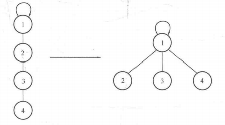

## 7.4 并查集

### 目录

1. 知识框架
2. 并查集的定义
3. 并查集的操作
4. 并查集的应用


### 知识框架

| 数据结构 | 存储结构 | 操作实现                 | 应用 |
| -------- | -------- | ------------------------ | ---- |
| 并查集   | 顺序存储 | 合并<br />查找<br />压缩 |      |


### 并查集的定义

并查集通过父系关系来表示元素所属的集合，是一种维护集合的数据结构。对于同一个集合而言，其根结点只有一个，因此根结点也被称作用来识别元素所属集合的标识，如果元素的父结点是其自身，则说明该元素是集合的根结点。

并查集的存储结构：

```java
class STree {
    int[] father;
    int len;
}
```


### 并查集的操作

#### 初始化

思路：

* 初始时，每一个元素都是独立的集合，因此所有元素的父结点都是其自身

代码：

```java
/**
 * 并查集的初始化
 */
public void init() {
    for (int i = 0; i < len; i++) {
        father[i] = i;
    }
}
```

#### 查找

思路：

* 反复寻找父结点，直到找到根结点

代码：

```java
/**
 * 查找元素所在集合
 * 
 * @param x 为元素
 * @return 所在集合的根结点
 */
public int findFather(int x) {
    while (x != father[x]) {
        x = father[x];
    }
    return x;
}
```


#### 合并

思路：

* 对于给定的两个元素，判断它们是否属于同一个集合
* 如果属于相同集合，则合并两个集合


代码：

```java
/**
 * 返回合并集合的根结点
 */
public int union(int a, int b) {
    int fa = findFather(a);
    int fb = findFather(b);
    if (fa != fb) {
        father[fa] = fb;
    }
    return fb;
}
```


#### 压缩

思路：

* 在查找元素所在集合的过程中，进行渐进式压缩
  * 反复寻找父结点，直到找到根结点r
  * 重复第一步，并将路径上的每一个结点的父亲全部指向根结点r



代码：

```java
/**
 * 查找元素所在集合，并压缩路径
 *
 * @param x 为元素
 * @return 所在集合的根结点
 */
public int findFather(int x) {
    int a = x;
    while (x != father[x]) {
        x = father[x];
    }
    
    while (a != father[a]) {
        int z = a;
        a = father[a];
        father[z] = x;
    }
    return x;
}
```


