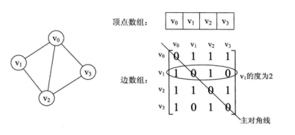
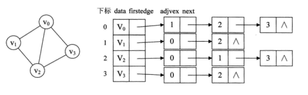

## 8.1 图的存储

图的存储必须要完整、准确地反应顶点集和边集的信息，根据具体的图和需要进行的操作，通常采用邻接矩阵和邻接表两种存储方式。

### 目录

1. 邻接矩阵
2. 邻接表


### 邻接矩阵

邻接矩阵用两个数组来表示图。其中，一维数组存储顶点信息，二维数组存储边或弧的信息。

无向图与对应的邻接矩阵：



代码：

```java
class Graph {
    int[][] edge;
    VexType[] vex;
    int num;
    
    Graph() {
        edge = new int[MAX][MAX];
        vex = new VexType[MAX];
    }
}
```


如果图的边数相对顶点数较少，这种结构存在对存储空间的极大浪费，因此，找到一种数组与链表相结合的存储方法称为邻接表。

### 邻接表

邻接表用一维数组存储图的顶点信息，用单链表存储边或弧的信息。

无向图与对应的邻接表：



代码：

```java
class Graph {
    
}

class Vnode {
    
}

class ArcNode {
    
}
```


