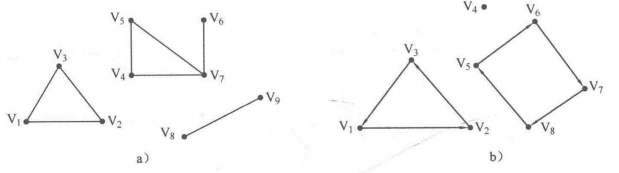
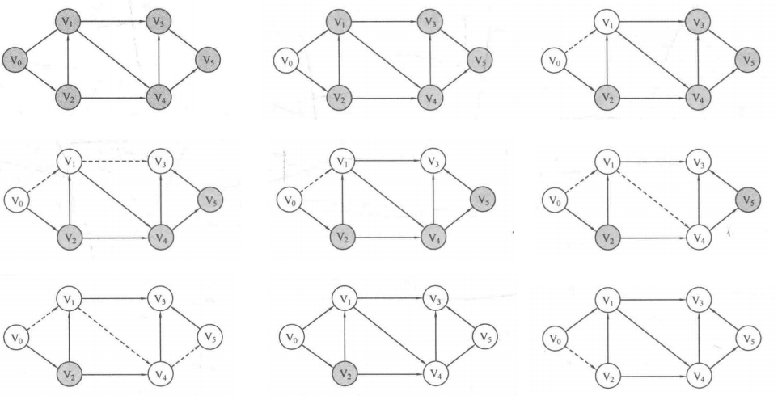
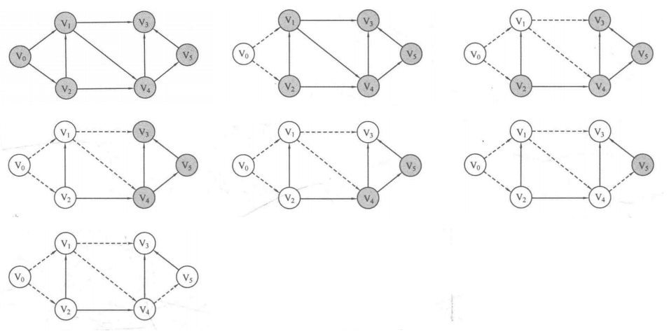

## 8.2 图的搜索

图的遍历是指对图的所有顶点按一定顺序进行访问，遍历方法一般有两种：深度优先搜索和广度优先搜。

### 目录

1. 深度优先搜索
2. 广度优先搜素
3. 例题详解


### 深度优先搜索

首先介绍两个概念：

* 连通分量：无向图中，如果任意两个顶点之间可以通过一定的路径直接或间接的到达，则该图称为连通图，否则称为非连通图。其中，非连通图中的极大连通子图称为连通分量。
* 强连通分量：在有向图中，如果任意两个顶点之间可以通过一定的路径直接或间接的到达，则该图称为强连通图，否则称为非强连通图。其中，非强连通图中的极大强连通子图称为强连通分量。

连通分量的示意图如a，强连通分量的示意图如b，连通分量和强连通分量被统称为连通块。



DFS的遍历过程：



DFS的思路：

* 遍历图的所有顶点，如果该顶点未访问，则从该点开始深度搜索
  * 首先将当前顶点置为已访问
  * 然后遍历所有的相邻顶点，如果该顶点未访问，则从该点开始深度搜索

邻接矩阵实现DFS：

```java
```


邻接表实现DFS：

```java
```


对于拓扑排序的序列求解，其实可以由DFS稍微变形得到。如果在遍历的过程中，对每个顶点的后序次序进行记录，则可以得到拓扑排序的逆序序列，而所谓后序次序是指，顶点最后一次被访问的顺序。

### 广度优先搜索

BFS的遍历过程：




BFS的思路：

* 遍历图中所有顶点，如果该顶点未访问，则从该点开始广度搜索
* 首先，访问当前顶点并入队，如果队列非空，则重复执行以下步骤
  * 取出队首元素，然后遍历所有的相邻顶点，如果该顶点未访问，则访问当前顶点并入队

注意：

* 必须在入队前访问结点，不然会出现重复入队

邻接矩阵实现BFS：

```java
```


邻接表实现BFS：

```java
```


对于最短路径问题，如果要求解从开始顶点到图中任意顶点的最短路径，则对图的BFS进行稍微的变形即可，在访问当前顶点的同时，计算到开始顶点的距离，该距离等于上一深度的距离加1。


### 例题详解

#### PAT A1034

#### PAT A1076

