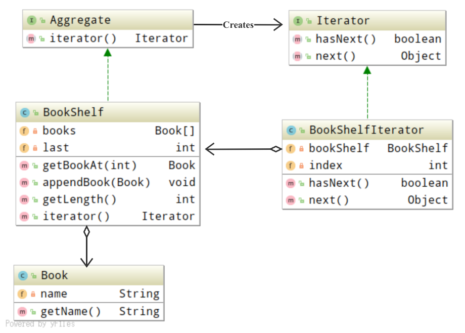

# Iterator 模式

*挨个遍历*

## 目录

1. 知识概述
2. 示例程序
3. Q&A


## 一、知识概述

Iterator 模式用于在数据集合中按照顺序遍历集合，其包含四种主要的角色：

* Iterator：意为迭代器，负责声明按顺序逐个遍历元素的接口api
* ConcreteIterator：为具体的迭代器，负责实现Iterator角色所声明的接口api
* Aggregate：意为集合，负责声明创建Iterator角色的接口api
* ConcreteAggregate：为具体的集合，负责实现Aggregate角色所声明的接口api


## 二、示例程序

以下为实现了Iterator模式的示例程序，这段示例程序的主要作用是将书放置到书架上，并通过迭代器遍历书架。

**类图示例**

Tips: 方法区上的类之间可以循环依赖，堆上的实例不可以循环依赖。类图表示的是方法区上类的关系，并非堆上实例关系。



**代码清单**

集合

```java
/**
 * 表示集合的接口
 */
public interface Aggregate {
    // 方法声明：生成一个用于遍历集合的迭代器
    public abstract Iterator iterator();
}

/**
 * 表示书架(集合)的类
 */
public class BookShelf implements Aggregate{
    private Book[] books;
    private int last = 0;

    public BookShelf(int maxsize) {
        this.books = new Book[maxsize];
    }

    public Book getBookAt(int index) {
        return books[index];
    }

    public void appendBook(Book book) {
        this.books[last] = book;
        last++;
    }

    public int getLength() {
        return last;
    }

    // 生成一个用于遍历书架的迭代器
    public Iterator iterator() {
        return new BookShelfIterator(this);
    }
}
```

迭代器

```java
/**
 * 遍历集合的接口
 */
public interface Iterator {
    // 方法声明：判断是否存在下一个元素
    public abstract boolean hasNext();

    // 方法声明：获取下一个元素
    public abstract Object next();
}

/**
 * 遍历书架的类
 */
public class BookShelfIterator implements Iterator{
    private BookShelf bookShelf;
    private int index;

    public BookShelfIterator(BookShelf bookShelf) {
        this.bookShelf = bookShelf;
        this.index = 0;
    }

    public boolean hasNext() {
        return index < bookShelf.getLength();
    }

    public Object next() {
        Book book = bookShelf.getBookAt(index);
        index++;
        return book;
    }
}
```

实体

```java
/**
 * 表示书的Bean类
 */
public class Book {
    private String name;

    public Book(String name) {
        this.name = name;
    }

    public String getName() {
        return name;
    }
}

```


## 三、Q&A

Q1：

```
在示例程序中，当书的数量超过了书架的最大容量时，就无法继续向书架添加书本了。请使用java.util.ArrayList修改程序，使得书架的容量动态增加。
```

A1：

由于外界遍历并不依赖于BookShelf的实现，而是依赖于迭代器，所以此处仅需要将BookShelf类修改如下。                                                                                                                                           

```java
/**
 * 表示书架(集合)的类
 */
public class BookShelf implements Aggregate{
    private ArrayList<Book> books;
    private int last = 0;

    public BookShelf(int maxsize) {
        this.books = new ArrayList<Book>(maxsize);
    }

    public Book getBookAt(int index) {
        return books.get(index);
    }

    public void appendBook(Book book) {
        this.books.add(book);
        last++;
    }

    public int getLength() {
        return last;
    }

    // 生成一个用于遍历书架的迭代器
    public Iterator iterator() {
        return new BookShelfIterator(this);
    }
}
```
